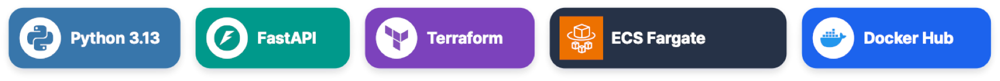
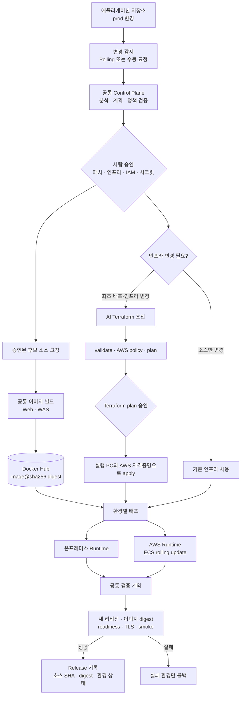

<p align="center"></p>

# Gerbera Deploy AI

> **AI가 제안하고, 사람이 승인하며, 코드가 안전하게 실행하는 배포 Control Plane**

온프레미스와 AWS를 하나의 흐름으로 배포하고 동일한 계약으로 검증합니다.



[전체 흐름](#-전체-흐름) · [안전 경계](#-ai-terraform-안전-경계) · [클라우드 이식성](#-클라우드-이식성) · [빠른 시작](#-빠른-시작) · [현재 구현 범위](#-현재-구현-범위)

---

Gerbera Deploy AI는 애플리케이션 저장소의 변경을 감지해 필요한 배포 단계만 계획하고 실행합니다. AI는 코드·인프라 변경안을 제안하지만 실제 빌드, 배포, 검증, 롤백은 결정적인 코드가 수행합니다. 소스 패치, Terraform, IAM, 시크릿 변경은 실행 전에 사람이 확인하고 승인합니다.

> [!NOTE]
> 현재 실제 클라우드 구현 대상은 **AWS 서울 리전**입니다. 공통 Control Plane과 OCI 이미지 계약, CD Provider 인터페이스를 분리해 Azure와 GCP로 확장할 수 있는 기반을 마련했습니다.

| AI 제안 | Human in the Loop | Deterministic Execution | Portable by Design |
|:---:|:---:|:---:|:---:|
| 변경 분석·패치·Terraform 초안 | 소스·인프라·IAM·시크릿 승인 | 빌드·배포·검증·롤백은 코드 실행 | 공통 Control Plane과 Provider 경계 |

## 👥 **Team Gerbera**

| 김준석 | 안승환 | 양서윤 | 장민영 | 정준우 |
| :-----: | :-----: | :-----: | :-----: | :-----: |
|  |  |  |  |  |
| [@LyleKim](https://github.com/LyleKim) | [@anshwan](https://github.com/anshwan) | [@seoyun0311](https://github.com/seoyun0311) | [@minch-070605](https://github.com/minch-070605) | [@JungJoonWoo](https://github.com/JungJoonWoo) |

## ✨ 핵심 기능

- 애플리케이션 저장소 `prod` 브랜치 Polling 감지 및 수동 배포 요청
- 변경된 Web/WAS/DB tier 분석과 선택적 실행 계획 생성
- AI 코드 패치, Dockerfile, Terraform·IAM 초안 제안
- 코드 검증과 사람 승인을 통과한 계획만 실행
- CodeBuild 또는 로컬 빌드와 Docker Hub digest 고정 배포
- AWS ECS Fargate rolling update, RDS MySQL, ALB·ACM·Route 53, Secrets Manager
- 온프레미스 VM 기반 Web/WAS/DB 배포
- 환경별 독립 실행과 실패 환경만 롤백
- 헬스, 이미지 digest, TLS, 스모크, 환경 간 동작 비교
- 배포 과정과 승인 내역을 확인하는 FastAPI 관리 콘솔

## 🧭 동작 원칙

1. **AI는 제안만 합니다.**
   AI가 만드는 결과는 분석 JSON, 선택 단계, 코드 패치, Dockerfile 및 Terraform 초안입니다.

2. **실행은 코드가 담당합니다.**
   잠금, 빌드, 배포, 검증, 롤백에는 LLM이 참여하지 않습니다.

3. **변경은 사람이 승인합니다.**
   소스 패치, Terraform plan, IAM 및 시크릿 변경은 승인된 해시와 결합한 뒤 실행합니다.

4. **비밀값은 AI에 전달하지 않습니다.**
   실제 값은 호스트 환경이나 비밀 저장소에서 코드가 읽으며, 로그·화면·AI 입력에는 남기지 않습니다.

5. **배포 산출물은 digest로 고정합니다.**
   이미지 태그 대신 `image@sha256:digest`를 기록하고 실제 실행 이미지와 비교합니다.

## 🔄 전체 흐름



### 파이프라인 단계

| 단계 | 역할 | AI 사용 |
|---|---|---|
| 1. Intake & Detect | 저장소 연결, 커밋 고정, 변경 tier 탐지 | 없음 |
| 2. Analyze & Plan | 환경 키 분류, 선택 단계 제안, 실행 계획 검증 | 제안에만 사용 |
| 3. Approve | 패치·인프라·IAM·시크릿 변경 확인 | 없음 |
| 4. Build | Web/WAS 멀티 아키텍처 이미지 빌드 및 push | 없음 |
| 5. Deploy | 온프레미스와 클라우드 트랙 독립 실행 | 없음 |
| 6. Verify | 헬스·TLS·스모크·환경 비교 | 판정에는 사용하지 않음 |
| 7. Report | 결과 기록 및 선택적 실패 원인 요약 | 설명에만 사용 |

온프레미스와 클라우드 트랙은 서로 기다리지 않고 독립적으로 실행됩니다. 한쪽이 실패해도 다른 환경은 계속 진행하며, 실패한 환경만 롤백합니다. 두 환경이 모두 성공했을 때만 교차 검증을 수행합니다.

## 🛡️ AI Terraform 안전 경계

Terraform 생성과 실행은 분리되어 있습니다.

```text
AI Terraform 초안
→ 파일·출력 스키마 검사
→ terraform validate
→ AWS 리소스·IAM 정책 검사
→ terraform plan
→ 사람 승인
→ 승인된 plan만 terraform apply
```

- AI는 앱 인프라의 리소스 HCL과 서비스용 IAM 정책을 제안합니다.
- Provider, backend, 공통 variable·output은 코드가 소유합니다.
- AI가 IAM 사용자나 액세스 키를 만들 수 없습니다.
- Terraform 실행에는 실행 PC에 미리 등록한 AWS 자격증명을 사용합니다.
- ECS 실행 역할, ECS 태스크 역할, CodeBuild 역할은 AWS 서비스가 키 없이 위임받습니다.
- AI 출력이 실패하면 전체 번들을 다시 만들지 않고 허용된 기존 파일만 부분 교정합니다.
- Terraform state와 plan 원문, 비밀값은 AI 입력으로 보내지 않습니다.
- 소스만 변경된 배포는 Terraform을 다시 적용하지 않고 새 이미지 digest만 반영합니다.

## ☁️ 클라우드 이식성

이 프로젝트는 모든 CSP를 구현한 제품이 아니라, **AWS 실제 구현과 다른 CSP를 추가할 수 있는 경계가 분리된 구조**입니다.

### 공통 영역

- 변경 감지와 실행 계획
- 승인 및 실행 상태 관리
- Web/WAS 빌드
- OCI 이미지 digest 계약
- CD Provider 인터페이스
- 검증 결과 및 Release 기록

### Provider별 영역

- Terraform 생성 규칙과 허용 리소스 정책
- IAM·Managed Identity·Service Account
- Runtime 배포 및 새 리비전 반영
- 시크릿 저장소 연동
- 헬스·TLS·롤백 구현

| Provider | Infra | Runtime | 상태 |
|---|---|---|---|
| AWS | ECS, ALB, RDS, IAM, Secrets Manager | 실제 배포·검증·롤백 | 구현 |
| Azure | Container Apps, MySQL, Managed Identity, Key Vault | Provider Stub | 확장 예정 |
| GCP | Cloud Run, Cloud SQL, Service Account, Secret Manager | Provider Stub | 확장 예정 |

Docker Hub의 동일한 digest를 공통 배포 산출물로 사용하므로, Azure와 GCP 지원 시 전체 파이프라인을 다시 만드는 대신 해당 Provider의 Terraform 정책과 Runtime Adapter를 추가할 수 있습니다. 미구현 Provider를 선택하면 AWS로 잘못 배포하지 않고 명시적인 미지원 오류로 중단합니다.

## 🏗️ AWS 배포 구조

```text
CodeBuild ──push──> Docker Hub
                         │ digest
                         ▼
Route 53 ──> ALB ──> ECS Fargate Web/WAS ──> RDS MySQL
              │             │
             ACM      Secrets Manager
```

- **ECS 실행 역할:** 이미지 pull, 로그 기록, 컨테이너 시작 시 시크릿 조회
- **ECS 태스크 역할:** 실행 중인 애플리케이션에 필요한 최소 AWS 권한
- **CodeBuild 역할:** 빌드 로그와 Docker Hub push 시크릿 조회
- **배포 방식:** rolling update
- **실패 복구:** 이전 릴리스 이미지 롤백, 최초 배포 실패 시 scale-to-zero
- **DB 변경:** ECS 일회성 태스크로 마이그레이션 실행 후 종료 코드 확인
- **TLS:** ACM 인증서, ALB HTTPS listener, HTTP→HTTPS redirect 검증

## ✅ 검증 계약

배포 성공은 단순히 프로세스가 실행됐다는 사실만으로 판단하지 않습니다.

- ECS 서비스의 현재 Task Definition 리비전 확인
- 새 리비전 태스크의 실제 이미지 digest 확인
- ALB Target Group healthy 상태 확인
- `/health/ready` readiness 확인
- `/version`의 `release_id == run_id` 확인
- 인증서 체인, 호스트명, TLS 버전, ACM·ALB 연결 확인
- 실제 사용자 흐름을 재현하는 smoke scenario 실행
- 온프레미스와 클라우드의 normalized 결과 비교

스모크 결과에는 주소, 쿠키 값, 비밀값을 남기지 않습니다. 쿠키는 이름과 `HttpOnly`, `Secure`, `SameSite`, `Path` 속성만 기록합니다.

## 🗂️ 프로젝트 구조

```text
.
├── src/ddak/
│   ├── core/          계약, 설정, 저장소, 툴 레지스트리, AI gateway
│   ├── plan/          접수, 변경 탐지, 분석, 계획, 패치, 계획 검증
│   ├── executor/      승인 이후 실행, 병렬 트랙, 잠금, 롤백
│   ├── cd/            공통 CD 인터페이스와 Provider dispatch
│   ├── cloud/
│   │   ├── infra/     AI Terraform 생성, 검증, plan, apply
│   │   ├── build/     CodeBuild·로컬 빌드, Registry Adapter
│   │   ├── deploy/    AWS ECS·DB·시크릿·롤백
│   │   ├── health/    ECS·ALB·애플리케이션 헬스
│   │   └── tls/       DNS·ACM·ALB·TLS 검증
│   ├── onprem/        VM 배포, 인벤토리, 프로비저닝
│   ├── verify/        smoke, compare, diagnose, report
│   ├── web/           FastAPI 관리 콘솔
│   └── ops/           운영 및 복구 도구
├── harness/
│   ├── apps/          샘플 애플리케이션
│   ├── contracts/     JSON Schema와 툴 카탈로그 스냅샷
│   ├── docs/          현행 결정, 계약, 역할별 가이드
│   ├── fixtures/      Fake·Replay 테스트 데이터
│   ├── scripts/       개발·데모·검증 명령 진입점
│   └── tests/         계약·단위·통합·E2E 테스트
├── single-app/        개발자 설계 문서
├── docs/              초기 설계·기획 기록
└── research/          조사 자료
```

실행 코드는 저장소 루트의 `src/ddak`에 있고, 명령·테스트·현행 개발 문서는 `harness`에 있습니다.

## 🚀 빠른 시작

### 요구 사항

- Python 3.13
- `uv` 0.12.20 이상, 0.13 미만
- GNU Make
- Git

### 설치와 로컬 Fake 실행

```bash
make -C harness setup-local
make -C harness ci
make -C harness run-fake
```

관리 페이지 기본 주소는 `http://127.0.0.1:8765`입니다. Fake 모드는 AWS, Docker, LLM을 실제 호출하지 않고 전체 제어 흐름과 UI를 확인합니다.

### 실제 실행

환경변수 예시는 [`harness/env.example`](harness/env.example)을 참고합니다. 비밀값이 들어간 `.env`는 커밋하지 않습니다.

```bash
set -a
source .env
set +a
make -C harness run
```

| 변수 | 설명 |
|---|---|
| `DDAK_ADAPTER_MODE` | `fake` 또는 `real` |
| `DDAK_LLM_BACKEND` | `cli`, `api`, `replay` |
| `DDAK_LLM_MODEL` | Terraform·계획 생성 모델 |
| `AWS_PROFILE` | Terraform과 AWS 배포에 사용할 호스트 프로필 |
| `AWS_REGION` | 기본 `ap-northeast-2` |
| `DDAK_AWS_READONLY_PROFILE` | 검증용 읽기 전용 프로필 |
| `DDAK_REGISTRY` | 기본 `dockerhub` |
| `DDAK_DOCKERHUB_NAMESPACE` | 이미지 저장소 namespace |
| `DDAK_WATCH_INTERVAL_S` | 저장소 Polling 간격 |
| `DDAK_ADMIN_PORT` | 관리 페이지 포트, 기본 `8765` |

AWS 액세스 키를 관리 페이지나 Terraform 코드에 넣지 않습니다. 실행 PC에 AWS CLI 프로필을 등록하고 `AWS_PROFILE`에는 프로필 이름만 지정합니다.

## 🧰 자주 사용하는 명령

```bash
make -C harness help          # 전체 명령 확인
make -C harness setup-local   # lock 기준 개발환경 설치
make -C harness run-fake      # 외부 서비스 없는 관리 콘솔
make -C harness run           # real adapter 실행
make -C harness onprem-run    # 온프레미스 실행 모드
make -C harness test          # 기본 테스트
make -C harness lint          # Ruff 검사
make -C harness type          # Pyright 검사
make -C harness boundary      # import 및 AI 경계 검사
make -C harness contracts     # 계약·카탈로그 드리프트 검사
make -C harness ci            # PR 전 전체 정적 검사와 테스트
make -C harness preflight     # 데모 전 사전 점검
make -C harness unlock        # 운영자 확인 후 제품 잠금 해제
```

실제 AWS, Docker, LLM 테스트는 비용과 외부 상태 변경 가능성이 있으므로 기본 테스트에서 제외됩니다.

```bash
make -C harness test-docker
make -C harness test-aws
make -C harness test-llm
```

## 🔐 보안과 안전

- 관리 콘솔은 기본적으로 `127.0.0.1`에만 바인드합니다.
- AI 입력은 redact를 통과하며 비밀값을 포함하지 않습니다.
- IAM 사용자·액세스 키 생성을 정책 검사에서 차단합니다.
- 서비스 역할은 최소 권한과 권한 경계 안에서만 생성합니다.
- 승인된 Terraform plan과 실제 apply 대상을 해시로 결합합니다.
- Terraform state 원문은 읽거나 AI에 전달하지 않습니다.
- 실행 중인 배포와 복구는 잠금으로 직렬화합니다.
- 미등록 툴, 잘못된 출력, 불명확한 롤백 상태는 안전하게 중단합니다.
- 자동으로 안전 상태를 판단할 수 없으면 `NEEDS_HUMAN`으로 전환합니다.

## 📌 현재 구현 범위

| 영역 | 상태 |
|---|---|
| 관리 콘솔·승인·진행·결과 | 구현 |
| Polling 기반 prod 변경 감지 | 구현 |
| GitHub Webhook 수신 | 향후 확장 |
| AI 분석·계획·Terraform 초안 | 구현 |
| Terraform 검증·plan·승인·apply | 구현 |
| AWS 이미지 빌드·ECS rolling 배포 | 구현 |
| AWS DB·시크릿·TLS·헬스·롤백 | 구현 |
| 온프레미스 VM 배포 | 구현 |
| 환경별 smoke 및 결과 비교 | 구현 |
| Azure·GCP Runtime | 안전한 미지원 Stub |
| Azure·GCP Terraform 정책 | 향후 구현 |

## 📚 문서

- [하네스 및 개발 안내](harness/README.md)
- [공통 계약](harness/docs/contracts/README.md)
- [최근 의사결정](harness/docs/decisions/2026-10-03-decisions-catch-up.md)
- [데모 실행 대본](harness/docs/guides/demo-runbook.md)
- [온프레미스 전체 실행 가이드](harness/docs/guides/onprem-fullchain-runbook.md)
- [클라우드 인프라](src/ddak/cloud/infra/README.md)
- [클라우드 배포](src/ddak/cloud/deploy/README.md)
- [클라우드 헬스](src/ddak/cloud/health/README.md)
- [스모크 테스트](src/ddak/verify/smoke/README.md)
- [기여 가이드](harness/CONTRIBUTING.md)

## 🤖 개발 과정의 AI 사용

개발 과정에서 사용한 AI 코딩 도구와 사람이 검증한 범위는 [`harness/docs/ai-usage`](harness/docs/ai-usage/README.md)에 기록합니다. 제품 실행 중 사용하는 AI와 개발 과정의 AI 도구 사용 기록은 서로 구분합니다.

## 📄 라이선스

프로젝트 라이선스는 팀 결정 대기 상태입니다. 외부 코드 및 의존성 고지는 [`harness/THIRD_PARTY_NOTICES.md`](harness/THIRD_PARTY_NOTICES.md)를 참고하세요.
