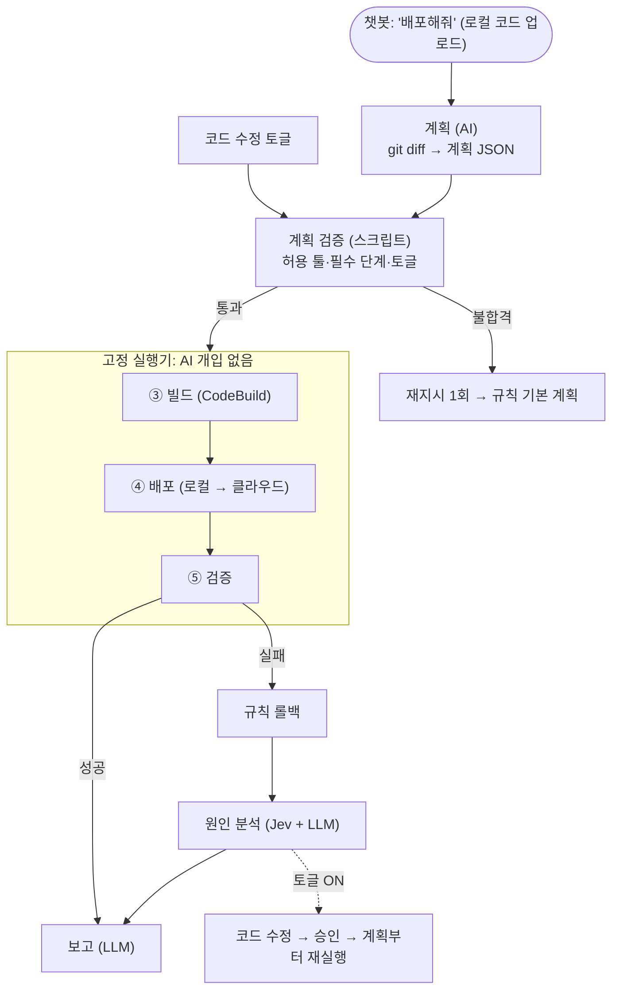

# 회의 브리핑 (2026-09-29)

> 오늘 회의용 한 장 정리입니다. 세부 근거는 각 번호 문서에 있습니다.
> 표기: ✅ 확정 / 🟡 잠정 / 💭 후보 / ⏸ 보류. "고려안"은 추천일 뿐 결정이 아닙니다.

---

## 0. 한눈에 보기

- **대회가 원하는 것:** 로컬에서 만든 웹앱을 AI를 활용해 **로컬(온프레미스)과 클라우드 양쪽에 원터치로 배포하는 시스템.** 평가 대상은 앱이 아니라 배포 시스템입니다.
- **우리 뼈대(🟡):**
  - 챗봇 "배포해줘" → AI가 git diff로 계획(JSON) → 검증 스크립트 → 고정 실행기가 빌드·배포·검증 → 실패하면 규칙 롤백 → AI가 분석·보고
  - **AI는 판단·해석·설명에만 쓰고, 실행에서는 뺍니다.**
- **"AI 에이전트가 파이프라인을 돌린다"는 것만으로는 차별점이 안 됩니다.** 같은 Term1의 Team Daisy, 2025 참가작 7개 이상, 2026 상용 제품 다수와 겹칩니다. 뼈대 위에 **AI 없이는 풀기 어려운 개발자 이슈**를 얹어야 합니다.
- **두 가지 방향(💭):**
  - **A "고치는 배포":** 로컬에서만 되는 코드를 AI가 고쳐 두 환경에서 증명한 뒤 배포
  - **B "증명하는 배포":** 초록불을 믿지 않고, 로컬을 대조군으로 두고 클라우드 기능까지 교차 검증
  - **A+B 통합안:** 로컬 SQLite ∥ 클라우드 RDS. AI가 DB 코드를 고치고, 교차 비교로 동작이 같은지 증명
- **오늘 정할 것 1순위:** 방향(A / B / 통합), 샘플 앱, DB 방침, 운영진 질문 발송. 그리고 **클라우드 배포 시간(D ≤ 60초) 실측 담당**을 정하는 것.

---

## 1. 공식 자료 핵심 (킥오프, 원문 대조)

### 1-1. 주제와 요구

| 원문 (일본어) | 번역 | 메모 |
|---|---|---|
| ローカルで作成した Web アプリケーションを、ワンタッチでデプロイ。 | 로컬에서 만든 웹앱을 원터치로 배포 | 출발점 = 로컬에서 만든 앱 |
| AI をフル活用した、Google Cloud・AWS などのハイパースケーラー、またはオンプレ環境（ローカル）へ簡単にデプロイできるシステム | AI를 전적으로 활용해 하이퍼스케일러 **또는 온프레미스(로컬)**로 쉽게 배포하는 시스템 | 여기서 "로컬"은 **배포 대상** |
| 自動でコードに変更を行ったりしながら、適切にインフラ環境を整えてくれるようなシステム | 코드를 자동으로 변경하면서 인프라 환경을 적절히 갖춰 주는 시스템 | 권유형 방향 제시 |
| ローカル開発とクラウド上でデータをどう保管する？ / クラウド環境・オンプレ環境の差異はどう埋める？ | 로컬 개발과 클라우드의 데이터 보관은? / 클라우드와 온프레미스의 차이는 어떻게 메우나? | 힌트 질문 |
| ローカルで動作する、サンプルのWebアプリケーション / そのアプリケーションをアップロードし、クラウドやオンプレ環境にデプロイできるサービス | 로컬에서 동작하는 샘플 웹앱 / 그 앱을 **업로드**해 클라우드·온프레미스에 배포하는 서비스 | 입력 = 업로드된 앱 |
| デプロイするアプリケーションの品質ではなく、デプロイするシステム自体の品質で評価 | 배포할 앱이 아니라 배포 시스템 자체의 품질로 평가 | 샘플 앱은 최소 기능이면 됨 |
| 「簡単にデプロイ」の例（一例であり、これに限ったものではありません）… SQLite → 適切に設定したRDS | "간단한 배포"의 예(하나의 예일 뿐) … SQLite → 적절히 설정된 RDS | **필수 아님.** 환경 차이 흡수를 좋게 본다는 신호 |

**킥오프 예시 방향:** 다양한 환경·규모 대응 / 대충 만든 앱도 운영 품질로 / 모니터링·시각화 / 작업 로그 / 롤백·블루그린·카나리 / AI 비용 대비 효과 / 여러 명 동시 안전 배포

### 1-2. 심사 기준 (100점)

| 항목 | 배점 | 원문 요지 |
|---|---:|---|
| 완성도·데모 | 30 | 배포 시스템이 실제로 동작하고, **로컬과 클라우드 양쪽 배포를 현장에서 시연**. **배포된 앱에 누구나 접근** 가능 |
| 클라우드 활용 | 30 | **환경 차이 흡수·포터빌리티**가 설계에 반영됐나. **각 클라우드 특유 기능**에 대응하나 |
| 흥미·독창성 | 10 | 독자적 궁리(대응 환경의 넓이, UX 등) |
| AI 활용 | 10 | AI 활용의 궁리 |
| 팀 개발 | 20 | 설계 문서화, **대안·논의 과정·고찰**, 실현 가능성 |

※ 최종 발표뿐 아니라 개발 중·중간보고의 정보도 평가에 포함됩니다. 본선 진출은 **개인 단위**로 선발합니다.

### 1-3. 제출·발표·일정

| 시점 | 내용 |
|---|---|
| **10/3(토) 10:00** | 소스코드·설계문서(Notion)·발표자료 링크를 Slack 팀 채널에 `@mentors`로 제출 (미완성 가능) |
| 10/3 Day1 | 10:30~14:00 개발 → 14:00~17:00 **중간보고 7분**(보고 3분 + Q&A 4분, 시스템 30초 설명 + 아키텍처 다이어그램) |
| **10/4(일) 13:00** | 발표 언어(한국어/일본어) + 통역용 스크립트 제출 |
| 10/4 Day2 | 10:00~14:00 개발 → 15:00~ **최종 발표 5분 = 설계문서 약 2분 + 라이브 데모 약 3분. 슬라이드 금지. 목업은 밝혀야 함** |

- 설계문서는 발표자료를 겸합니다. 별도 제출본이 아니라 **작업 중 메모와 회의록(대안·선택 이유 포함)**을 공유합니다.
- 장소: 스페이스쉐어 중부센터 8층, 10:00~18:00. 인프라 지원금은 팀당 ₩300,000입니다.

### 1-4. 해석 노트 (문서에 명시되지 않은 것)
- **트리거**(버튼 / push / CLI), **초기 조건**(첫 배포인지 업데이트인지, 인프라가 이미 있는지), **로컬↔클라우드 배포의 관계**(병렬 / 순차)는 모두 명시돼 있지 않습니다. → 우리가 설계로 정합니다.
- SQLite→RDS의 데이터 이관 여부, 1회인지 매번인지도 명시돼 있지 않습니다.
- 로컬 Compose 배포는 "개발용 실행"이 아니라 **"온프레미스 배포 대상"**으로 설명합니다.

---

## 2. 지금까지 정한 것

| 항목 | 내용 | 상태 |
|---|---|---|
| 제품 중심 | 딸깍 한 번으로 **실제 배포까지** 이어지는 파이프라인. 분석·조언에서 끝나지 않음 | ✅ |
| 차별화 방식 | 뼈대는 모든 팀이 같다. 현장 개발자 이슈를 얼마나 잘 푸느냐로 승부 | ✅ |
| AI | **반드시 사용.** 계획·분석·보고에만. 빌드·배포 실행에서는 뺌 | ✅ |
| 샘플 앱 | 평가 대상이 아니므로 가볍고 빨리 빌드되는 앱 | ✅ |
| 로컬 배포 | Docker Compose. 외부 접근은 추후 검토 | ✅ |
| 결정 순서 | 컴포넌트 → 컴포넌트별 툴 → 배포 방식·전환 | ✅ |
| 파이프라인 | **플랜 → 검증 → 빌드 → 배포 → 검증 및 보고** (단위·통합 테스트 제외, 9/30 결정) | ✅ |
| 배포 대상 구조 | 3tier (Web / WAS / DB) | 🟡 |
| SSL/TLS | **클라우드 HTTPS 필수**(ACM + ALB 443 + 80→301 + TLS13 정책, RDS TLS). 도메인은 사람이 관리 페이지에 입력. 로컬 HTTPS는 보류(`http://localhost:8080`) ([03](03_아키텍처-3tier.md) 7절) | ✅ 9/30 |
| 빌드 | **CodeBuild.** 목적은 속도가 아니라 **빌드 환경 재현성**(개발자 PC마다 다른 도구·OS 문제 제거) + 같은 리전 ECR 푸시 | 🟡 |
| 코드 수정 | 토글로 켜고 끔. OFF면 툴 목록에서 제거 + 스크립트로 차단(이중) | 🟡 |
| 보안 스캐너 | SAST·DAST·SCA 등은 추후 목표 | ⏸ |

---

## 3. 논의 흐름 요약 (설계문서 "검토한 대안"에 그대로 쓸 수 있음)

1. **팀원 초기 아이디어 3개**(로컬 분석→IaC→AWS / Claude+MCP 배포 / GitHub→IaC 전체 구성)는 모두 선행 제품과 크게 겹쳤습니다(StackGen, Encore, AWS ECS MCP, Qovery, Pulumi Neo).
2. **"오류 코드 자동 수정→배포"는 3분 안에 매번 성공한다고 보장할 수 없어** 핵심 경로에서 뺐습니다.
3. **2025 수상작 분석:** 예선 최우수 Orange·Yoitang, 본선 Blue·Green 모두 제품에 AI가 없었습니다(2025에는 AI 배점 없음). 공통점은 네 가지입니다.
   - 끝까지 동작하는 배포(공개 URL·데이터 유지)
   - 신뢰 경계·이중화·비용 고려
   - 세부 기능까지 만든 완성도
   - 설계 결정 설명력

   탈락 사례는 인프라는 만들었지만 "버튼→배포" 연결을 못 한 팀이었습니다.
4. **"AI 에이전트가 파이프라인을 실행·관리"는 주력 차별점이 아니라 바닥층**이라는 판정을 내렸습니다.
5. **"필요한 Step만 선택"**: 바닥층으로는 넣습니다. 다만 업계 해법이 규칙·그래프라서 "AI라서 핵심"은 아닙니다. AI는 경로로 알 수 없는 네 가지(API 추가형/파괴형, 스키마 확장형/파괴형, 환경변수를 읽는 tier·시점, lockfile 영향)에만 씁니다.
6. **컴퓨트 전환(EC2→ECS 등):** 기술적으로는 되지만 실무에서는 1회성 마이그레이션이라 후보로만 둡니다.
7. **이중화·LB·오토스케일링:** CI/CD가 아니라 플랫폼(IaC) 층의 몫입니다. 파이프라인은 배포 중 가용성을 깨지 않을 책임만 집니다.
8. **오케스트레이션:** "스킬로 순서를 고정하고 LLM이 툴을 순서대로 호출"하는 구조는 LLM이 판단 없이 지연·오류만 더합니다. → **LLM은 계획만, 실행기가 MCP 툴을 호출**하는 구조로 바꿨습니다.

---

## 4. 파이프라인 구조 (🟡)

> **AI 사용 경계 (중요):** 우리가 만드는 것은 MCP 서버입니다. 하지만 "LLM이 쓸 때마다 툴을 골라 호출하는 MCP"가 아닙니다.
> - 툴은 처음에 MCP 명세(이름·입력 스키마·출력)로 **미리 정의**하고, 배포 실행 때는 **실행기(코드)가 계획 JSON 순서대로 호출**합니다.
> - **③ 빌드 · ④ 배포 · ⑤ 검증 실행, 롤백, 잠금 = AI 없음(결정적 코드).**
> - AI가 들어가는 곳은 6곳뿐입니다: `analyze_project`(Jev 분류) · `generate_plan`(LLM 계획) · `patch_*` 3개(LLM 코드 패치, 토글 ON일 때만) · `diagnose_parity_gap`(Jev 분류 + LLM 설명) · `post_report`(LLM 요약, 선택) · `call_ai`(AI 호출 관문).

**원칙**
- **AI 역할:** 계획(단계·순서 **추가만**, 규칙 필수 단계는 못 뺌) / 실패 원인 분석 / 보고. 실행에는 개입하지 않습니다.
- **계획 검증 스크립트:** JSON 형식, 허용 툴, 필수 단계, 토글을 검사하고, `domain`·`host`·`url`·`zone` 계열 키가 있으면 불합격시킵니다. git diff는 신뢰할 수 없는 입력(프롬프트 인젝션)이라는 전제입니다.
- **툴 파라미터:** 좁은 스키마(예: `tier`, `target` enum)만 받습니다. 나머지 값은 ① 프로젝트 설정 파일(`deploy.yaml`) ② 실행 컨텍스트(커밋 SHA 등)에서 코드가 채웁니다. 클라우드 도메인은 관리 페이지 설정(사람만 쓰기)에서 실행 컨텍스트로만 들어옵니다([10](10_전체-흐름-초안.md) 6절). 위험 옵션(빌드 명령 재정의, IAM 역할 재정의)은 노출하지 않습니다.
- **환경별 어댑터:** 툴 하나에 로컬·클라우드 구현을 둡니다(예: `prepare_db` → SQLite 파일 / RDS). 어느 구현을 쓸지는 AI가 아니라 **실행기가 설정 파일로** 정합니다.
- **Jev와 LLM:** 정해진 보기 중 고르는 판단은 Jev(빠르고 저렴), 문장·코드 생성은 LLM이 맡습니다. Jev가 안 될 때를 위한 규칙 대체 경로는 필수입니다.
- **CodeBuild:** 프로젝트·역할·캐시는 Terraform으로 한 번 정의합니다(콘솔 설정도 코드로 가능). 툴은 Python + boto3로 빌드 시작 → 상태 폴링 → 로그 요약만 합니다. `buildspecOverride`는 임의 명령 실행과 같아서 툴에서 노출하지 않고 IAM으로도 막습니다.

---

## 5. 단계별 툴 (확정 주제 기준, 테스트 제외)

위 그림이 최신 목록입니다(주제 전용 툴·SSL 툴 포함 33개). 아래 표는 방향과 무관한 공용 툴만 추렸습니다.

| 컴포넌트 | 툴 |
|---|---|
| 입구·공통 | `receive_deploy_request`(요청 받기) · `stream_progress`(로컬·클라우드 2열 실시간 화면) · `call_ai`(AI 호출 관문: 비밀값 가림·타임아웃·규칙 대체·비용 기록) · `request_approval`(승인 버튼) |
| 계획 | `detect_changed_tiers`(바뀐 tier 판별) · `generate_plan`(AI 계획 JSON) · `validate_plan`(검증 스크립트) |
| 빌드 | `build_image`(바뀐 tier만, 같은 이미지를 두 환경에) |
| 배포 | `acquire_deploy_lock`(동시 배포 잠금) · `ensure_infra`(고정 IaC, 데모 중엔 안 돎) · `inject_env_config`(설정·시크릿 참조 주입) · `prepare_db` · `ensure_tls`(클라우드: 인증서 재사용/발급(DNS 검증)·443·80→301·DNS 레코드. 로컬: 보류(해당 없음)) · `deploy_tier` · `rollback_tier` |
| 검증 | `health_check`(배포 버전 일치 확인) · `smoke_test`(쓰기→읽기, 데이터 유지) · `verify_tls`(인증서·리다이렉트·TLS 버전, 클라우드만) · `watch_post_deploy`(배포 후 30~60초 관찰) · `collect_diagnostics` |
| 보고 | `record_deploy_log`(작업 로그, AI 호출 수·비용) · `post_report`(결과 카드) |
| 운영 | `preflight_check`(발표 직전 점검) · `reset_demo_state`(리허설 초기화) · `cleanup` |

- **권장 추가:** 비용 카드(`estimate_infra_cost`). 여유가 되면 비차단 이미지 스캔과 부하 프로브도 넣습니다.
- **기본 경로만 약 120~140초(추정)** → 강조 기능에 쓸 수 있는 시간은 약 40~60초입니다.

---

## 6. 방향 후보 3가지: A "고치는 배포" / B "증명하는 배포" / A+B 통합안 (💭)

### A "고치는 배포" (평가 1순위)
- **한 줄:** 로컬에서만 되는 코드를 AI가 고치고, 두 환경에서 증명한 뒤 배포합니다.
- **해결하는 개발자 이슈:**
  - I2: 태스크가 바뀌면 업로드 파일이 사라짐
  - I1: 하드코딩된 주소·CORS 때문에 클라우드에서 연결부터 깨짐
  - I5: 로컬은 관대해서 결함이 클라우드에서야 드러남
  - I4: 새 설정값·시크릿이 클라우드에만 없음
- **강조 툴:**

| 툴 | 역할 | 판단 |
|---|---|---|
| `scan_portability_risks` | 규칙으로 후보 줄 수집 → Jev가 영속 데이터 / 하드코딩 주소 / CORS / 프록시 / 무해로 분류 | 규칙 + Jev |
| `generate_portability_patch` | (토글 ON) 지원 패턴 안에서 LLM이 패치 → 빌드·로컬 스모크 → 승인 → 재진입 | LLM |
| `bind_backing_services` | 로컬 MinIO / 클라우드 S3 연결 (AI는 권한을 만들지 않음) | 규칙 |
| `verify_statelessness` · `prove_fix_both_envs` | 복제본 2개가 번갈아 응답해도 파일 유지, 패치 전후 증거 표 | 규칙 |
| `derive_cloud_constraints` · `rehearse_cloud_profile` | 읽기 전용·복제본 2개 같은 클라우드 제약을 로컬에서 리허설, 실패하면 클라우드 배포 차단 | 규칙 |
| `extract_config_contract` · `reconcile_config_targets` · `sync_env_to_cloud` | 설정 키 추출·분류 → 클라우드 누락 감지 → 일반값 자동 등록, 비밀값은 사람 승인 | Jev + 규칙 |

- **3분 데모 요약:** 사진 업로드 커밋 "배포해줘" → 로컬 리허설에서 "복제본 A에서 올린 사진이 B에서 안 보임" 빨간불, 클라우드 차단 → AI 패치 → 승인 → 두 환경 배포 → **심사위원 휴대폰으로 접속해 태스크가 바뀌어도 사진 유지** → 작업 로그·AI 비용
- **장점:** 주제 문구 "코드를 자동으로 변경"에 정면 대응. 2025 수상 기준(데이터 유지·이중화·실제 서빙)을 라이브로 증명
- **위험:** LLM 패치가 매번 같지 않습니다(캐시 폴백, 쓰면 밝힘). 지원 패턴을 좁히지 않으면 4일을 넘깁니다.

### B "증명하는 배포" (평가 2순위)
- **한 줄:** 초록불을 믿지 않습니다. 로컬을 대조군으로 두고 이번 변경의 기능이 클라우드에서도 같은지 검증합니다.
- **해결하는 개발자 이슈:**
  - I7: 헬스체크·스모크는 통과했는데 이번에 바꾼 기능만 클라우드에서 다르게 동작
  - I4: 설정 누락
- **강조 툴:**

| 툴 | 역할 | 판단 |
|---|---|---|
| `generate_change_probe` | diff를 읽고 이번 변경에 맞춘 검사 1~3개 생성(HTTP 순서, 응답 단언, 읽기 전용 SELECT) | LLM |
| `check_probe_discriminates` | 이전 버전에는 FAIL, 새 버전에는 PASS여야 채택(검사가 변경을 실제로 잡는지) | 규칙 |
| `compare_env_results` | 같은 검사를 로컬·클라우드에 동시에 실행하고 필드 단위로 비교 | 규칙 |
| `diagnose_parity_gap` | 차이의 원인 범주 분류 + 조치 설명. 자동 조치는 롤백만 | Jev + LLM |
| (I4 툴) | 설정 계약 추출·동기화 | Jev + 규칙 |

- **3분 데모 요약:** 새 필드 + 새 환경변수 커밋 → AI가 "환경변수 클라우드 누락 → 동기화" 단계 추가 + 검사 생성 → 판별력 검사(이전 FAIL · 새 PASS) → 양쪽 배포 → 헬스·스모크 모두 초록불 → **교차 비교에서 클라우드만 불일치** → 클라우드만 롤백 + 원인 설명
- **장점:** 라이브 위험이 낮습니다(코드 수정 없음, 클라우드 배포 1회).
- **단점:** 찾기만 하고 흡수하지는 못해 클라우드 30점 기여가 A보다 약합니다.

### A+B 통합안: 환경별 DB (로컬 SQLite ∥ 클라우드 RDS)
- **한 줄:** DB는 설정(`DATABASE_URL`)으로 바꾸고, 코드는 AI가 두 DB에서 모두 돌게 고치고, 같은 동작인지는 두 환경 교차 검증으로 증명합니다.
- **근거:**
  - 킥오프 예시 "SQLite → 적절히 설정된 RDS"를 동시 배포 전제로 재해석한 안입니다.
  - 12-factor "백킹 서비스"는 설정만으로 DB를 바꿀 수 있어야 한다고 합니다.
  - 같은 12-factor의 "개발/운영 일치"는 SQLite↔PostgreSQL 같은 차이를 경고합니다. **그 차이를 흡수하는 것 자체가 제품 가치**가 됩니다.
  - 평가표에서 이 이슈(I3)는 클라우드 30 적합도 4.5로 전체 최고였습니다.
- **툴:**
  - SQLite 전용 코드 탐지(규칙)
  - DB 접근 공용화 패치(LLM)
  - `prepare_db`·`backup_db`·스키마·이관(환경별 어댑터: SQLite 파일 / RDS)
  - `compare_env_results`
  - `diagnose_parity_gap`
- **결정적으로 재현되는 데모 장면:** "apple" 검색 → 로컬(SQLite)은 "Apple"이 나오고 클라우드(RDS)는 안 나옴(LIKE 대소문자 차이) → 교차 비교가 불일치를 잡음 → AI가 원인 설명·수정 → 재배포 후 일치
- **주의:**
  - 킥오프 예시라 다른 팀과 겹칠 위험이 큽니다. 차별화 포인트는 "동시 배포 + 교차 비교 증명 + 운영급 RDS 설정 근거"입니다.
  - 샘플 앱은 **SQLite를 raw SQL로 쓰는 작은 앱**이어야 합니다(ORM이면 AI 몫이 작음).
  - RDS는 미리 생성해야 합니다.
  - 로컬은 2tier, 클라우드는 3tier가 됩니다.

### 방향 비교

| 항목 | A 고치는 배포 | B 증명하는 배포 | A+B 통합(DB) |
|---|---|---|---|
| 주제 "코드 자동 변경" | 정면 대응 | 약함 | 정면 대응 |
| 클라우드 30 | 코드 수준 흡수 + 이중화 | 탐지 중심 | 환경별 DB + 운영급 RDS 설정 |
| AI 10 | Jev 분류 + LLM 패치 + 결정적 게이트 | LLM 검사 + 판별력 검사 + Jev | LLM 패치·검사 + Jev |
| 라이브 위험 | 중 (패치 흔들림) | 낮음 | 중 |
| 겹침 위험 | 낮음~중 | 중 | **높음** (킥오프 예시) |
| 4일 난이도 | 중 (업로드 한정) | 중 | 중~상 |

---

## 7. 판단 기준

**방향을 고를 때 물어볼 네 가지**
1. 클라우드 30점을 어디서 딸 것인가?
2. "AI가 없으면 여기서 막힌다"를 한 문장으로 말할 수 있는가?
3. 그 장면이 3분 안에 화면으로 보이는가?
4. 샘플 앱 하나로 4일 안에 끝까지 완성할 수 있는가?

**AI를 붙일지 정하는 기준:** 판단 지점마다 분류합니다.
- 규칙으로 결정 가능 → 규칙
- 정해진 보기 중 선택 → Jev
- 문장·코드 생성 → LLM

**이슈 평가 가중치(내부 평가에 사용):** 3분 데모 0.22 / 클라우드 0.18 / AI 필요성 0.13 / 차별화 0.13 / 불편 근거 0.12 / 2025 수상 패턴 0.12 / 4일 실현성 0.1

**2025 결과에서 가져온 기준**
- 끝까지 실제로 동작(공개 URL·데이터 유지)
- 신뢰 경계 설명(AI에게 권한을 어디까지 주나)
- 이중화·비용을 고려한 한두 줄
- 대안 → 반대 의견 → PoC → 결정 기록
- 현장에서 잴 수 있는 수치만 주장
- 문서와 코드 일치
- 데모 스택은 일찍 확정하고 단순하게

**결정 게이트 제안: 10/1 정오.** 샘플 변형 10개 중 8개 이상에서 AI 패치가 20초 안에 빌드·로컬 스모크를 통과하면 A(또는 통합안), 아니면 B로 갑니다. 공용 툴은 모든 방향이 공유하므로 버려지는 작업이 없습니다.

---

## 8. 오늘 회의에서 정할 것

| 우선 | 결정 | 선택지 | 고려안 |
|---|---|---|---|
| 1 | 방향 | A / B / A+B 통합(DB) | 게이트 실측 후 확정, 오늘은 후보를 1~2개로 좁히기 |
| 2 | 샘플 앱 | awesome-compose 후보 / SQLite raw SQL 앱 등 | 방향에 맞춰: A=업로드 기능, B=날짜 필드, 통합=SQLite raw SQL |
| 3 | DB 방침 | 스키마 고정 / 조건부 마이그레이션 / 환경별 DB | 방향과 함께. 환경별 DB면 초기 데이터 1회 이관 여부도 |
| 4 | 로컬↔클라우드 배포 관계 | 병렬 / 순차(로컬 = 스테이징) | 순차 (승격 흐름, 추가 시간 작음) |
| 5 | 소스 전달 | GitHub 연결 / 로컬 코드 S3 업로드 | S3 업로드 (문서의 "업로드"와 일치, 미커밋 코드도 가능) |
| 6 | 로컬용 이미지 | CodeBuild 결과를 ECR에서 받기 / 로컬 빌드 | ECR에서 받기 (같은 이미지) |
| 7 | ~~테스트·검증 별도 단계~~ | 결정됨: 테스트 제외, 5단계 파이프라인 | ✅ |
| 8 | Web 배치 | nginx 컨테이너 / S3+CDN | nginx 컨테이너 |
| 9 | 클라우드 범위 | AWS만 / + 두 번째 클라우드 매핑 | AWS 완성 후 여유되면 매핑표 |
| 10 | AI 모델 | Jev + LLM / LLM만 | Jev 지연 실측 후 |
| 11 | 역할 분담 | 파이프라인 / 인프라(Terraform·CodeBuild·ECS) / AI 툴 / 데모·문서 | – |
| 12 | 저장소 | 모노레포(web/was/db), 공개 여부 | – |
| 13 | **클라우드 HTTPS 도메인** (SSL 필수) | 결정됨(9/30): 도메인은 사람이 관리 페이지에 입력. ~~(a) 팀 도메인 / (b) CloudFront~~ | 남은 것: 도메인 제공자(DNS 수정 권한 포함), DNS 방식(Route 53 영역 / 외부) ([03](03_아키텍처-3tier.md) 7-2) |

전체 17개 목록은 [12_결정-체크리스트.md](12_결정-체크리스트.md)에 있습니다.

## 9. 운영진 질문 (`#term1_all_question`, 오늘 발송 권장)
1. 로컬(온프레미스) 배포에도 "누구나 접근" 조건이 적용되나요?
2. 기반 인프라(DB·네트워크)를 미리 만들어 두고 데모에서는 앱 배포만 보여줘도 되나요?
3. 데모에서 **처음 배포(업로드→배포)**를 보여줘야 하나요, 업데이트 배포만 보여줘도 되나요?
4. 인프라 지원금(₩300,000)에 외부 AI API 비용도 포함되나요?
5. 설계문서 발표 중에 파이프라인을 미리 트리거해도 되나요? 캐시한 AI 결과를 쓰면 목업으로 보나요?
6. 현장에서 외부 LLM API 호출이 가능한가요(네트워크 제약)?

## 10. 실측 항목과 일정

| 언제 | 할 일 |
|---|---|
| 9/30 | **클라우드 배포 시간 D 실측(≤ 60초 목표)**, 데모 도메인 제공자·DNS 방식 확정, CodeBuild 대기(PROVISIONING) 시간, Jev 호출 지연, 샘플 앱 빌드 |
| 10/1 정오 | 방향 결정 게이트(AI 패치 성공률 10개 실측) |
| 10/1~10/2 | 공용 툴 25개 + 선택한 방향의 강조 툴 구현, 데모 스택 고정(2일차까지). 10/1에 관리 페이지 도메인 입력 → "도메인 연결"로 ISSUED(늦어도 10/2 리허설 전) |
| 10/2 | 3분 데모 대본 작성·리허설, Notion 설계문서(대안·결정 기록) 정리 |
| **10/3 10:00** | 링크 3종 제출 → 중간보고 7분 |
| **10/4 13:00** | 발표 언어·통역 스크립트 제출 → 15:00~ 최종 발표 |

---

## 참고 문서
- 요구사항 전체와 해석 노트: [01](01_해커톤-요구사항.md)
- 결정 로그: [02](02_의사결정-로그.md)
- 3tier·샘플 앱·환경별 DB: [03](03_아키텍처-3tier.md)
- 컴포넌트·시간 예산: [04](04_파이프라인-컴포넌트.md)
- 보류 항목: [05](05_향후-개발-목표.md)
- 경쟁·리서치: [06](06_리서치-요약.md)
- 2025 수상작: [07](07_2025수상작-분석.md), [08](08_GPT-추가분석-판단.md)
- 선택적 Step: [09](09_선택적-Step-실행-판정.md)
- 전체 흐름·파라미터·어댑터·CodeBuild: [10](10_전체-흐름-초안.md)
- 툴 카탈로그·이슈 순위: [11](11_툴-카탈로그-이슈-후보.md)
- 결정 체크리스트: [12](12_결정-체크리스트.md)
- 원자료: [../research/](../research/)
