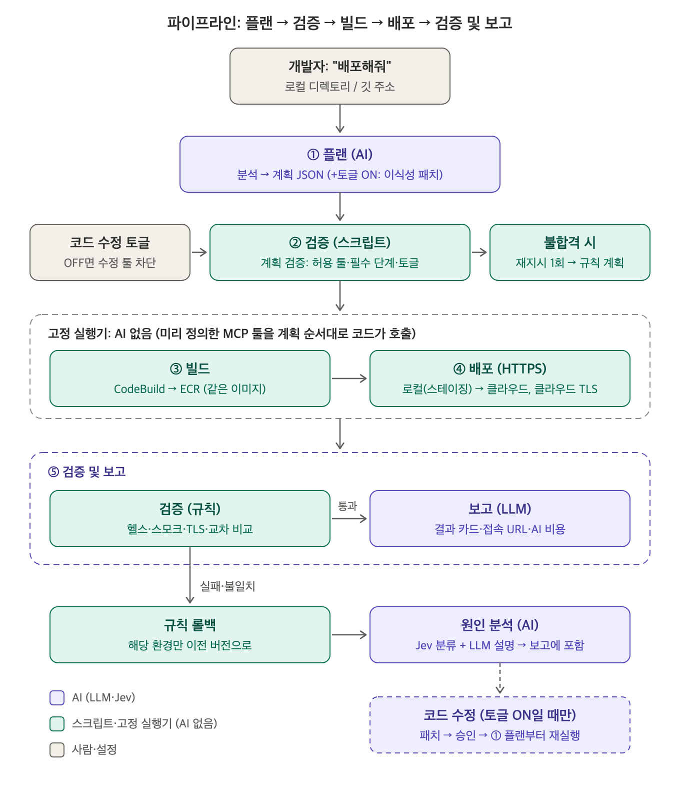
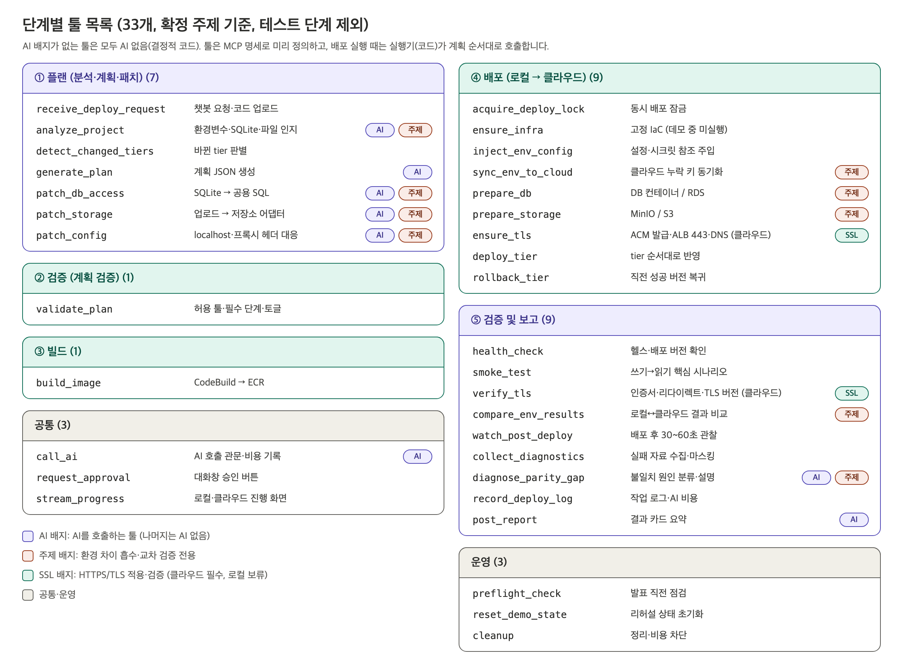
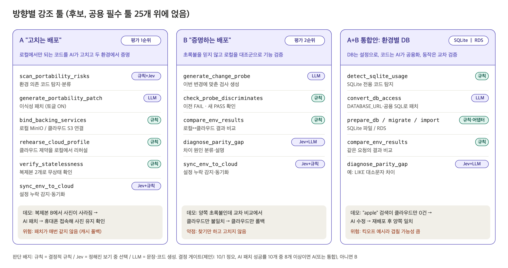

# 02. 의사결정 로그

> 팀 개발(20점)은 "대안·논의 과정·고찰"을 평가합니다. 결정만 적지 말고 **무엇을 검토했고 왜 그렇게 했는지**를 계속 추가해 주세요.
> 표기: ✅ 확정 / 🟡 잠정 / 💭 후보 / ⏸ 보류

## 현재 상태 요약 (2026-09-29)

| 구분 | 내용 | 상태 |
|---|---|---|
| **주제** | "로컬에서 만든 앱을 딸깍 한 번으로 로컬(온프레미스)과 클라우드에 동시에 배포하면서, 환경 차이로 깨지는 부분은 AI가 고치고, 두 환경이 똑같이 동작하는지 교차 검증까지 끝내는 파이프라인" (A+B 통합 방향) | ✅ 2026-09-30 |
| 역할 | 클라우드 3 + 온프레미스 3, 공용 모듈은 부 담당 ([14](14_역할-분담.md)) | 💭 |
| 제품의 중심 | "딸깍"으로 빌드부터 실제 배포까지 자동으로 이어지는 파이프라인. 분석·조언에서 끝나지 않고 반드시 실제 배포까지 간다 | ✅ |
| 차별화 방향 | 공통 뼈대(원클릭 배포)는 모든 팀이 같다. 현장 실무자의 니즈·이슈를 얼마나 잘 해결하느냐로 승부한다 | ✅ (구체안 미정) |
| 샘플 웹앱 | 평가 대상이 아니므로 가볍고 빨리 빌드되는 오픈소스나 간단한 앱으로 처리 | ✅ |
| 배포 대상 구조 | 3tier (Web / WAS / DB) | 🟡 |
| 데모 운영 방식 | 3tier 전체 배포, 또는 이미 배포된 상태에서 Web·WAS를 수정 (시간 문제 대응) | 🟡 |
| 로컬 배포 | Docker Compose. 배포되는 것까지만. 외부 접근은 추후 검토 | ✅ |
| SSL/TLS | **클라우드 HTTPS 필수**(ACM + ALB 443 + 80→443, RDS TLS). **도메인은 사람이 관리 페이지에 입력**하고 파이프라인이 그 값을 씀(구매 안 함). 로컬 HTTPS는 보류(`http://localhost:8080`) | ✅ 2026-09-30 |
| 데모 범위 | 두 환경 모두 3티어를 미리 띄워 두고, 데모에서는 웹서버·WAS 코드 수정분이 자동 배포되는 장면. **초기 배포도 파이프라인으로 되게 함.** 최우선 = 엔드투엔드 무사 배포 | ✅ 2026-09-30 |
| **골든 패스** | 범용 대신 시나리오 하나를 끝까지: flaskr(BSD-3) **v1 익명 게시판 → v2 로그인 추가**(nginx 변경 없음, users 테이블 추가). 두 환경 DB 사전 구축, 환경 차이는 "환경변수 → Secrets Manager" 구조. 순차 관문(온프렘 → 클라우드). 온프렘 tier별 VM 설계, 자원 부족 시 컨테이너 + 발표에서 고지(🟡). 상세·남은 결정은 [17](17_골든패스-시나리오.md) | ✅ 2026-09-30 |
| 파이프라인 컴포넌트 | 빌드·배포는 필수. 나머지는 [04](04_파이프라인-컴포넌트.md)에서 선정 중 | ✅ (빌드·배포) / 논의 중 |
| 보안 컴포넌트 | SAST·DAST·SCA 등은 핵심이 아니므로 추후 개발 목표로만 기록 | ⏸ |
| 결정 순서 | ① 파이프라인 컴포넌트 → ② 컴포넌트별 세부(도구·서비스) → 배포 방식·전환은 그 후 | ✅ |
| SoftBank 맞춤 주제 | 범용 스타트업 제품보다 SoftBank 서비스·아키텍처에 맞추는 편이 발표에 유리하다고 판단 | 💭 |
| 클라우드·IaC | AWS + Terraform 중심 (ECS 등은 예시) | 💭 |
| 인프라 사전 프로비저닝 | 관계형 DB처럼 오래 걸리는 자원은 미리 배포해 둠 | 💭 |
| 배포 방식 | 블루그린 / 카나리 / 롤링 등 | 💭 (추후 결정) |
| 컴퓨트 전환 | EC2→ECS, API Gateway→Lambda 같은 전환 | 💭 (추후 결정) |
| AI 활용 | **AI는 반드시 사용**. "AI 에이전트 파이프라인 실행·관리" 자체는 주력 차별점이 되지 않는다는 판정 → 에이전트 파이프라인 위에 내부 이슈를 얹는 방향 ([07](07_2025수상작-분석.md)) | ✅ (AI 필수) / 💭 (내부 이슈 미정) |
| AI 세부 | AI 에이전트 + 고정 워크플로 혼합, 자연어 빌드·배포, TypeSafe Jev 활용 | 💭 |
| 배포 후 AI 이슈 확인 | 배포 후 이슈를 파이프라인 안에서 AI가 확인 | 💭 |

---

## 파이프라인 구조와 방향 후보 (그림, 2026-09-29)

### 컴포넌트와 흐름 (🟡 정준우 확정안 기준)

파이프라인: **플랜 → 검증 → 빌드 → 배포 → 검증 및 보고** (✅ 9/30, 테스트 제외). AI는 플랜·원인 분석·보고에만 쓰고, 빌드~검증은 고정 실행기가 실행합니다.

### 컴포넌트별 상세 툴 (공용 필수 25개, 보여주기용)

### 방향 후보 3가지 (💭, 공용 툴 위에 얹는 강조 기능)

| | A "고치는 배포" | B "증명하는 배포" | A+B 통합안: 환경별 DB |
|---|---|---|---|
| 한 줄 | 로컬에서만 되는 코드를 AI가 고치고, 두 환경에서 증명한 뒤 배포 | 초록불을 믿지 않고, 로컬을 대조군으로 이번 변경의 기능까지 교차 검증 | DB는 설정(`DATABASE_URL`)으로 바꾸고, 코드는 AI가 두 DB 공용으로 고치고, 같은 동작인지 교차 검증 |
| 해결하는 개발자 이슈 | 태스크가 바뀌면 업로드 파일이 사라짐(I2), 하드코딩 주소·CORS(I1), 로컬이 관대해 결함이 늦게 드러남(I5), 설정·시크릿 누락(I4) | 헬스·스모크는 통과했는데 이번 기능만 클라우드에서 다름(I7), 설정 누락(I4) | 로컬 SQLite로 만든 앱을 운영급 RDS로 올릴 때의 코드·동작 차이 (킥오프 예시, I3 재해석) |
| 강조 툴 | `scan_portability_risks`, `generate_portability_patch`, `bind_backing_services`, `rehearse_cloud_profile`, `verify_statelessness`, `sync_env_to_cloud` | `generate_change_probe`, `check_probe_discriminates`, `compare_env_results`, `diagnose_parity_gap`, `sync_env_to_cloud` | `detect_sqlite_usage`, `convert_db_access`, `prepare_db`·스키마·이관(어댑터), `compare_env_results`, `diagnose_parity_gap` |
| AI 역할 | Jev 분류 + LLM 패치 + 결정적 게이트 | LLM 검사 생성 + 판별력 검사 + Jev 원인 분류 | LLM 패치·검사 + Jev 원인 분류 |
| 3분 데모 | 복제본 B에서 사진 사라짐(빨간불, 클라우드 차단) → AI 패치 → 승인 → 두 환경 배포 → 휴대폰으로 사진 유지 확인 | 양쪽 초록불 → 교차 비교에서 클라우드만 불일치 → 클라우드만 롤백 + 원인 설명 | "apple" 검색이 로컬(SQLite)은 1건, 클라우드(RDS)는 0건(LIKE 대소문자 차이) → AI 수정 → 재배포 후 일치 |
| 클라우드 30 | 코드 수준 흡수 + 이중화 증명 | 탐지 중심 (약함) | 환경별 DB + 운영급 RDS 설정 (평가표 최고 4.5) |
| 라이브 위험 | 중 (패치가 매번 같지 않음, 캐시 폴백) | 낮음 | 중 |
| 겹침 위험 | 낮음~중 | 중 | **높음** (킥오프 예시) |
| 4일 난이도 | 중 (업로드 한정) | 중 | 중~상 (raw SQL SQLite 샘플 필요, RDS 사전 생성) |
| 내부 평가 | 1순위 (I2 3.37) | 2순위 (I7 3.24) | I3 3.26 (클라우드 적합도 최고) |

- **결정 게이트(제안):** 10/1 정오. 샘플 변형 10개 중 8개 이상에서 AI 패치가 20초 안에 빌드·로컬 스모크를 통과하면 A 또는 통합안, 아니면 B.
- 공용 툴 25개는 세 방향이 모두 공유하므로 어느 쪽을 골라도 버려지는 작업이 없습니다.
- 세부 근거: [11](11_툴-카탈로그-이슈-후보.md)(A·B), [03](03_아키텍처-3tier.md) 6절(통합안)

---

## 결정 기록 (시간순)

### 2026-09-28 — 대회 해석과 기본 뼈대
- **해석:** 일반 해커톤처럼 새로운 앱을 만드는 대회가 아니다. 배포 파이프라인을 만들고 그 안에 팀의 아이디어를 넣는 대회다.
- **검토한 대안:**
  - 보안 강화 파이프라인(사용자의 보안 배경 활용) vs 개발자 병목 해결 → 보안은 일단 제외하고 병목·실무 이슈 쪽으로.
  - 팀원 3인의 초기 아이디어를 비교했다.
    - 정준우: 로컬 실행 분석 → AI가 IaC 작성 → AWS 배포
    - 서윤: Claude + MCP 도구로 빌드·배포·오류 대응
    - 상준: GitHub 저장소 입력 → 앱·DB·인프라·CI/CD·모니터링을 IaC로 구성
  - 시장조사 결과 세 아이디어 모두 선행 제품과 크게 겹친다(Encore, StackGen, AWS ECS MCP, Qovery, Pulumi Neo). 상세는 [06_리서치-요약.md](06_리서치-요약.md).
- **결정:** "설정 누락을 고쳐주는 에이전트"가 아니라 **무조건 배포까지 이어지는 파이프라인**이어야 한다.

### 2026-09-29 — 데모 제약 반영
- **제약:** 발표 5분 중 데모는 3분이다. 처음부터 프로비저닝하는 것은 시간상 어렵다.
- **검토 내용:**
  - "오류가 있는 코드 → AI가 자동 수정 → 배포"를 3분 안에 매번 성공시키는 것은 보장할 수 없다(Codex 검토). 그래서 핵심 데모 경로에서 뺐다.
  - 관계형 DB 생성처럼 느린 작업은 3분 안에 불가능하다 → 미리 배포해 두는 방향.
- **결정:** 코드가 수정됐을 때 도는 파이프라인과 실제 배포 자동화를 중심으로 한다.

### 2026-09-29 — 조사: 이중화 책임, 점진 배포, 컴퓨트 전환, SoftBank
- 보고서: [../research/2026-09-29_파이프라인-방향-검토.md](../research/2026-09-29_파이프라인-방향-검토.md) (결론·안은 모두 검토용 후보)
- **확인된 것:**
  - 이중화·LB·오토스케일링은 보통 CI/CD가 아니라 플랫폼(IaC) 층이 만든다.
  - 파이프라인은 배포 전략·배포 후 검증·자동 롤백을 맡고, 배포 중 가용성을 깨지 않을 책임이 있다.
- 블루그린·카나리와 배포 후 검증은 CD의 정석이다. 롤백을 촉발하는 것은 보통 결정적 규칙이다. "AI가 카나리를 판정한다"는 것 자체는 기존 제품과 겹친다.
- 컴퓨트 전환은 기술적으로 가능하다(ALB 가중치 타깃 그룹, Lambda Web Adapter). 다만 실무에서는 한 번 하고 끝나는 마이그레이션 성격이라 메인 스토리로는 약할 수 있다는 의견이 나왔다. **→ 후보로만 유지한다.**

### 2026-09-29 — 결정 순서와 범위 정리 (정준우)
- 사용자 제시 예시(ECS, 컴퓨트 전환, 카나리, Jev 등)는 **후보이며 확정이 아니다.**
- **결정 순서:** 파이프라인 컴포넌트를 먼저 정한다. 배포 방식·전환은 추후 정한다.
- **배포 대상:** 3tier(Web/WAS/DB)로 계획한다. 🟡 다음 회의에서 확정한다.
- **보안 컴포넌트:** SAST·DAST·SCA는 핵심이 아니므로 ⏸ 추후 개발 목표로만 기록한다. → [05_향후-개발-목표.md](05_향후-개발-목표.md)
- **로컬:** 외부 접근 없이 배포까지만 한다(IP·도메인 지정이 먼저 필요하므로 추후 검토).

---

### 2026-09-29 — 컴포넌트 수준 정정
- "컴포넌트"는 파이프라인에 끼워넣는 단계(빌드·배포·SAST 수준)로 정의한다.
- 소스·트리거, 아티팩트 저장·버전, 환경별 설정 주입, 롤백 등은 별도 컴포넌트가 아니라 빌드·배포의 **내부 기능**이다.
- 컴포넌트 수준의 남은 결정은 **테스트·검증을 별도 단계로 뺄지 여부**다.

### 2026-09-29 — 컴포넌트 조사 결과
- 보고서: [../research/2026-09-29_파이프라인-컴포넌트-조사.md](../research/2026-09-29_파이프라인-컴포넌트-조사.md)
- 3분 예산을 가장 많이 쓰는 것은 기본 CI/CD(기동 대기·빌드·배포)입니다. 파이프라인 약 85초 + 배포 시간(D)으로 추정되므로, D가 약 60초 이하여야 합니다 → **D 실측이 최우선.**
- 보안 제외 결정을 뒷받침하는 근거:
  - 배점에 보안 항목이 없음
  - DAST는 차단 단계로 넣으면 3분 안에 불가
  - AI 스캔 결과 트리아지는 이미 흔한 기능
- 배포 방식 전에 정할 상위 전제 4개: 컨테이너 이미지 통일 / 사전 프로비저닝 / 저장소 공개 여부 / 원터치 시스템과 CI의 관계

### 2026-09-29 — 2025 수상작 분석과 AI 에이전트 판정
- 보고서: [07_2025수상작-분석.md](07_2025수상작-분석.md)
- 정준우의 문제 제기: 2025 수상작은 파이프라인을 깔고 내부 이슈 하나를 개선한 것 같다. AI 에이전트 파이프라인 실행·관리가 그만큼의 임팩트가 있는가?
- **판정:** 주력 차별점으로는 불가, 바닥층으로는 필요하다.
  - 근거: Term1 Team Daisy가 거의 같은 구조를 공개했고, 2025 예선에도 AI 중심작이 7개 이상 있었으며, 2026년 상용 에이전트가 다수 나왔다.
- **가설 판정:** 부분적으로 맞다. 수상작은 모두 완성된 파이프라인 위에 무언가를 얹었다. 다만 "이슈 하나" 구조는 비수상작에도 흔했고, 수상작의 공통점은 끝까지 동작하는 배포·HA·보안·비용 고려·완성도·설계 설명력이었다.
- **방향:** AI 에이전트 기반 파이프라인 + 내부 이슈 디테일. 고려안 6개 중 선택은 다음 회의에서 한다.

### 2026-09-29 — GPT 추가 분석 검증
- 문서: [08_GPT-추가분석-판단.md](08_GPT-추가분석-판단.md)
- 새로 확인한 것:
  - 1차 예선 탈락팀이 인프라는 만들고 "버튼 → 실제 배포" 연결을 못 한 기록(자기보고)
  - Orange가 발표 이틀 전 복잡한 Blue/Green 구성을 단순화한 사실
  - 수상작 README와 코드의 불일치
  - 2025 1차 예선은 온라인이었음
- 계획 반영: E2E를 1순위로, 데모 스택은 개발 2일차까지 고정, 데모 대본을 먼저 작성, 수치에는 측정 방법과 스크립트를 붙이고, 문서와 코드를 일치시킨다.

### 2026-09-29 — "필요한 Step만 선택" 판정
- 문서: [09_선택적-Step-실행-판정.md](09_선택적-Step-실행-판정.md)
- 정준우의 주장: AI 기반이라면 당연히 포함돼야 할 핵심 기능이다. Web·WAS·DB마다 과정이 다른데 과잉 실행이 병목이 된다.
- **판정: 절반 맞음.**
  - 과잉 실행 병목은 대형 모노레포나 재배포 시 다운타임이 있는 구성에서만 강합니다. 소규모 3tier에서는 약합니다.
  - 기능은 바닥층으로 넣는 게 맞지만, 업계의 해법은 규칙·그래프·해시라서 "AI라서 핵심"은 아닙니다.
- AI가 필요한 곳은 경로로 판단할 수 없는 네 가지(API 추가형/파괴형, 스키마 확장형/파괴형, 환경변수 읽는 tier·시점, lockfile 영향)입니다. 3tier의 논거는 속도보다 위험 노출과 배포 순서입니다.
- 고려안 A(바닥층 + 안 1·2의 입구) / B(주력으로 재정의) / C(규칙만) 중 선택은 다음 회의에서 합니다.

### 2026-09-29 — 툴 카탈로그와 이슈 후보
- 문서: [11_툴-카탈로그-이슈-후보.md](11_툴-카탈로그-이슈-후보.md)
- 만든 방법: 네 관점에서 후보를 생성하고, 평가자 4명(인프라 / 회의론 / 데모 / 2025 수상 패턴)이 독립 채점했습니다.
- **기본 툴 25개:** 입구 2, 공통 2, 계획 3, 빌드 1, 테스트 2, 배포 6, 검증 4, 보고 2, 운영 3
- **이슈 순위(가중 점수):** I2 로컬 상태 이식 3.37 > I3·I4 3.26 > I7 3.24 > I1 3.18 > I5 3.14. 상위 6개가 0.23점 안에 몰려 있어 조합으로 판단합니다.
- **고려안:** A "고치는 배포"(I2+I1+I5+I4) / B "증명하는 배포"(I7+I4). 결정 게이트는 10/1 정오(패치 성공률 실측)로 제안.

### 2026-09-29 — 해석 정리와 A+B 통합안
- **킥오프 원문 해석:** "로컬"은 출발점(로컬에서 만든 앱)과 배포 대상(온프레미스) 두 뜻입니다. 심사 기준의 "로컬과 클라우드 양쪽 배포"는 배포 대상입니다 → **로컬(온프레미스)과 클라우드 모두 배포하는 것은 확실**(정준우 확인).
- 트리거·초기 조건·두 배포의 관계, SQLite→RDS의 데이터 이관 여부는 문서에 명시돼 있지 않습니다 → 설계로 정합니다.
- **통합안 도출:** "설정으로 DB만 바꾸고 동작은 동일하게"(정준우 제안) + 12-factor 백킹 서비스 원칙 → 로컬 SQLite ∥ 클라우드 RDS 동시 배포.
  - AI는 앱 코드를 두 DB 공용으로 고칩니다.
  - 동작 차이(LIKE 대소문자 등)는 교차 비교로 검증합니다.
- **툴 설계 원칙:** DB처럼 환경별로 다른 작업은 "툴 하나 + 환경별 어댑터". 어느 어댑터를 쓸지는 실행기가 설정 파일로 정합니다(AI 아님).
- **빌드는 CodeBuild(🟡).** 목적은 빌드 환경 재현성입니다. 프로젝트는 Terraform으로 정의하고, 툴은 Python + boto3로 실행만 합니다. 위험한 재정의 옵션은 노출하지 않습니다.

### 2026-09-30 — 주제 확정
- **확정 주제:** "로컬에서 만든 앱을 딸깍 한 번으로 로컬(온프레미스)과 클라우드에 동시에 배포하면서, 환경 차이로 깨지는 부분은 AI가 고치고, 두 환경이 똑같이 동작하는지 교차 검증까지 끝내는 파이프라인"
- **근거:**
  - 킥오프 요구(로컬·클라우드 양쪽 배포, 환경 차이 흡수, 코드 자동 변경)
  - 이전 분석(A "고치는 배포" + B "증명하는 배포" + 환경별 DB 통합안)
- **검토 후 제외:**
  - 자연어로 DB별 쿼리 작성 → 앱 기능이라 배포 시스템 평가 밖
  - AI 배포 전략 추천 → 규칙으로 되고 2025 최우수작과 겹침. 배포 후 검증 부분만 교차 검증으로 흡수
- **역할:** 클라우드 3 + 온프레미스 3 + 공용 모듈 부 담당 ([14](14_역할-분담.md)). 추가로 필요한 개발은 두 가지: 트리거·분석 로직(로컬 디렉토리 / 깃 주소 → 코드 분석 → 환경변수·SQLite 인지), 관리 페이지(배포 대상 웹앱과 별개).

### 2026-09-30 — 파이프라인 5단계 확정, 테스트 제외
- **파이프라인:** 플랜 → 검증 → 빌드 → 배포 → 검증 및 보고
  - ① 플랜: 분석(인지) + 계획 JSON + (토글 ON일 때) 이식성 패치
  - ② 검증: 계획 검증 스크립트
  - ⑤ 검증 및 보고: 헬스·스모크·교차 비교 → 보고 / 실패 시 규칙 롤백 → 원인 분석
- **단위·통합 테스트는 제외합니다(시간 문제).** `run_unit_tests`, `run_integration_tests`를 툴 목록에서 뺐습니다.
- **영향:** AI 패치를 확인할 테스트가 없어졌습니다. → **빌드 + 로컬(스테이징) 배포 후 스모크 통과를 클라우드 배포의 관문**으로 삼습니다. 결정 게이트 기준도 "빌드·로컬 스모크 통과"로 바꿉니다.
- 그림 갱신: [01 흐름](images/01_pipeline-flow.png), [02 단계별 툴](images/02_component-tools.png)(당시 31개, SSL 반영 후 33개), [04 단계 매핑](images/04_pipeline-stages-roles.png)

### 2026-09-30 — SSL/TLS 배포 필수
> ⚠ 이 항목의 "두 환경 모두 HTTPS", 로컬 TLS 리버스 프록시, Terraform 사전 구축(인증서·리스너), `ensure_tls`의 "준비 확인" 역할, 남은 결정 (a)/(b)는 **아래 "HTTPS 방식 정정"으로 대체됨**. 기록으로 남깁니다.

- **결정(정준우):** 배포에 SSL 관련 부분이 반드시 있어야 합니다. 두 환경 모두 HTTPS로 접속되게 합니다. *(아래 정정으로 대체됨: 클라우드만 필수, 로컬 보류)*
- **적용:**
  - 클라우드: ALB 443 + ACM 인증서 + 80→443 리다이렉트 + TLS 1.2 이상. Terraform으로 사전 구축 *(아래 정정으로 대체됨: Terraform은 80 리스너까지, 인증서·443은 `ensure_tls`)*
  - 로컬: Compose 안 TLS 리버스 프록시(로컬 CA 인증서) *(아래 정정으로 대체됨: 로컬 HTTPS 보류)*
  - RDS 연결도 TLS 강제
- **새 툴 2개 (AI 없음, 규칙 필수 단계):** `ensure_tls`(④ 배포, 준비 확인) · `verify_tls`(⑤ 검증, 인증서·리다이렉트·TLS 버전 검사). 툴은 31개에서 33개가 됐습니다. *(아래 정정으로 대체됨: 두 툴 모두 cloud 대상만. `ensure_tls`는 확인만이 아니라 인증서 발급·443 연결·80→301·DNS까지)*
- **앱 영향:** TLS 프록시 뒤 `X-Forwarded-Proto` 처리, `http://` 하드코딩(mixed content), 쿠키 `Secure`를 `patch_config` 지원 패턴에 넣었습니다. *(정정 후: 로컬 TLS 프록시가 없으므로 `ProxyFix`·쿠키 `Secure`는 클라우드 환경 플래그로만. [03](03_아키텍처-3tier.md) 7-3)*
- **남은 결정:** ALB 기본 주소에는 ACM 인증서를 발급받을 수 없습니다. (a) 팀 도메인 + Route 53 + ACM / (b) CloudFront 기본 도메인 중 선택해야 합니다. 팀 도메인 보유 여부를 먼저 확인합니다([03](03_아키텍처-3tier.md) 7-2). *(아래 정정으로 대체됨: 도메인은 관리 페이지 입력, (a)/(b) 선택지 없음)*
- 그림 갱신: [02 단계별 툴](images/02_component-tools.png)(33개), [04 단계 매핑](images/04_pipeline-stages-roles.png)(SSL/TLS 행), [05 관리 페이지](images/05_admin-page-wireframe.png)(HTTPS 결과 카드)

### 2026-09-30 — HTTPS 방식 정정: 도메인은 관리 페이지 입력, 로컬 HTTPS 보류
- **결정(정준우):**
  - 작년 수상작도 HTTPS까지 배포한 것을 확인했습니다. **클라우드는 HTTPS 배포까지 반드시 되게** 합니다.
  - **로컬(온프레미스) HTTPS는 보류합니다.** 퍼블릭 IP가 필요한지 아직 모릅니다. 로컬은 `http://localhost:8080`으로 서빙합니다.
  - **클라우드 도메인은 사람이 관리 페이지에 입력하고, 파이프라인은 그 값을 씁니다.** `deploy.yaml`에 적는 것이 아닙니다. 파이프라인이 도메인을 사지는 않습니다.
- **바뀐 것 (같은 날 앞 항목 대비):**
  - "(a) 팀 도메인 / (b) CloudFront 기본 도메인" 선택지는 없어졌습니다.
  - 로컬 TLS 리버스 프록시와 `ensure_tls`(local)는 보류합니다.
  - `ensure_tls`·`verify_tls`는 클라우드 필수 단계로 남깁니다(툴 33개 유지).
- **흐름:** 관리 페이지에 도메인 입력 → 관리 페이지 백엔드가 프로젝트 설정으로 저장 → 실행 컨텍스트로 `ensure_tls`에 전달 → ACM 인증서 확인·발급(DNS 검증) → ALB 443 연결·80→443 → DNS 레코드 → `verify_tls`. AI는 도메인 값을 바꿀 수 없습니다.
- **주의:** ACM DNS 검증은 시간이 걸릴 수 있어 데모 전에 도메인을 등록하고 인증서를 미리 발급해 둬야 합니다(검증 완료: [../research/2026-09-30_HTTPS-설정도메인-검증.md](../research/2026-09-30_HTTPS-설정도메인-검증.md)). 데모에 쓸 도메인(DNS 수정 권한 포함)을 누가 제공할지 정해야 합니다.
- **검증 결과 (✅ 검증 완료, 기준은 [03](03_아키텍처-3tier.md) 7절):**
  - 신규 발급에는 SLA가 없습니다(최대 30분~수 시간). 3분 데모 안에서는 발급할 수 없으므로 관리 페이지 **"도메인 연결"로 사전 발급**하고, 데모 run은 기존 인증서 재사용 경로만 탑니다.
  - 보안 정책 이름을 명시합니다: `ELBSecurityPolicy-TLS13-1-2-Res-PQ-2025-09`. "API 기본값이 TLS 1.3"이라는 가정은 **반박**됐습니다(API·Terraform 기본값 `ELBSecurityPolicy-2016-08`은 TLS 1.0 허용, TLS 1.3 없음).
  - **443 리스너는 `ensure_tls`가 만들고, Terraform은 80 리스너까지만** 만듭니다(인증서 없이 443을 만들 수 없고, 도메인은 Terraform에 없음). 80 리스너는 `ignore_changes`로 드리프트를 막습니다.
  - DNS가 같은 계정 Route 53 공인 영역이면 완전 자동입니다. **외부 DNS면 사람이 CNAME을 넣습니다**(관리 페이지가 안내하고 승인 대기).
  - RDS 연결은 `sslmode=verify-full` + `global-bundle.pem`으로 맞춥니다.
- 그림 갱신: [01 흐름](images/01_pipeline-flow.png)(④ 배포 부제), [02 단계별 툴](images/02_component-tools.png)(`ensure_tls` 설명), [04 단계 매핑](images/04_pipeline-stages-roles.png)(SSL/TLS·검증 행), [05 관리 페이지](images/05_admin-page-wireframe.png)(도메인 설정 줄, 로컬 SSL 보류, 결과 카드)

### 2026-09-30 — 데모 범위와 초기 배포
- **결정(정준우):**
  - 클라우드·온프레미스 모두 **3티어(Web/WAS/DB)를 미리 띄워 둡니다.**
  - 라이브 데모에서는 **웹서버나 WAS 코드만 수정**하고, 파이프라인이 자동으로 돌아 양쪽에 배포되게 합니다(업데이트 배포).
  - 데모에서는 시간 때문에 보여주지 않지만, **완전 처음 코드를 배포하는 것(초기 배포)도 파이프라인으로 되게** 합니다.
  - **"되게 하는 것"에 집중합니다.** 엔드투엔드로 무사히 배포된다는 것을 보이는 것이 가장 중요합니다. AI 기능은 그다음입니다.
- **영향:**
  - 개발 우선순위는 초기 배포와 업데이트 배포가 두 환경에서 끝까지 도는 경로(P0)입니다. AI 패치와 교차 검증은 그 위에 올립니다(P1).
  - [03](03_아키텍처-3tier.md) 2절의 "A. 전체 배포 / B. 수정 배포"는 "B를 데모, A도 파이프라인으로 가능"으로 정리됩니다.
- 이 설계 전체를 GPT에 상세 검토 요청했습니다(요청문: research/2026-09-30_GPT-주제검토-프롬프트.md).

### 2026-09-30 — 개발 언어·MCP 서버 수·AI 컨트리뷰터 금지
- 문서: [16](16_병렬-개발-규칙과-하네스.md), 하네스 템플릿 [../harness/](../harness/), devpi-guardian 검토 [../research/2026-09-30_devpi-guardian-하네스-검토.md](../research/2026-09-30_devpi-guardian-하네스-검토.md)
- **결정(정준우):**
  - **개발 언어는 파이썬**입니다(백엔드, MCP 서버·툴, 실행기, 스크립트). 관리 페이지 프런트엔드가 예외인지는 아직 정하지 않았습니다.
  - **MCP 서버는 3개**입니다: "검증 MCP", "파이프라인 MCP", "검증 및 보고 MCP". 9개로 쪼개는 건 별로라는 의견이 있어 서버 수만 줄였고, 내부 툴 33개는 그대로입니다.
  - **Claude(Claude Code)·Codex 등 AI가 GitHub 컨트리뷰터로 들어가지 않게** 합니다. Co-authored-by AI 트레일러, AI 봇 작성자, "Generated with Claude Code" 류 문구를 모두 금지합니다.
- **이유:**
  - 서버 수: 9개로 쪼개는 건 별로라는 팀 의견(구체적 이유는 기록되지 않음). 툴 단위 구현은 그대로 두고 묶는 단위만 바꿨습니다.
  - AI 컨트리뷰터: 컨트리뷰터 목록에 사람만 보이게 하려는 것입니다. AI 사용 사실을 숨기는 것은 아니며, 개발 과정의 AI 사용은 README와 `docs/ai-usage/`에 따로 공개하는 방향(💭)입니다.
- **조사로 확인한 것 (AI 컨트리뷰터):**
  - GitHub 저장소 사이드바 Contributors는 Co-authored-by 트레일러만으로도 claude를 올리고, REST API는 author만 셉니다 → 트레일러와 작성자 두 경로를 모두 막아야 합니다.
  - Claude Code 설정(`attribution`)은 노이즈를 줄일 뿐 보장하지 못합니다. 로컬 훅은 `--no-verify`로 우회됩니다. → **CI 필수 체크(작성자 허용목록 + 트레일러 검사)가 최종 관문**입니다(💭 방어 10층, [16](16_병렬-개발-규칙과-하네스.md) 7절).
  - 커밋 메타데이터 Ruleset은 Enterprise 전용이라 뺐습니다. 이력 재작성 뒤에도 사이드바 캐시가 남는 사례가 많아 첫 커밋 전에 가드를 설치합니다.
- **devpi-guardian 검토:** 하네스를 쓴 게 맞습니다(AGENTS.md + 외부 스킬 + spec/plan 문서 + CI의 "문서 + CI"형). 강제 장치가 없어 규칙은 한 사람만 지켰고, 공유 파일·번호 파일 충돌로 PR 두 개를 직접 merge하지 못했습니다. → 규칙·문서 골격만 가져오고 코드는 복사하지 않습니다(MIT, 대회 전 작업물 재사용 규정 미확인).
- **같은 날 다른 문서와의 관계:** 이 결정 뒤 [17](17_골든패스-시나리오.md)의 D24(툴 33개 → 노출 14개, 🔶)와 [18](18_팀-합의요청-MCP-구조.md)의 "MCP 서버 대신 앱 1개 + 툴 레지스트리" 합의 요청(🟡)이 나왔습니다. 둘 다 확정 전이며, 하네스는 이 결정(MCP 3개, 툴 33개)을 기준으로 두고 [16](16_병렬-개발-규칙과-하네스.md) 11절 I-27·I-28로 올렸습니다.
- **남은 결정** ([16](16_병렬-개발-규칙과-하네스.md) 11절 I-1~I-28 중 오늘 스캐폴드 전에 필요한 것):
  - 전제: MCP 서버 유지 여부 [I-27], 툴 수 33 vs 14 [I-28]
  - 툴 → 서버 배치: A안(검증 MCP = ① 플랜 7개 + `validate_plan`) vs B안(① 플랜은 모듈, 검증 MCP = `validate_plan` 1개). 고려안 A안 [I-1]
  - 프로젝트 이름(가칭 `ddak`) [I-2], 서버 코드명(`plan_mcp`·`pipeline_mcp`·`report_mcp`) [I-3], Python 3.13 [I-4]
  - `receive_deploy_request`의 S3 업로드 위치 [I-5], 저장소 공개 시점·플랜 [I-6], 관리 페이지 프런트 기술 [I-7]
  - 실행기 ↔ 서버 호출 방식(MCP 클라이언트, stdio) [I-8]
  - 브랜치·머지 규칙 [I-10], 계약 v1 동결 시각(💭 9/30 22:00) [I-11], 허용 작성자 이메일 수집 [I-15], 로컬 훅 방식 [I-24]
  - 운영진 질문 추가: 대회 전 작업물 재사용, AI 사용 공개 의무, 현장 외부 LLM 호출 가능 여부 [I-22]

### 2026-09-30 — 골든 패스: flaskr 로그인 추가 시나리오 하나로 좁힘
- 문서: [17](17_골든패스-시나리오.md), GPT 설계 검토 판정 [../research/2026-09-30_GPT-설계검토-판정.md](../research/2026-09-30_GPT-설계검토-판정.md)
- **결정(정준우):**
  - 범용 대신 **시나리오 하나를 끝까지** 제대로 배포합니다. 최우선은 엔드투엔드 무사 배포입니다.
  - 베이스 앱은 Flask 공식 튜토리얼 **flaskr**(pallets/flask examples/tutorial, BSD-3)입니다. **v1 = 로그인(auth)을 뺀 익명 게시판**이 온프렘과 클라우드에 3티어로 이미 떠 있는 상태에서 시작합니다.
  - 라이브 데모 변경은 **v2 로그인 기능 추가**입니다. WAS가 로그인 화면 템플릿을 렌더링하고, nginx 설정은 바꾸지 않으며, 엔드포인트·로직과 users 테이블 스키마가 추가됩니다.
  - DB는 두 환경 모두 이미 떠 있습니다(사전 구축). 라이브 시나리오는 킥오프 예시 SQLite→RDS가 아니라 **"환경변수 → Secrets Manager"**처럼 간단히 띄울 수 있는 환경 차이 구조로 갑니다.
  - 온프렘은 tier별 VM에 각각 배포하는 환경으로 설계합니다. 자원 문제가 있으면 tier별 컨테이너로 띄우고, 발표에서 "실제는 tier별 서버, 자원 이슈로 컨테이너로 진행, 추후 고민할 방향"이라고 명확히 말합니다(🟡 미정).
  - 순차 관문은 가능합니다: 빌드 1회 → 온프렘 마이그레이션·배포·스모크 → 관문 → 클라우드 마이그레이션·배포·스모크. 클라우드 준비(시크릿 동기화·태스크 정의)는 온프렘과 병렬입니다.
  - 초기 배포(부트스트랩)도 파이프라인으로 되게 합니다(데모에서는 안 보여줌).
- **이유:** 9/30 "데모 범위" 결정의 최우선 목표(엔드투엔드 무사 배포)를 3일 안에 확실히 지키기 위해 범위를 한 시나리오로 좁혔습니다. flaskr은 auth가 별도 모듈로 나뉘어 있어 "v1(auth 제거) → v2(auth 추가)" diff가 자연스럽게 나옵니다 [코드 확인].
- **바뀐 것:**
  - [15](15_파이프라인-단계별-개발-매핑.md)의 "사진 게시판" 예시와 SQLite→RDS 라이브 시나리오는 이 결정 이전 예시가 됐습니다. 현재 기준은 [17](17_골든패스-시나리오.md)입니다.
  - 샘플 앱의 "SQLite raw SQL·로컬 업로드·localhost 하드코딩" 패턴은 골든 패스에서 빠집니다. 라이브 환경 차이는 SECRET_KEY(환경변수 ↔ Secrets Manager), SESSION_COOKIE_SECURE(http ↔ https), DB TLS입니다.
- **GPT 설계 검토 반영:** 44개 주장(GPT 40 + 우리가 추가로 확인한 것 4)을 1차 출처로 확인했습니다. 판정은 확인 26 · 일부 확인 10 · 미검증 8, 채택은 채택 21 · 수정 채택 16 · 보류 2 · 반대 1 · 사용자 결정 4입니다.
  - 표현 정직성: "원터치 인프라 구축" 대신 "사전 구축한 플랫폼 위에서 앱 부트스트랩·업데이트". "SQLite→RDS 자동 변환"은 말하지 않습니다(`DATABASE_URL`은 연결 이식성이지 SQL 이식성이 아님). 목업은 고지합니다(킥오프 규정).
  - ECS는 Secrets Manager 값을 결국 환경변수로 넣어 줍니다. 그래서 앱은 두 환경 모두 `SECRET_KEY`만 읽고, 환경 차이는 배포 정의가 흡수합니다. 회전 후에는 새 배포가 필요합니다.
  - flaskr 원본 `schema.sql`은 DROP으로 시작합니다 → `init-db`를 없애고 `schema_migrations` + 추가형 마이그레이션만 허용합니다. 앱만 롤백하고 DB는 되돌리지 않습니다.
  - ALB 새 대상은 헬스체크 1회 통과로 healthy입니다. 간격 5초, deregistration 5~10초(기본 300초)로 명시합니다. "60초 배포"는 약속하지 않고 실측 p50/p95만 말합니다.
  - circuit breaker는 안전망으로만 씁니다. 부트스트랩(COMPLETED 없음)에서는 롤백하지 못하고, 스모크 실패도 못 잡습니다.
  - SESSION_COOKIE_SECURE를 켜면 온프렘 http(LAN IP·Safari·파이썬 스모크)에서 로그인이 깨집니다 → 환경별 설정, 데모 브라우저는 Chrome.
  - 검증 뒤 추가로 찾은 것: ProxyFix `x_for`·`x_proto`를 같은 값으로 두면 클라우드에서 스킴이 http로 남습니다(로컬 실행 확인) → 두 값을 분리합니다.
  - 반대: GPT의 총점 추정·2025 수상작 상세는 근거로 쓰지 않습니다.
- **남은 결정** ([17](17_골든패스-시나리오.md) 16-2, D1~D26):
  - 오늘(9/30): 계획 방식 고정 DAG vs AI 단계 추가 [D1], v1 SECRET_KEY 없음 [D2], 클라우드 web·was 한 태스크 [D3], CPU 아키텍처 [D4], Fargate 서브넷 [D18], ALB 헬스 경로 `/health/live` vs `/health/ready` [D21], 클라우드 desiredCount [D23], 툴 33개 → 14개 [D24], DB 엔진 Postgres / MySQL [D26](17은 Postgres 고려안 전제)
  - 10/1 오전: 온프렘 공개 접근(named/quick tunnel)과 도메인 배치 [D5], 운영진 질문 [D20]
  - 그 밖: 온프렘 비밀 주입 env vs 파일 [D22], fixture 개수 [D25], 주제 문구 "동시에" [D16] 등
  - 이 결정으로 위 "방향 후보 3가지"와 다음 회의 안건 0번이 닫혔는지는 확인이 필요합니다.

---

## 다음 회의 안건

0. **방향 선택: A "고치는 배포" / B "증명하는 배포" / A+B 통합안(환경별 DB), 결정 게이트 동의** → 위 "방향 후보 3가지" 표, [11](11_툴-카탈로그-이슈-후보.md), [03](03_아키텍처-3tier.md) 6절. (참고) 에이전트 파이프라인 위에 얹을 내부 이슈 선택 (고려안 6개, 고를 때 물어볼 네 가지) → [07](07_2025수상작-분석.md) 4절. "필요한 Step만 선택"의 위치(A/B/C) → [09](09_선택적-Step-실행-판정.md) 5절
1. 3tier 구조 확정 여부와 데모 운영 방식(전체 배포 vs 수정 배포). → [03](03_아키텍처-3tier.md)
2. 샘플 앱 선정(후보 4개, 빌드 시간 실측 후). → [03](03_아키텍처-3tier.md)
3. ~~파이프라인 컴포넌트 확정~~ → 9/30 결정(5단계, 테스트 제외). 남은 것: 선택 기능 중 무엇을 넣을지. → [04](04_파이프라인-컴포넌트.md)
4. 상위 전제 4개 결정(컨테이너 이미지 통일 / 사전 프로비저닝 / 저장소 공개 여부 / 원터치 시스템과 CI의 관계) → [04](04_파이프라인-컴포넌트.md) 5절
5. 운영진 확인 질문(`#term1_all_question`)
   - "배포된 앱에 누구나 접근"이 로컬 배포에도 해당하는가?
   - 인프라를 미리 만들어 두고 데모에서는 앱 배포만 보여줘도 되는가?
   - ₩300,000 지원에 AI API 비용도 포함되는가?
   - 설계문서 발표 중에 파이프라인을 미리 트리거하거나, 이전 실행 결과를 보여줘도 되는가?
