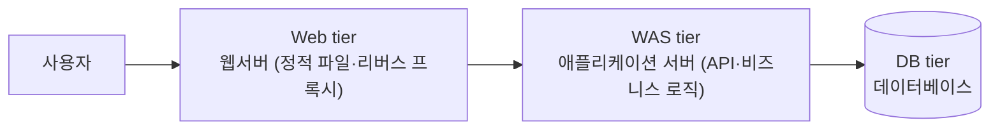
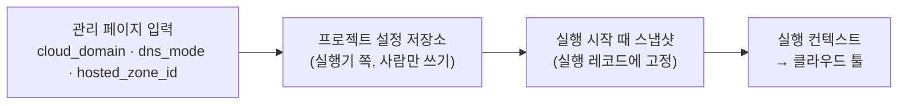

# 03. 배포 대상 구조: 3tier (🟡 잠정)

> 다음 회의에서 확정합니다. 클라우드 쪽 구현(서비스 선택)은 아직 정하지 않았고, 아래 예시는 모두 💭 후보입니다.

## 1. 구조

| tier | 역할 | 로컬 (Docker Compose) | 클라우드 (💭 예시일 뿐, 미정) |
|---|---|---|---|
| Web | 정적 파일 제공, 요청을 WAS로 전달 | nginx 컨테이너 | LB + 웹 컨테이너, 또는 정적 호스팅 + CDN 등 |
| WAS | API·비즈니스 로직 | 앱 컨테이너 | 컨테이너 서비스 / VM / 서버리스 등 |
| DB | 데이터 저장 | DB 컨테이너 + 볼륨 | 관리형 DB (미리 생성) 등 |

## 2. 데모 운영 방식 (✅ 2026-09-30 결정)

> **결정:** 클라우드·온프레미스 모두 3티어를 **미리 띄워 두고**, 라이브 데모에서는 **웹서버 또는 WAS 코드만 수정 → 파이프라인이 자동으로 양쪽 배포**(아래 B). 데모에서 보여주지는 않지만 **초기 배포(아래 A)도 파이프라인으로 되게** 합니다. 최우선은 엔드투엔드 무사 배포입니다. 아래 표는 결정 전에 비교한 내용입니다.

| 방식 | 내용 | 장점 | 주의 |
|---|---|---|---|
| A. 3tier 전체 배포 | Web·WAS·DB를 처음부터 배포 | "원터치로 전부 뜬다"를 보여줌 | 클라우드 관리형 DB 생성은 수 분 이상 걸려 3분 데모 안에 넣기 어려움. 로컬 Compose는 빠름 |
| B. 수정 배포 | 3tier가 이미 배포된 상태에서 Web 또는 WAS 코드가 수정되면 파이프라인이 돌아 반영 | 시간 예측이 쉽고, 실무의 일상적 배포와 같음 | "원터치"에 초기 구축이 포함돼야 하는지 운영진 확인 필요 |
| A+B 혼합 (💭) | 로컬은 전체 배포, 클라우드는 수정 배포 | 두 장면을 모두 보여줄 수 있음 | 로컬·클라우드의 흐름이 달라 설명이 필요 |

## 3. 이 구조에서 생기는 논점

1. **"Web tier"의 정의.** nginx가 리버스 프록시만 한다면 "웹서버 수정"은 설정 변경뿐이라 실무에서 드뭅니다. 프론트엔드 정적 파일(화면)까지 들어 있으면 UI 수정이라는 흔하고 눈에 보이는 변경이 됩니다.
2. **변경 종류 = tier.** Web만 바뀌었는지, WAS가 바뀌었는지에 따라 빌드·테스트·배포 대상이 달라집니다. 이것이 파이프라인이 판단할 거리가 됩니다. → [04](04_파이프라인-컴포넌트.md)의 "변경 범위 판별"
3. **DB는 미리 배포하고 스키마를 고정**(또는 하위 호환 변경만 허용)하면, 느린 생성 작업과 롤백이 어려운 스키마 변경 문제를 피할 수 있습니다.
4. **환경 차이 = 클라우드 활용 30점의 재료.** 같은 3tier가 로컬과 클라우드에서 다르게 구현됩니다. 다음 차이를 파이프라인이 흡수하는 것이 "환경 차이 극복·포터빌리티"의 직접적인 예가 됩니다.
   - Web → WAS 연결 주소
   - WAS → DB 접속 정보(로컬은 비밀번호 파일, 클라우드는 시크릿 관리 서비스)
   - 로드밸런서 유무
5. **배포 순서.** WAS의 API가 바뀌고 Web이 그 API에 의존하면, WAS를 먼저(하위 호환) 배포해야 합니다. 앞선 커뮤니티 조사에서 실무 불만으로 나온 항목입니다. (💭 차별화 후보)

## 4. 샘플 앱 후보

[docker/awesome-compose](https://github.com/docker/awesome-compose)에 3tier 샘플이 Compose 파일까지 갖춰져 있습니다. 2026-09-29 기준 별 약 4.6만 개, 9/22에도 갱신됐고 아카이브되지 않았습니다.

| 샘플 | Compose 서비스 구성 | 3tier 대응 | 메모 |
|---|---|---|---|
| [`nginx-flask-mysql`](https://github.com/docker/awesome-compose/tree/master/nginx-flask-mysql) | proxy(nginx 빌드) / backend(Flask) / db(mariadb) | Web·WAS·DB 1:1 | 네트워크가 frontnet/backnet으로 분리돼 있음 |
| [`nginx-golang-postgres`](https://github.com/docker/awesome-compose/tree/master/nginx-golang-postgres) | proxy(nginx) / backend(Go) / db(postgres) | Web·WAS·DB 1:1 | Go라 빌드가 빠르고 이미지가 작을 것으로 예상(미측정) |
| [`react-express-mysql`](https://github.com/docker/awesome-compose/tree/master/react-express-mysql) | frontend(React) / backend(Express) / db(mariadb) | Web(프론트)·WAS·DB | UI 변경을 보여주기 좋음. nginx 없음 |
| [`react-java-mysql`](https://github.com/docker/awesome-compose/tree/master/react-java-mysql) | frontend / backend(Java) / db | Web(프론트)·WAS·DB | Java 빌드가 무거워 3분 데모에 불리할 수 있음(미측정) |

**선정 기준 (제안):**
- 빌드 시간: 캐시가 없을 때와 있을 때
- 이미지 크기
- 테스트 코드 보유 여부 (단위 테스트 컴포넌트를 넣는다면)
- `/health` 엔드포인트 추가 용이성
- Web 변경과 WAS 변경을 각각 눈에 보이게 만들 수 있는지

**TODO:** 후보 2~3개를 로컬에서 실제로 빌드해 시간과 이미지 크기를 측정합니다.

## 5. 샘플 앱에 필요한 최소 수정 (예상)

- `/health` 엔드포인트: WAS는 DB 연결까지 확인
- 버전 표시: 응답 헤더나 화면에 빌드 버전(git SHA)을 넣어 배포 반영을 눈으로 확인
- 환경변수 기반 설정: DB 접속 정보, WAS 주소

## 6. (💭 후보) 환경별 DB: 로컬 SQLite ∥ 클라우드 RDS 동시 배포 (2026-09-29)

킥오프 예시 "SQLite → 적절히 설정된 RDS"를 **동시 배포** 전제에서 재해석한 안입니다. 같은 이미지가 로컬(온프레미스)에서는 SQLite, 클라우드에서는 RDS로 동시에 돕니다.

| | 로컬(온프레미스) | 클라우드 |
|---|---|---|
| 앱 이미지 | 같은 이미지 | 같은 이미지 |
| DB | SQLite 파일(볼륨) | RDS (미리 생성, 프라이빗 서브넷·암호화·백업·TLS) |
| 연결 | `DATABASE_URL=sqlite:///...` | `DATABASE_URL=postgres://...` (시크릿 참조) |
| 스키마·데이터 | 이미 있음 | 배포 때 스키마 생성 + (선택) 초기 데이터 이관(VPC 안 일회성 태스크) |
| tier 모양 | WAS에 DB 내장 (사실상 2tier) | WAS와 DB 분리 (3tier) |

**흐름:** 업로드 → 계획(규칙이 SQLite 사용 탐지, AI가 "DB 이식성 패치"·"클라우드 DB 준비" 단계 추가) → AI 패치(DB 접근을 `DATABASE_URL` 기반으로, SQLite 전용 SQL을 두 DB 공용으로) → 한 번 빌드(두 드라이버 포함) → 로컬 배포 ∥ 클라우드 스키마·이관 → WAS 배포 → 양쪽 스모크 + 교차 비교

**장점**
- 킥오프 예시 그대로이고, 환경 차이 흡수가 가장 눈에 띕니다.
- 11 문서 I3의 클라우드 30 적합도는 4.5로 전체 최고였습니다.
- 두 DB의 동작 차이를 I7(교차 비교)이 잡는 구조라서 A안과 B안을 하나로 묶을 수 있습니다.

**주의**
- 킥오프 예시라 다른 팀과 겹칠 위험이 큽니다. 차별화는 "동시 배포 + 교차 비교 증명 + 운영급 RDS 설정 근거"로 합니다.
- 앱이 ORM을 쓰면 AI 몫이 작아집니다. 샘플 앱은 SQLite를 raw SQL로 쓰는 작은 앱이어야 합니다.
- RDS는 미리 만들어야 합니다(생성에 수 분 이상).
- 배포 후 두 환경의 데이터는 독립적입니다(초기 이관만).
- 로컬은 2tier, 클라우드는 3tier가 됩니다. 이 차이를 흡수하는 것 자체를 시연 포인트로 설명합니다.

### 6-1. "설정으로 DB만 바꾸고 동작은 동일하게" 원칙과 AI의 역할

- **원칙(맞음):** 12-factor "백킹 서비스"는 로컬 DB를 Amazon RDS 같은 관리형 DB로 바꿀 때 코드는 그대로 두고 설정만 바꿀 수 있어야 한다고 합니다([12factor.net/backing-services](https://12factor.net/backing-services)). `DATABASE_URL`로 환경별 DB를 바꾸는 설계가 정석입니다.
- **보정 1: AI는 앱이 그렇게 짜여 있지 않을 때만 필요합니다.** ORM을 쓰는 앱이면 설정만 바꾸면 됩니다. SQLite에 직접 묶인 코드(sqlite3 직접 호출, 자리표시자 `?` vs `%s`, `INSERT OR REPLACE`·`datetime('now')`·`AUTOINCREMENT` 같은 전용 문법)를 두 DB 공용으로 고치는 것이 AI의 자리입니다.
- **보정 2: 설정만 바꿔도 동작이 달라질 수 있습니다.** 12-factor "개발/운영 일치"는 개발 SQLite · 운영 PostgreSQL처럼 서로 다른 DB를 쓰지 말라고 경고합니다([12factor.net/dev-prod-parity](https://12factor.net/dev-prod-parity)). → **동일 동작은 가정하지 않고 검증합니다.** 이 차이를 흡수하는 것 자체가 제품의 가치입니다.

| 차이 (일반적 동작, 데모 전 재확인) | SQLite | PostgreSQL | 생기는 문제 |
|---|---|---|---|
| `LIKE` 대소문자 | 영문 구분 안 함 | 구분함 | 검색 결과가 환경마다 다름 |
| 오름차순 NULL 위치 | 맨 앞 | 맨 뒤 | 목록 순서가 다름 |
| 타입 검사 | 느슨함 | 엄격함 | 데이터 이관 실패 |
| 외래 키 강제 | 기본 꺼짐 | 켜짐 | 삭제가 클라우드에서만 실패 |
| `VARCHAR(n)` 길이 | 강제 안 함 | 강제함 | 긴 입력이 클라우드에서만 실패 |

| 할 일 | 누가 |
|---|---|
| SQLite 전용 코드 탐지 | 규칙 |
| 두 DB 공용 코드로 수정 | AI(LLM) → 테스트로 검증 |
| 동작 차이 지점에 맞춘 검사 생성 | AI(LLM) |
| 환경별 `DATABASE_URL` 주입 | 규칙(설정 파일 + 시크릿 참조) |
| 같은 검사를 두 환경에서 실행·비교 | 규칙 |
| 차이의 원인 분류·설명·수정 제안 | AI(Jev 분류 + LLM 설명), 토글 ON이면 패치 |

**데모 장면 후보 (재현이 결정적):** "apple" 검색 → 로컬(SQLite)은 "Apple"이 나오고 클라우드(RDS)는 안 나옴 → 교차 비교가 불일치를 잡음 → AI가 "대소문자 구분 차이"로 설명·수정(`ILIKE`/`lower()`) → 재배포 후 양쪽 일치. 시간대 결함과 달리 발표 시각과 무관하게 재현됩니다.

> 발표용 한 줄: "DB는 설정으로 바꾸고, 코드는 AI가 두 DB에서 모두 돌게 고치고, 같은 동작인지는 두 환경 교차 검증으로 증명합니다."

## 7. SSL/TLS (✅ 클라우드 필수, 로컬 보류, 2026-09-30)

> **클라우드는 HTTPS 필수, 로컬(온프레미스) HTTPS는 ⏸ 보류**입니다(퍼블릭 IP 필요 여부 미정). 로컬은 `http://localhost:8080`으로 서빙합니다.
> 클라우드 도메인은 **사람이 관리 페이지에 입력**하고 파이프라인이 그 값을 씁니다. 도메인을 사지 않고, AI는 바꿀 수 없습니다.
> 이 절이 SSL/TLS의 기준 문서이고, 다른 문서는 여기를 참조합니다. 근거: [../research/2026-09-30_HTTPS-설정도메인-검증.md](../research/2026-09-30_HTTPS-설정도메인-검증.md). 역할별 구현은 [guides/](../harness/docs/guides)를 보세요.

### 7-1. 환경별 적용 방식

| 항목 | 로컬(온프레미스) | 클라우드 |
|---|---|---|
| TLS 종료 지점 | ⏸ 보류(해당 없음) | ALB HTTPS(443) 리스너 |
| 인증서 | ⏸ 보류(해당 없음) | ACM(ap-northeast-2, ALB와 같은 리전) DNS 검증. 도메인은 사람이 관리 페이지에 입력한 `cloud_domain` |
| HTTP 처리 | ⏸ 보류(해당 없음). HTTP 그대로 서빙 | 80 리스너는 HTTPS:443으로 301 리다이렉트만(host·path·query 유지) |
| TLS 버전 | ⏸ 보류(해당 없음) | `SslPolicy`를 **`ELBSecurityPolicy-TLS13-1-2-Res-PQ-2025-09`로 명시**(TLS 1.3·1.2만 허용) |
| HSTS | ⏸ 보류(해당 없음) | 443 리스너 속성 `routing.http.response.strict_transport_security.header_value`로 `max-age=300`(데모용으로 짧게, `includeSubDomains`·`preload` 제외). 80에는 걸지 않음 |
| 내부 구간 | Compose 내부 네트워크 HTTP | ALB → ECS 태스크는 VPC 안 HTTP(대상 그룹 HTTP, 대상 유형 ip). 종단 간 TLS는 추후 |
| DB 연결 | DB 컨테이너, SSL 없음(교차 검증의 예상된 차이) | `sslmode=verify-full` + RDS CA 번들 `global-bundle.pem`. Postgres 15 이상은 `rds.force_ssl` 기본 1. MySQL은 `require_secure_transport` 기본 OFF라 ON 명시 |
| 접속 주소 예 | `http://localhost:8080` | `https://<관리 페이지에 입력한 도메인>` |

**보안 정책 이름을 명시하는 이유.** 콘솔 기본값만 `TLS13-1-2-Res-PQ-2025-09`입니다. boto3·CLI·Terraform으로 만든 리스너의 기본값은 `ELBSecurityPolicy-2016-08`이고, TLS 1.0을 허용하며 TLS 1.3이 없습니다. "API 기본값이 TLS 1.3"이라는 가정은 검증에서 반박됐습니다. 호환 문제가 생기면 대안은 `ELBSecurityPolicy-TLS13-1-2-2021-06`입니다.

**누가 만드나**

| 누가 | 무엇 |
|---|---|
| Terraform (C1, 사전 구축) | ALB, 대상 그룹, 보안 그룹 80·443(443 리스너가 생기기 전부터 열어 둠), 80 리스너(초기값 forward, `lifecycle { ignore_changes = [default_action] }`), 허용 호스팅 영역 IAM, RDS TLS. **여기까지만** 만듭니다 |
| `ensure_tls`(cloud, C1) | 인증서 재사용/발급, 검증 CNAME, 443 리스너 생성·연결(SslPolicy·HSTS), 80→301 전환, DNS 레코드. 모두 조회 후 필요한 것만 바꿉니다(멱등) |
| 사전 발급 | 관리 페이지 **"도메인 연결"** 버튼 → 실행기가 AI 없이 `[ensure_tls(cloud), verify_tls(cloud)]` 두 단계만 실행. 데모 전날(10/2 리허설 전)까지 ISSUED |

- 443 리스너는 인증서 없이 만들 수 없고, 도메인은 Terraform에 없습니다. 그래서 443은 `ensure_tls`가 만듭니다.
- Terraform이 80 리스너의 기본 동작(301)을 되돌리지 않도록 `ignore_changes`를 겁니다(설계 판단, 실제 apply로 확인 필요).
- ALB 기본 주소(`*.elb.amazonaws.com`)에는 ACM 인증서를 받을 수 없습니다. 자체 서명 인증서는 브라우저 경고가 떠서 쓰지 않습니다.

### 7-2. 도메인 입력·저장·전달 (✅ 2026-09-30)

| 단계 | 내용 |
|---|---|
| 입력 | 관리 페이지 설정 화면. `cloud_domain`(FQDN 하나), `dns_mode`(`route53` / `external`), `hosted_zone_id`(route53일 때. 비우면 자동으로 찾고 사람이 확인) |
| 형식 검증 | 저장 때: 소문자 변환, 끝 점 제거, `https://`·포트·경로·IP·와일드카드 입력 거부, ACM 규칙(전체 253자·라벨 63자·64자 이하), 한글 도메인은 punycode, `amazonaws.com`·`cloudfront.net`·`elasticbeanstalk.com` 거부 |
| 저장 | 프로젝트 설정 저장소(관리 페이지 백엔드, 실행기 쪽). 쓰기는 관리자 인증 경로만, 변경 이력 남김. 저장 형식(DB 테이블/파일)은 💭 팀 결정 |
| 스냅샷 | 실행기가 실행 시작 때 읽어 실행 레코드에 고정. 실행 중 설정이 바뀌어도 그 실행은 스냅샷 값 사용 |
| 전달 | 실행 컨텍스트로 `ensure_tls`·`verify_tls`·`health_check`·`smoke_test`·`compare_env_results`(클라우드)에 전달 |
| AI 차단 | 툴 스키마에 domain 필드 없음 + 계획 검증이 `domain`·`host`·`url`·`zone` 계열 키를 불합격 + 설정 저장소 쓰기는 관리자만 + IAM(Route 53 쓰기는 허용 영역만) |
| 쓰지 않는 곳 | `deploy.yaml`, Terraform 변수, 계획 JSON |

> ALB·리스너 ARN과 허용 호스팅 영역 목록은 Terraform 출력에서 실행 컨텍스트로 들어옵니다. 허용 영역은 IAM 범위를 정하는 인프라 경계이고, 도메인 값 자체가 아닙니다.

**DNS 방식**

| DNS 방식 | 검증 CNAME | 서비스 레코드 | 사람 작업 |
|---|---|---|---|
| `route53` (같은 계정 Route 53 공인 영역, 권장) | `ensure_tls`가 UPSERT → INSYNC 대기 | A 별칭 → ALB. apex 가능 | 없음(완전 자동) |
| `external` (가비아·Cloudflare 등) | 관리 페이지가 Name·Value 안내 → 사람이 추가 → 승인 대기 | CNAME → ALB DNS 이름. **apex 불가**(서브도메인 필수) | CNAME 추가 |
| 대안: 서브도메인 NS 위임 | Route 53에 서브 영역 생성, 부모 DNS에 NS 4개 추가(1회) → 이후 `route53`과 같음 | 같음 | 1회 |

- CAA 레코드가 있으면 Amazon CA(amazon.com 등)를 허용해야 합니다.
- 검증되지 않은 요청은 72시간 뒤 실패합니다. 남의 도메인을 적으면 발급되지 않습니다(안전장치).
- 도메인을 바꾸면 재발급이 필요합니다. 마감(10/2) 이후 변경은 막습니다(💭 잠금).

### 7-3. 앱 쪽 영향 (AI 패치 대상, 토글 ON일 때)

| 증상 | 원인 | `patch_config`가 하는 일 | 환경 |
|---|---|---|---|
| 리다이렉트·링크가 `http://`로 생성됨 | 앱이 ALB 뒤에서 요청을 http로 인식 | Flask `ProxyFix`(`x_for=1, x_proto=1, x_port=1`, `x_host=0`)를 **환경 플래그로 클라우드에서만** 켬. 로컬에서 켜면 헤더 스푸핑을 허용하게 됨 | 클라우드 |
| WAS가 계속 http로 인식 | web tier nginx가 `X-Forwarded-Proto $scheme`으로 덮어씀 | ALB가 준 값을 덮어쓰지 않고 그대로 전달. 프록시 홉 수 재확인(확인 필요) | 클라우드 |
| HTTPS 화면에서 API 호출이 막힘 (mixed content) | 화면 코드에 `http://localhost:5000` 같은 하드코딩 | 상대 경로 `/api` 또는 실행 시 설정으로 | 두 환경 |
| 세션 쿠키가 평문 전송 가능 | 쿠키 `Secure` 플래그 없음 | `SESSION_COOKIE_SECURE`(와 `HttpOnly`)를 환경 플래그로 | 클라우드 ON, 로컬 OFF |
| – | HSTS | 앱이 아니라 **ALB 443 리스너가 넣음**. 앱 코드 수정 없음 | 클라우드 |

- 교차 검증에서 스킴(`http`/`https`), `Secure` 쿠키, HSTS 헤더, 301 동작, DB SSL은 **예상된 차이**로 비교에서 뺍니다.

### 7-4. 파이프라인에서의 위치 (AI 없음)

| 툴 | 단계 | 로컬 | 클라우드 | 담당 |
|---|---|---|---|---|
| `ensure_tls` | ④ 배포 (앱 배포 직전) | ⏸ "보류(해당 없음)" 반환 | (route53) 서비스 A 별칭 먼저(네거티브 캐시 회피) → ISSUED 인증서 재사용/없으면 발급 → 검증 CNAME(route53 자동 / external 안내·승인) → ISSUED 대기 → 443 생성·연결(SslPolicy) → HSTS → 80→301 → (external) 서비스 CNAME 안내·승인 | C1 (로컬 보류 표시는 O1) |
| `verify_tls` | ⑤ 검증 | ⏸ "보류(해당 없음)" 반환 | 합격 기준: DNS가 ALB와 교집합 / 핸드셰이크·체인·호스트명 검증 / TLS 1.2 이상 / 발급자 O=Amazon, 남은 30일 이상 / ACM ISSUED·InUseBy에 ALB / 443 SslPolicy 허용 값 / `http://` → 301. TLS 1.0/1.1 거부·HSTS는 표시만 | C3 |

- 두 툴은 규칙이 넣는 **cloud 대상 필수 단계**입니다. AI는 뺄 수 없고, 계획 검증 스크립트가 누락을 막습니다. 툴 수는 33개 그대로입니다.
- 대상 주소: `health_check`·`smoke_test`·`compare_env_results`는 로컬 `http://localhost:8080`, 클라우드 `https://<cloud_domain>`.
- **신규 발급에는 SLA가 없습니다**(검증 레코드 생성 후 최대 30분, 발급까지 수 시간 가능). 그래서 "도메인 연결"로 미리 발급하고, 데모 run은 재사용 경로만 탑니다(수 초 예상, 실측 필요). 데모 run에서 발급이 필요하면 60초(제안) 뒤 실패하고 "관리 페이지에서 도메인 연결 필요"를 표시합니다.
- TLS 1.0/1.1 거부 검사는 `SECLEVEL=0`으로 붙어 서버 alert를 받을 때만 통과입니다. OpenSSL 3.0 클라이언트가 스스로 막으면 거짓 통과가 되기 때문입니다.
