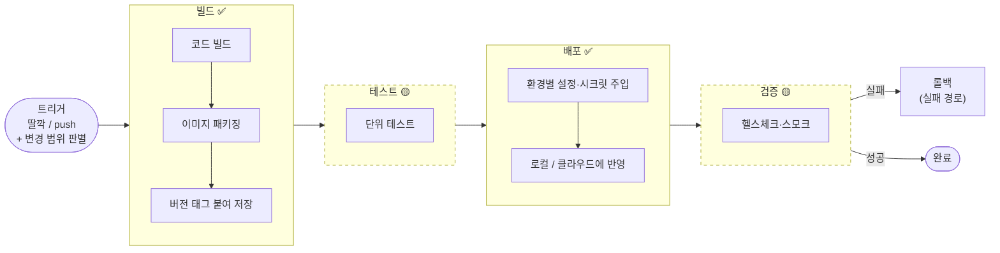
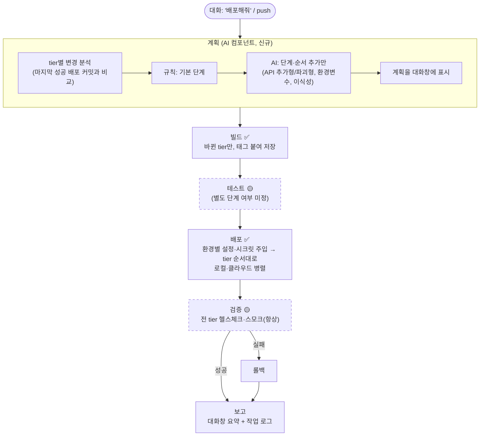

# 04. 파이프라인 컴포넌트 (도구·서비스 선택 전 단계)

> **이 문서의 범위:** "빌드에 Jenkins를 쓸지 CodeBuild를 쓸지"가 아니라 **"빌드"라는 컴포넌트를 넣을지**만 정합니다. 도구·서비스 같은 세부 디테일은 컴포넌트가 확정된 뒤에 정합니다.
> 전제: 배포 대상은 🟡 3tier(Web/WAS/DB). [03](03_아키텍처-3tier.md) 참고.
> 표기: ✅ 확정 / 🟡 사실상 필수(넣는 것을 권장) / 🔵 많이 쓰는 선택 / ⚪ 상황 의존 선택 / ⏸ 보류

> **9/30 확정:** 파이프라인은 **플랜 → 검증 → 빌드 → 배포 → 검증 및 보고**입니다. 단위·통합 테스트는 시간 문제로 제외했고, 로컬(스테이징) 스모크를 관문으로 씁니다. 최신 툴 목록은 [images/02_component-tools.png](images/02_component-tools.png)를 보세요.

## 0. 두 가지 수준을 구분합니다 (2026-09-29 정정)

초판에서는 "파이프라인 단계"와 "단계 안의 기능"을 한 표에 섞어 두었습니다. 이 문서에서 **컴포넌트 = 파이프라인에 끼워넣는 단계(박스)**이며, 빌드·배포·SAST·DAST와 같은 수준입니다.

| 수준 | 의미 | 예 |
|---|---|---|
| **컴포넌트(단계)** | 파이프라인에 박스로 끼워넣는 것 | 빌드, 테스트, 배포, 검증, (보류) SAST·DAST |
| **내부 기능** | 컴포넌트 안에서 반드시 해야 하는 일. 따로 끼워넣지 않음 | 빌드 안의 "이미지에 버전 태그 붙여 저장", 배포 안의 "환경별 설정 주입" |
| **파이프라인 공통 속성** | 특정 단계가 아니라 파이프라인 전체에 걸린 것 | 트리거(시작점), 동시 배포 잠금, 알림, 작업 로그 |

## 1. 결론 요약

### 1-1. 컴포넌트(단계)

| 분류 | 컴포넌트 | 메모 |
|---|---|---|
| ✅ 필수 (확정) | **빌드**, **배포** | |
| 🟡 별도 단계로 둘지 결정 필요 | **테스트**, **검증(배포 후 확인)** | 빌드·배포 안에 넣어도 되고 따로 빼도 됨. GitLab CI는 기본 단계가 build → test → deploy로 테스트를 따로 둠. AWS DPRA는 단위 테스트를 Build 안에 둠 |
| ⚪ 상황 의존 | 통합·E2E·성능 테스트, DB 마이그레이션, 수동 승인, 인프라 구축(IaC 적용, 별도 파이프라인 권장), 비용 추정, 드리프트 검사 | 3절 참고 |
| ⏸ 보류 → [05](05_향후-개발-목표.md) | 시크릿 탐지, SAST, SCA, IaC 스캔, 이미지 스캔, SBOM, 서명·프로비넌스, 정책 게이트, DAST, 런타임 보안 | |

### 1-2. 컴포넌트 안에 반드시 들어갈 내부 기능 (체크리스트)

| 속한 컴포넌트 | 내부 기능 | 필수도 |
|---|---|---|
| (시작점) | 소스·트리거: push 또는 "딸깍"으로 파이프라인 시작 | 🟡 모든 파이프라인에 있음 |
| (시작점 직후) | 변경 범위 판별: Web인지 WAS인지 | 🔵 3tier에서 유용 |
| 빌드 | 코드 빌드 → 이미지 패키징 → **버전 태그를 붙여 저장** | 🟡 롤백·"한 번 빌드, 여러 환경 배포"의 전제 |
| 빌드 | 빌드 캐시 | 🔵 데모 시간 확보 |
| 빌드 또는 테스트 | 단위 테스트 | 🟡 |
| 배포 | **환경별 설정·시크릿 주입**: 이미지에 굽지 않고 배포 시점에 넣음 | 🟡 3tier 환경 차이 흡수의 핵심 |
| 배포 또는 검증 | 헬스체크·스모크 | 🟡 |
| 배포 또는 검증 | **롤백**: 정상 흐름이 아니라 확인 실패 시에만 도는 경로 | 🟡 |

### 1-3. 파이프라인 공통 속성 (🔵 선택)

알림, 작업 로그·배포 이력(킥오프 예시), 동시 배포 잠금(킥오프 예시), 모니터링 연동·배포 마커(킥오프 예시)

**"사실상 필수"로 분류한 근거:**
- AWS Deployment Pipeline Reference Architecture(DPRA)는 애플리케이션 파이프라인을 Source → Build → Test(Beta) → Test(Gamma) → Prod 순으로 둡니다.
  - Build 단계: "Build Code", "Unit Tests", "Package and Store Artifact(s)"
  - Source 단계: "Static Configuration"
  - Prod 단계: "Monitoring and rollback capabilities"
  - ([DPRA](https://aws-samples.github.io/aws-deployment-pipeline-reference-architecture/application-pipeline/), 2026-09-29 확인)
- GitLab Auto DevOps도 Build → Test → … → Deploy 순서입니다([GitLab](https://docs.gitlab.com/topics/autodevops/stages/)).
- 배포 후 확인과 롤백은 배포 방식과 관계없이 최소형으로 먼저 깔 수 있습니다(스모크 실패 → 이전 버전 재배포).

## 2. 파이프라인 흐름 (배포 방식과 무관한 추상 흐름)

큰 박스가 컴포넌트(단계)이고, 박스 안의 항목이 내부 기능입니다. 점선 박스는 별도 단계로 둘지 아직 정하지 않은 것입니다.

- 테스트·검증을 별도 단계로 두지 않으면, 단위 테스트는 빌드 안으로, 헬스체크·롤백은 배포 안으로 들어갑니다.
- 알림·작업 로그는 파이프라인 전체에 걸린 공통 속성입니다(선택).
- 배포 단계 전체를 **동시 배포 잠금**으로 감쌉니다(선택).
- **빌드 캐시**는 빌드 단계 안의 최적화입니다(선택).
- **배포 방식**(블루그린/카나리/롤링 등)은 "배포" 박스 안의 세부이며 추후 결정합니다.

## 3. 컴포넌트별 상세

소요 시간은 조사 기반 **추정**이며 실측이 필요합니다. "통합 노력"은 4일 개발 기준 추정(신뢰도 낮음)입니다.

### ✅ 필수

| 컴포넌트 | 하는 일 | 실행 시간(추정) | 배포 방식 의존성 |
|---|---|---|---|
| **빌드** | 소스 → 실행 가능한 아티팩트(tier별 컨테이너 이미지 등) | 캐시 사용 시 수십 초, 캐시 없이 분 단위 | 무관 |
| **배포** | 아티팩트를 로컬·클라우드 대상에 반영 | 대상·방식에 따라 수 초~수 분 (미측정) | **이 컴포넌트 자체가 방식 선택을 포함** (추후 결정) |

### 🟡 사실상 필수 내부 기능 (별도 단계가 아니라 빌드·배포 등에 포함 — 1-2 참고)

| 컴포넌트 | 하는 일 | 왜 사실상 필수인가 | 실행 시간(추정) | 통합 노력(추정) | 배포 방식 의존성 |
|---|---|---|---|---|---|
| **소스·트리거** | 코드 변경(push) 또는 "딸깍"(수동 실행)으로 파이프라인을 시작 | 모든 파이프라인의 시작점 (DPRA Source 단계) | 0 | 낮음 | 무관 |
| **단위 테스트** | 함수·모듈 단위 회귀 방지 | DPRA Build 단계에 포함. 깨진 코드가 배포로 넘어가는 것을 막는 최소 장치 | 수 초~1분 | 샘플에 테스트가 있으면 0.5시간 | 무관 |
| **아티팩트 저장·버전 관리** | 빌드 결과를 변하지 않는 태그(예: git SHA)로 저장 | 롤백 대상 식별의 전제. **같은 아티팩트를 로컬·클라우드에 배포**할 수 있게 함("한 번 빌드, 여러 환경 배포" → 포터빌리티) | 수 초 | 0.5시간 | 무관 (모든 방식의 전제) |
| **환경별 설정·시크릿 주입** | 환경마다 다른 값(DB 접속 정보, WAS 주소 등)을 배포 시점에 주입 | 3tier에서는 WAS→DB, Web→WAS 연결이 환경마다 다름. **환경 차이 흡수(클라우드 30점)의 핵심 지점.** DPRA도 Source에 "Static Configuration", 테스트 환경에 시크릿 관리 자격증명을 둠 | 수 초 | 1~2시간 (추정) | 무관 |
| **배포 후 확인 (헬스체크·스모크)** | 배포 직후 핵심 경로(Web 응답, WAS `/health`의 DB 연결)가 실제로 동작하는지 확인 | "배포 성공 ≠ 기능 동작"이라는 실무 불만의 최소 해결책. 심사 기준 "누구나 접근"도 이 단계에서 확인 가능 | 수 초~30초 | 0.5~1시간 | 약함 (블루그린·카나리면 전환 전 새 버전에, 교체 방식이면 배포 후에 실행) |
| **롤백** | 확인 실패 시 이전 버전으로 복귀 | DPRA Prod의 "rollback capabilities". 최소형(이전 태그 재배포)은 배포 방식과 무관하게 먼저 구현 가능 | 대상에 따라 수 초~수 분 | 최소형 1~2시간, 플랫폼 기본 기능 연동은 2~6시간 | **강함** (고도화는 방식 결정 후) |

### 🔵 많이 쓰는 선택 (내부 기능 또는 공통 속성)

| 컴포넌트 | 하는 일 | 넣을 이유 | 실행 시간(추정) | 통합 노력(추정) | 배포 방식 의존성 |
|---|---|---|---|---|---|
| **변경 범위 판별** | 바뀐 tier(Web/WAS)를 판별해 해당 tier만 빌드·배포 | 3tier에서 파이프라인이 "판단"할 거리를 만듦. 불필요한 빌드를 줄여 데모 시간 확보. 모노레포 경로 필터는 흔한 실무 기법 (일반 지식, 별도 검증 안 함) | 수 초 | 0.5~1시간 | 무관 |
| **빌드 캐시** | 이미지 레이어·패키지 캐시 | 3분 데모 시간 확보의 핵심. 현장 네트워크 변수 대비 | (빌드 시간 단축) | 0.5~1시간 | 무관 |
| **통합 테스트** | tier 간 연동 검증 (WAS↔DB 등) | 3tier 연결을 배포 전에 확인. 로컬 Compose에서 먼저 통과시킨 뒤 클라우드로 보내는 흐름이 가능 | 1~3분 | 2~4시간 | 무관 |
| **알림** | 시작·성공·실패를 팀 채널로 통지 | 데모에서 진행 상황을 보여주는 보조 수단 | 수 초 | 0.5시간 | 무관 |
| **작업 로그·배포 이력** | 누가·언제·무엇을·어디에 배포했고 결과가 어땠는지 기록 | **킥오프 예시 "작업 로그"에 직접 대응** | 수 초 | 1~2시간 | 무관 |
| **동시 배포 잠금** | 여러 명이 동시에 배포할 때 충돌 방지 | **킥오프 예시 "여러 명 동시 안전 배포"에 직접 대응.** 비용이 가장 낮음. 세부 단계 주의: CI 도구에 따라 동시 실행 제어의 기본값이 "대기 중인 이전 실행을 취소"라서, 순서대로 배포하려면 대기열 설정이 따로 필요함(GitHub Actions는 `queue: max`) | 0 | 0.5~1시간 | 무관 |
| **모니터링 연동·배포 마커** | 배포 시점을 지표 타임라인에 표시, 대시보드 | **킥오프 예시 "모니터링"에 대응.** 나중에 자동 롤백의 판단 입력이 됨 | 수 초 | 1~3시간 (대시보드 포함) | 약함 (카나리 분석·알람 롤백을 택하면 필수 입력) |

### ⚪ 상황 의존 선택

| 컴포넌트 | 하는 일 | 판단 메모 |
|---|---|---|
| 린트·코드 품질 | 코드 스타일·명백한 오류 조기 차단 | DPRA Build에 포함되지만 배포 시스템 평가에는 기여가 작음 |
| E2E 테스트 | 사용자 시나리오를 브라우저로 끝까지 검증 | 실행 1~5분, 통합 3~6시간(추정). 데모에는 스모크로 충분할 가능성이 큼 |
| 성능·부하 테스트 | 응답 시간·처리량 회귀 탐지 | 카나리 같은 점진 배포를 택하면 판단 신호로 가치가 커짐 → 배포 방식 결정 후 판단 |
| DB 마이그레이션 | 스키마 변경을 배포와 함께 적용 | DB 스키마를 고정하면 제외 가능. 두 버전이 공존하는 방식에서는 확장 후 축소(expand-contract) 방식이 필요해 **배포 방식에 강하게 의존** |
| 수동 승인 게이트 | 운영 배포 전 사람 확인 | "원터치" 컨셉과 충돌할 수 있음 → 켜고 끄는 옵션으로만 고려 |
| 인프라 프로비저닝 (IaC 적용) | 네트워크·LB·DB 등 인프라 생성·변경 | 앱 파이프라인과 **분리된 인프라 파이프라인**으로 두는 것이 실무 전형. 사전 프로비저닝 방향이면 데모 경로 밖 |
| 비용 추정 | 인프라 변경 시 월 비용 증감 예측 | IaC를 파이프라인에서 돌릴 때만 의미 있음. "AI 비용 대비 효과"와는 별개 |
| 환경 드리프트 검사 | 선언된 인프라와 실제 상태의 불일치 탐지 | 사전 프로비저닝 방향이면 가치가 올라감. "환경 차이 흡수" 서사와 연결 가능 |

## 4. 3tier 적용 매트릭스

| 컴포넌트 | Web | WAS | DB |
|---|---|---|---|
| 빌드 | ● 웹 이미지 (정적 파일 포함 시 프론트 빌드) | ● 앱 이미지 | – (미리 배포, 공식 이미지 사용) |
| 단위 테스트 | △ 프론트 테스트가 있으면 | ● | – |
| 아티팩트 저장·버전 | ● | ● | – |
| 환경별 설정·시크릿 주입 | ● WAS 주소 | ● DB 접속 정보 | ● 접속 정보를 WAS에 제공 |
| 배포 | ● | ● | – (수정 배포 방식) / △ (전체 배포 방식) |
| 배포 후 확인 | ● 첫 페이지 응답 | ● `/health` + DB 연결 | △ WAS 헬스체크로 간접 확인 |
| 롤백 | ● | ● | – (스키마 고정 전제) |
| 변경 범위 판별 | ● | ● | – |
| 통합 테스트 | △ Web→WAS | ● WAS→DB | △ |
| DB 마이그레이션 | – | △ | △ (스키마 고정이면 제외) |

● 적용 / △ 조건부 / – 해당 없음

## 5. 배포 방식과의 의존성 (나중에 같이 정할 것)

- **대부분의 컴포넌트는 배포 방식과 무관합니다.** 그래서 "컴포넌트 먼저, 방식은 나중"이라는 순서는 타당합니다.
- **방식이 정해져야 확정되는 것:**
  - 롤백의 고도화 방식
  - 배포 후 확인을 트래픽 전환 전에 할지 후에 할지
  - DB 마이그레이션 순서
  - 성능 테스트를 판단 신호로 쓸지
- **지금 고정할 것은 "입력과 출력(계약)"이고, 실행 위치·시점은 나중에 정합니다.**
  - 배포 후 확인: "URL을 받아 통과/실패를 돌려준다"
  - 롤백 최소형: "확인 실패 시 이전 버전 태그를 재배포한다"
- **방식보다 먼저(또는 동시에) 정하면 좋은 상위 전제 네 가지:**
  1. 아티팩트를 **컨테이너 이미지로 통일**할지
  2. 인프라를 **사전 프로비저닝**할지, 매 배포마다 IaC를 돌릴지
  3. 코드 저장소를 **공개**할지 (CI 서비스의 무료 기능 범위가 달라지고, 로컬 배포용 러너의 안전성과 맞바꿔짐)
  4. **"원터치 시스템"과 CI의 관계**: 자체 오케스트레이터나 AI 에이전트가 CI를 호출하는지, 스스로 파이프라인을 실행하는지
- **늦출 때의 위험:** 배포 방식이 마지막 날까지 밀리면 배포 후 확인·롤백 연결이 한꺼번에 몰립니다. 개발 2일차까지는 정하는 편이 안전해 보입니다(추측).

## 5-1. 3분 데모 시간 예산 (보안 컴포넌트 제외 기준)

> 모든 수치는 **추정**입니다. 실측으로 교체해야 합니다. 출처: [컴포넌트 조사 보고서 4장](../research/2026-09-29_파이프라인-컴포넌트-조사.md)

**핵심:** 3분을 가장 많이 쓰는 것은 부가 컴포넌트가 아니라 **기본 CI/CD 자체**(파이프라인 기동 대기, 빌드, 배포)입니다.

| 항목 | 중간값(추정) | 메모 |
|---|---:|---|
| 결과 보여주기 + 트리거 조작 | 30초 | 파이프라인에 쓸 수 있는 시간은 180 − 30 = **150초** |
| 트리거 + 실행 환경 할당 | 20초 | 호스티드 CI 기준 10~40초(벤더 수치, 미확인). 붐비는 시간대에는 더 늦을 수 있음 |
| 체크아웃·준비 | 10초 | |
| 빌드 + 저장 (캐시 적중) | 45초 | 캐시가 없으면 1~3분 |
| 단위 테스트 | +0초 | 빌드와 병렬로 돌리면 핵심 경로에 더해지지 않음 |
| **배포 (D)** | **변수** | 로컬·클라우드에 병렬로 배포하면 **가장 느린 쪽**이 D |
| 배포 후 확인 | 10초 | |

- 합계: **약 85초 + D.** 150초 안에 들어가려면 **D가 약 60초 이하**여야 합니다.
- 결론: **부가 컴포넌트를 논의하기 전에 D(대상별 배포 시간)와 실행 환경 할당 시간을 먼저 재야 합니다.**
- 시간을 버는 수단:
  - 빌드 캐시와 베이스 이미지를 사전 준비
  - 변경된 tier만 빌드(변경 범위 판별)
  - 한 번 빌드한 이미지를 여러 대상에 병렬 배포
  - 배포 방식을 고를 때 "트래픽을 받기 전 새 버전을 검증할 수 있는가"를 평가 기준에 넣기(확인과 배포 시간을 겹칠 수 있음)
- 규칙 확인 필요: 설계문서 2분 발표를 시작할 때 파이프라인을 미리 눌러 두는 것이 허용되면 가용 시간이 크게 늘어납니다. 운영진 확인 전에는 전제하지 마세요.

## 6. AI가 붙을 수 있는 자리 (💭 후보 메모, 결정 아님)

AI 활용 10점과 차별화를 위해 **나중에** 검토할 지점입니다. 지금은 컴포넌트 선정에 영향을 주지 않습니다.
- 변경 범위 판별: 경로 규칙으로 부족한 경우(공통 코드 변경 등) 영향 tier 분류
- 환경별 설정: 로컬 설정과 클라우드 설정의 차이를 찾아 누락 경고
- 배포 후 확인: 결과·로그를 해석해 원인 유형 분류와 설명
- 작업 로그: 배포 결과 요약 보고서 작성

기존 제품과의 중복 여부는 [06](06_리서치-요약.md)을 참고하세요.

## 6-1. 고려안 A 기준 컴포넌트 구성안 (💭 초안, 2026-09-29)

> 전제: 회의에서 나온 "AI에게 대화로 '배포해줘'라고 하면 파이프라인이 자동으로 돌아 배포된다"를 입구로 두고, [09](09_선택적-Step-실행-판정.md)의 고려안 A를 계획 단계로 얹은 구성입니다.

- **"대화로 배포해줘"는 입구(트리거)입니다.** push와 같은 파이프라인을 탑니다. 대화 배포 자체는 차별점이 아닙니다(AWS ECS MCP, Qovery, 2025 Kube Garden). "배포해줘" 다음에 AI가 무엇을 판단하느냐가 차별점입니다.
- **AI가 고르는 것은 "단계와 순서"이지 "도구"가 아닙니다.** 컴포넌트별 도구는 설계 단계에서 고정하고, 실행은 고정된 워크플로가 결정적으로 합니다. LLM이 클라우드 API를 직접 호출하지 않습니다.

**컴포넌트별 AI 역할: "실행에서는 빼고, 판단·해석·설명에만"**

| 컴포넌트 | AI 역할 | 결정 주체 |
|---|---|---|
| 계획 | **핵심.** 변경 분석 → 단계·순서 추가 | 규칙이 기본 단계, AI는 추가만 |
| 빌드 · 테스트 · 배포 | 없음 | 고정 워크플로 (tier 순서는 계획을 따름) |
| 검증 | 선택: 실패했을 때만 원인 해석(로그 분류·설명) | 합격/불합격과 롤백 여부는 규칙(헬스체크·스모크) |
| 보고 | 결과를 대화창에 요약 | – |

- **예외:** 07 문서 안 1(앱 코드 이식성)을 채택하면, 계획이 빌드 앞에 "이식성 수정" 단계를 추가하고 그 단계에서 AI가 패치를 만듭니다. 패치 검증은 빌드·테스트가 결정적으로 합니다.
- **이렇게 나누는 이유:**
  - 3분 데모의 재현성
  - "규칙으로 되는 곳에 AI를 안 썼다 / AI에게 실행 권한은 없다"는 심사 답변
  - "AI 비용 대비 효과": 배포 1회당 AI 호출은 계획 1회 + 보고 1회(실패하면 진단 1회 추가). 호출 횟수와 비용을 작업 로그에 기록합니다.

**오케스트레이션 구성 비교 (💭)**

원래 구상은 "컴포넌트의 상세 기능(도커 빌드, 도커 배포 등)을 MCP 도구로 만들고, 순서는 스킬로 정해 두고, LLM이 도구를 순서대로 호출"하는 것이었습니다.
- 순서가 스킬로 고정돼 있으면, LLM은 판단을 추가하지 않고 호출마다 지연·비용·오류 가능성만 더합니다.
- LLM이 가치를 내는 곳은 순서가 정해져 있지 않은 **계획** 단계입니다.

| 구성 | 내용 | 판단 |
|---|---|---|
| (a) 원래 구상 | LLM이 스킬을 보고 MCP 도구를 순서대로 호출 | 데모 재현성이 가장 낮고, 판단 없이 LLM을 씀. ECS MCP·Kube Garden·Daisy와 같은 구조 |
| (b) | MCP 도구는 그대로 만든다. LLM은 실행 계획(JSON)만 세우고, **결정적 실행기가 계획대로 같은 MCP 도구를 호출** | 도구층 재사용. 정상 경로가 결정적 |
| (c) | (b)에 더해, 대화창 AI도 같은 MCP 도구로 상태 조회·롤백 등을 처리 | "대화로 배포" UX를 유지하면서 실행 권한은 통제 |

역할 정리: **MCP 도구 = 컴포넌트 상세 기능 / 스킬 = 계획이 지켜야 할 규칙·정책 / 실행 = 결정적 실행기**

**Jev 배치 후보 (💭)**

Jev는 선택지·예/아니오·점수를 반환하는 빠른 판단 모델이고, 문장은 만들지 않습니다.

| 위치 | 질문 예시 | 메모 |
|---|---|---|
| 대화 입구 | 요청 의도: 배포 / 롤백 / 상태 / 기타 | Vercel이 비슷한 예제를 공개함(차별점 아님) |
| 계획 | tier별 "API 변경: 없음 / 추가형 / 파괴형", "스키마: 없음 / 추가형 / 파괴형", "새 환경변수: 실행 시 / 빌드 시", "영향 tier" | 가장 잘 맞는 자리 |
| 검증 | 실패 유형(코드 / 설정 / 의존성 / 용량 / 인프라), "롤백으로 해결되나" | 롤백 여부 자체는 규칙이 결정 |
| 보고 | 부적합 | 문장 생성이 필요해 LLM |

- 분류는 Jev, 설명·보고·패치는 LLM으로 나누면 "AI 비용 대비 효과"를 수치로 보여줄 수 있습니다.
- 질문은 좁게 쪼개서 설계합니다. 서드파티 테스트에서 단일 질문은 62.6%, 좁은 질문 5개로 분해하면 95.0%였습니다.
- 공개 2주 차라 한국에서의 지연·한도는 [미확인]입니다. 규칙만으로도 동작하는 대체 경로가 필수입니다.

**AI 적용을 정하는 순서**

컴포넌트별 상세 기능 → 판단 지점 식별 → 판단 지점마다 다음으로 분류합니다.
- 규칙으로 결정 가능 → 규칙
- 정해진 보기 중 선택 → Jev
- 문장·코드 생성이 필요 → LLM

**이 구성에서 확정할 것**
1. [계획]을 AI 컴포넌트로 넣을지 (고려안 A 채택 여부)
2. [테스트]·[검증]을 별도 단계로 둘지
3. DB 마이그레이션을 배포 안의 조건부 단계로 넣을지, "DB 미리 배포 + 스키마 고정"을 유지할지
   - 스키마 고정을 유지하면 AI 판단 예시를 "API 추가형/파괴형 + 환경변수 반영"으로 좁힙니다.
4. [보고]를 대화창 요약 컴포넌트로 둘지, 알림·작업 로그 공통 속성으로만 둘지

## 7. 다음 단계

1. 회의에서 🟡·🔵 중 넣을 컴포넌트 확정
2. 컴포넌트별 세부 디테일(도구·서비스) 선정
   - CI 실행 주체(CI 서비스 vs 자체 오케스트레이터/AI 에이전트)
   - 아티팩트 저장소를 하나로 둘지 클라우드별로 둘지
   - 저장소 공개 여부(무료 기능 범위가 달라짐)
3. 샘플 앱으로 빌드·배포 시간 실측 → 3분 데모 시간 예산 배분
4. 배포 방식·전환 결정 (5절의 의존 항목 함께 확정)

## 출처

- AWS DPRA 애플리케이션 파이프라인: https://aws-samples.github.io/aws-deployment-pipeline-reference-architecture/application-pipeline/
- GitLab Auto DevOps 단계: https://docs.gitlab.com/topics/autodevops/stages/
- 컴포넌트 조사 보고서(2026-09-29, 보안 포함 전체 메뉴·시간 예산·체크리스트): [../research/2026-09-29_파이프라인-컴포넌트-조사.md](../research/2026-09-29_파이프라인-컴포넌트-조사.md)
