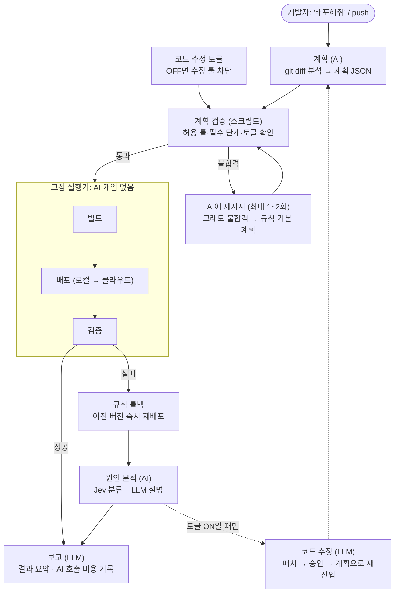

# 10. 전체 흐름 초안: AI 계획 → 결정적 실행 → AI 분석 (💭 초안, 2026-09-29)

> **AI 사용 경계 (중요):** 우리가 만드는 것은 MCP 서버입니다. 하지만 "LLM이 쓸 때마다 툴을 골라 호출하는 MCP"가 아닙니다.
> - 툴은 처음에 MCP 명세(이름·입력 스키마·출력)로 **미리 정의**하고, 배포 실행 때는 **실행기(코드)가 계획 JSON 순서대로 호출**합니다.
> - **③ 빌드 · ④ 배포 · ⑤ 검증 실행, 롤백, 잠금 = AI 없음(결정적 코드).**
> - AI가 들어가는 곳은 6곳뿐입니다: `analyze_project`(Jev 분류) · `generate_plan`(LLM 계획) · `patch_*` 3개(LLM 코드 패치, 토글 ON일 때만) · `diagnose_parity_gap`(Jev 분류 + LLM 설명) · `post_report`(LLM 요약, 선택) · `call_ai`(AI 호출 관문).


> 파이프라인(✅ 9/30): **플랜 → 검증 → 빌드 → 배포 → 검증 및 보고**. 단위·통합 테스트는 제외하고, 로컬(스테이징) 스모크를 클라우드 배포의 관문으로 씁니다.
> 원칙: **AI는 판단·해석·설명에만 씁니다. 실행은 고정 실행기가 합니다.**
> SSL/TLS(✅ 9/30, 클라우드 필수): ④ 배포에 `ensure_tls`, ⑤ 검증에 `verify_tls`가 **cloud 대상** 규칙 필수 단계로 들어갑니다(둘 다 AI 없음, local은 "보류(해당 없음)" 반환). 기준은 [03](03_아키텍처-3tier.md) 7절.

## 1. 흐름



## 2. 단계별 역할

| 단계 | 누가 | 입력 → 출력 | AI 개입 |
|---|---|---|---|
| 요청 | 개발자 | 대화창 "배포해줘" 또는 push | – |
| 계획 | AI | git diff(tier별 마지막 성공 배포 커밋과 비교) → 미리 정한 툴 이름으로 된 계획 JSON | 있음 |
| 계획 검증 | 스크립트 | 계획 JSON → 통과/불합격 | 없음 |
| 빌드·배포·검증 | 고정 실행기 | 계획대로 툴을 순서대로 호출 | 없음 |
| 롤백 | 규칙 | 검증 실패 → 이전 버전 즉시 재배포 | 없음 |
| 분석·보고 | AI | 로그·결과 → 대화창 보고 (분류는 Jev, 설명은 LLM) | 있음 |
| 코드 수정 | AI | 토글 ON일 때만 패치 생성 → 승인 → 계획부터 재실행 | 있음 |

## 3. 계획 검증 스크립트가 확인하는 것

1. JSON 스키마가 맞는가
2. 모든 툴 이름이 **허용 목록**에 있는가
3. 규칙이 요구한 단계가 빠지지 않았는가 (AI는 단계를 **추가만** 가능. 예: `ensure_tls`·`verify_tls`는 cloud 대상 필수(local은 보류 반환), `smoke_test`는 대상별 필수)
4. 토글이 OFF인데 코드 수정 툴이 들어 있지 않은가
5. 계획에 `domain`·`host`·`url`·`zone` 계열 키가 있으면 불합격 (클라우드 도메인은 관리 페이지 설정에서만 들어옴)
6. 불합격이면 이유를 붙여 재지시(최대 1~2회) → 그래도 불합격이면 **규칙 기본 계획으로 대체**

- git diff는 AI에게 **신뢰할 수 없는 입력**입니다. 코드 주석을 이용한 프롬프트 인젝션이 가능하므로, 이 스크립트가 방어선입니다.

## 4. 코드 수정 토글

| 상태 | 동작 |
|---|---|
| OFF (데모 기본값 권장) | 코드 수정 툴을 AI의 툴 목록에서 **제거** + 검증 스크립트가 계획에 그 툴이 있으면 **불합격** (이중 차단) |
| ON | 패치를 브랜치/PR로 만들고 대화창에서 **승인** → 계획부터 같은 파이프라인 재실행 → 재시도 상한(예: 2회) |

- 자동 수정은 3분 안에 매번 성공한다고 보장할 수 없습니다(2026-09-29 검토). ON은 별도 장면으로 보여주거나, 이전 실행 결과라고 밝히고 보여줍니다.

## 5. 계획 JSON 예시 (형식 초안, 툴 이름은 미정)

> 9/29 형식 초안입니다. 테스트 단계는 9/30에 제외했고(`run_unit_tests` 삭제), 현재 단계 흐름과 예시는 [17](17_골든패스-시나리오.md)(작성 중)을 기준으로 합니다.

```json
{
  "change_summary": "WAS 응답에 필드 추가, 새 환경변수 PAYMENT_TIMEOUT",
  "affected_tiers": ["was", "web"],
  "steps": [
    {"tool": "build_image", "tier": "was", "by": "rule"},
    {"tool": "sync_env_to_cloud", "tier": "was", "by": "ai",
     "reason": "새 환경변수를 WAS가 실행 시 읽는데 클라우드 시크릿에 없음"},
    {"tool": "deploy", "tier": "was", "targets": ["local", "cloud"], "by": "rule"},
    {"tool": "deploy", "tier": "web", "targets": ["local", "cloud"], "by": "ai",
     "reason": "응답 필드 추가는 하위 호환 → WAS 다음에 Web"},
    {"tool": "smoke_all_tiers", "targets": ["local", "cloud"], "by": "rule"}
  ],
  "confidence": 0.82,
  "fallback": "full_run_if_invalid"
}
```

- `by` 필드로 규칙 판정과 AI 추가 판정을 구분합니다. 데모 계획 화면과 판정 로그에 그대로 씁니다.
- 툴 이름(`build_image`, `deploy` 등)은 컴포넌트별 세부 디테일을 정할 때 확정합니다.

## 6. 툴 파라미터 설계 원칙 (💭, 2026-09-29)

**파라미터는 정의합니다. 대신 값의 출처를 넷으로 나눕니다.**

| 출처 | 예시 | 언제 | 누가 채우나 |
|---|---|---|---|
| ① 프로젝트 설정 파일 (`deploy.yaml` 등) | tier 목록, tier별 경로·Dockerfile·포트·헬스 경로, 레지스트리, 리전, 배포 대상, 빌드 방식 | 프로젝트마다 한 번 | 사람 (초안은 AI 가능) |
| ② 실행 컨텍스트 | 커밋 SHA, 바뀐 tier, 이미지 태그·digest, 마지막 성공 SHA, 실행 ID | 매 배포 | 실행기 (git·이력에서 계산) |
| ③ 계획 JSON | 툴·순서·대상 tier, AI 추가 단계(예: 동기화할 설정 키 이름) | 매 배포 | LLM·Jev → 검증 스크립트 |
| ④ 관리 페이지 프로젝트 설정 | `cloud_domain`, `dns_mode`, `hosted_zone_id` | 프로젝트마다 한 번(데모 전) | **사람만 쓰기.** 실행기가 실행 시작 때 스냅샷해 ② 실행 컨텍스트로 주입 |

- **"어떤 프로젝트든"은 ① 덕분에 가능합니다.** 툴은 프로젝트를 모르고 설정 파일만 읽습니다.
- **툴 스키마는 좁게 정의합니다.** 예: `build_image(tier: enum, target: enum)`.
  - enum 값은 설정 파일에서 자동으로 생성합니다.
  - SHA·레지스트리·CodeBuild 프로젝트 이름은 스키마에 넣지 않고 툴 내부에서 ②·①로 채웁니다.
- **값 우선순위:** 계획 인자(허용 목록 안에서만) → 실행 컨텍스트 → 설정 파일 → 기본값. 계획 인자가 컨텍스트와 충돌하면 검증 스크립트가 불합격시킵니다. **도메인은 계획 인자 경로가 없습니다**(④ → ② 실행 컨텍스트로만).
- **위험한 옵션은 노출하지 않습니다.** 빌드 명령 재정의, 실행 역할(IAM) 재정의 같은 옵션을 툴 인자로 열지 않습니다. git diff를 통한 프롬프트 인젝션을 막기 위해서입니다.

| 방식 | 결과 |
|---|---|
| 파라미터 없이 하드코딩 | 샘플 앱 하나에서만 동작. 다른 프로젝트나 tier에 재사용 불가 |
| 모든 파라미터를 LLM이 채움 | 유연하지만 값 환각·인젝션 위험, 데모 재현성 낮음 |
| **좁은 파라미터 + 설정 파일 + 실행 컨텍스트** | 설정 파일만 바꾸면 어떤 프로젝트에도 적용. LLM은 판단할 것만 정함 |

**설정 파일 예시**

```yaml
project: shop
tiers:
  web: { path: web/, dockerfile: web/Dockerfile, port: 80,   health: /version.json }
  was: { path: was/, dockerfile: was/Dockerfile, port: 8080, health: /health }
  db:  { managed: true, engine: postgres }
targets:
  local: { runtime: compose }
  cloud: { provider: aws, region: ap-northeast-2, registry: ecr, build: codebuild }
```
- 클라우드 도메인은 `deploy.yaml`이 아니라 관리 페이지 설정에서 실행 컨텍스트로 들어옵니다. ALB·리스너 ARN과 허용 호스팅 영역은 Terraform 출력에서 옵니다. AI는 채우지도 바꾸지도 않습니다([03](03_아키텍처-3tier.md) 7-2).

**환경별로 다른 작업은 "툴 하나 + 환경별 어댑터"로 (예: DB)**

| 층 | 무엇 | 환경별로 다른가 | 구현 | 선택 주체 |
|---|---|---|---|---|
| ① 파이프라인 DB 작업 | DB 준비 확인, 스키마 적용, 백업, 데이터 이관, 연결 정보 주입 | 다름 (SQLite 파일 vs RDS API) | 툴 하나 + 환경별 어댑터 | **실행기** (설정 파일의 `engine`) |
| ② 앱의 DB 접근 | 서비스 실행 중 조회·저장 | 드라이버·방언이 다름 | 앱 코드 (ORM 또는 공용 SQL) | 앱 자체. 안 되어 있으면 AI가 한 번 패치 |

```
prepare_db(target)  local(sqlite) → 볼륨 파일 확인, 컨테이너에서 마이그레이션
                    cloud(postgres) → 시크릿 참조, RDS 상태 확인, VPC 안 일회성 태스크로 마이그레이션
backup_db(target)   local → 파일 복사   |   cloud → RDS 스냅샷(boto3)
```

- 계획 JSON에는 `{"tool": "prepare_db", "target": "cloud"}`만 들어가고, 실행기가 설정 파일을 보고 해당 어댑터로 보냅니다.
- DB별 툴을 AI가 직접 고르게 하지 않는 이유:
  - 설정 파일로 이미 정해진 일이라 AI가 판단할 게 없음
  - 잘못 고를 위험만 생김
  - 새 DB를 추가할 때 어댑터만 더하면 됨(확장성)
  - 데모 재현성
- **AI의 DB 관련 역할:** DB 작업이 필요한가(스키마 변경 여부) / 변경이 안전한가(확장형 vs 파괴형) / 앱 코드가 두 DB에서 도는가(패치) / 마이그레이션 도구가 없을 때 DB별 DDL 생성 / 실패·불일치 원인 분류와 설명.

**(💭 후보) 초기 설정 단계:** 새 프로젝트를 연결할 때 AI가 저장소를 분석해 `deploy.yaml` 초안(tier 구성, 포트, 헬스 경로, 필요한 환경변수 키)을 만들고, 사람이 확인해 커밋합니다. 한 번만 하고 사람이 검토하므로 위험이 작고, 3분 데모 경로 밖에서 돌 수 있습니다. 주제 문구 "코드를 분석해 인프라 환경까지"와도 연결됩니다.

**클라우드 빌드 서비스(예: CodeBuild)를 쓸 때**

| 구분 | 방법 |
|---|---|
| 설치 (프로젝트·IAM 역할·빌드 환경·권한·캐시) | 한 번, Terraform으로 정의. 콘솔로 만들지 않음 (재현성) |
| 실행 (매 배포) | Python + boto3 툴: 빌드 시작 → 상태 폴링 → digest·로그 수집 |

- 3분 데모에서는 빌드 환경을 띄우는 시간 때문에 로컬 빌드가 더 빠를 수 있습니다. 두 구현을 같은 `build_image` 뒤에 두고 실측으로 고릅니다.

**검증된 사실 (2026-09-29, 원문 확인):** [../research/2026-09-29_CodeBuild-MCP-툴-검증.md](../research/2026-09-29_CodeBuild-MCP-툴-검증.md)

| 항목 | 확인 결과 |
|---|---|
| 콘솔 설정을 코드로? | **가능.** Terraform `aws_codebuild_project`로 프로젝트·역할·이미지·privileged·캐시를 모두 정의할 수 있음. 예외는 GitHub CodeConnections 최초 승인(콘솔에서 한 번) |
| 빌드 시작 API의 재정의 옵션 | `sourceVersion`, `environmentVariablesOverride`, `buildspecOverride`, `imageOverride`, `privilegedModeOverride`, `serviceRoleOverride`, `computeTypeOverride` 등 20개 이상. 재정의는 그 빌드 1회에만 적용 |
| `buildspecOverride` 위험 | **빌드 명령을 통째로 바꿀 수 있어 서비스 역할 권한으로 임의 명령 실행과 같음.** AWS 문서가 직접 경고함. 툴에서 노출하지 않고, IAM에서도 조건 키(`codebuild:source.buildspec` Null)로 Deny 가능. `sourceVersion`·타임아웃은 IAM 키가 없어 툴 코드에서 검증 |
| 상태·로그 조회 | `batch_get_builds`로 단계별(PROVISIONING, BUILD 등) 상태·소요 초, CloudWatch 로그 위치 조회 가능 |
| 빌드 시작 대기(PROVISIONING) | 공식 수치 없음. 커뮤니티 사례로는 최신 기본 이미지면 수십 초, 구형·커스텀 이미지면 1.5~5분. **자기 환경에서 실측 필요** |
| 대기를 없애는 예약 용량(fleet) | 있음. 대신 상시 과금(작은 인스턴스 1대 월 약 $130, 가격 페이지 예시). **서울 리전은 지원 목록에 없음**(도쿄는 있음) |
| Lambda 컴퓨트 | 도커 이미지 빌드 불가 → 이미지 빌드에는 못 씀 |
| 도커 레이어 캐시 | 로컬 캐시는 같은 호스트일 때만 적중(보장 없음, privileged 필요, VPC 구성 시 미지원). **ECR을 buildx 원격 캐시로 쓰면 호스트가 달라도 적중.** 원격 Docker Server 기능(2025-05)도 있으나 VPC 필요·추가 비용 |
| AWS 공식 CodeBuild MCP 서버 | **없음**(awslabs/mcp 기준). 범용 `aws-api-mcp-server`(CLI 문자열을 LLM이 채움)나 ECS MCP의 `build_and_push_image_to_ecr` 정도 → 직접 좁은 툴을 만드는 게 맞음 |
| MCP 인자 채우기 | 사양상 도구는 "모델이 호출"하고 인자는 LLM이 채움. 단, **서버가 모든 입력을 검증해야 함(MUST).** enum은 모델 측 strict 모드로 강제 가능하지만 pattern은 서버 검증 필수. enum 안에서 어떤 값을 고를지는 여전히 인젝션 대상 |

**그래서 툴 구현 원칙은:**
1. 인프라(프로젝트·역할·캐시)는 Terraform으로 한 번 고정합니다.
2. 툴은 Python + boto3로 `start_build` → `batch_get_builds` 폴링 → 로그 요약만 합니다.
3. 툴 인자는 `tier`·`target`(enum) 정도만 받습니다. `projectName`·`sourceVersion`은 코드가 채우고, 위험한 재정의는 노출하지 않으며 IAM에서도 막습니다.
4. 실행기가 부를 때는 계획 JSON과 컨텍스트로, 대화창 AI가 부를 때는 enum 안에서만 인자를 받고 서버가 검증합니다.
