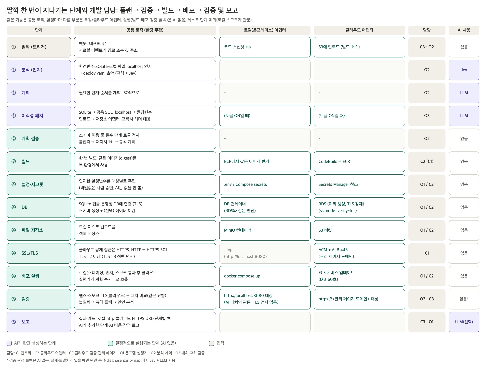
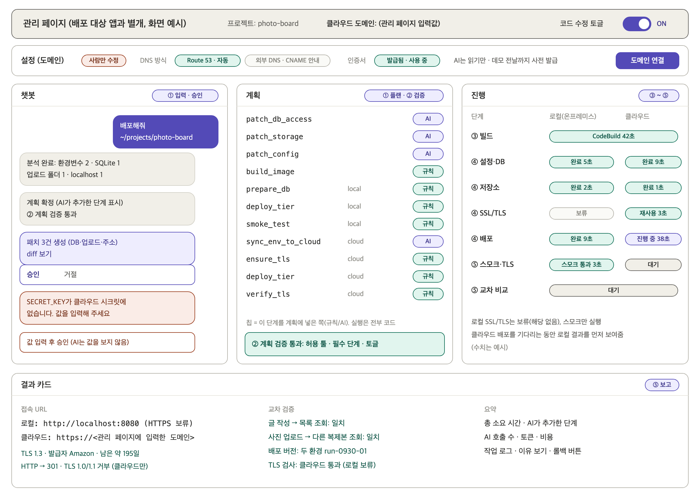

# 15. 파이프라인 단계별 개발 매핑과 예시 (💭 초안, 2026-09-30)

> ⚠ 사진 게시판 예시는 골든 패스 결정(9/30) 이전 예시입니다. 현재 기준은 [17](17_골든패스-시나리오.md)입니다.

> **AI 사용 경계 (중요):** 우리가 만드는 것은 MCP 서버입니다. 하지만 "LLM이 쓸 때마다 툴을 골라 호출하는 MCP"가 아닙니다.
> - 툴은 처음에 MCP 명세(이름·입력 스키마·출력)로 **미리 정의**하고, 배포 실행 때는 **실행기(코드)가 계획 JSON 순서대로 호출**합니다.
> - **③ 빌드 · ④ 배포 · ⑤ 검증 실행, 롤백, 잠금 = AI 없음(결정적 코드).**
> - AI가 들어가는 곳은 6곳뿐입니다: `analyze_project`(Jev 분류) · `generate_plan`(LLM 계획) · `patch_*` 3개(LLM 코드 패치, 토글 ON일 때만) · `diagnose_parity_gap`(Jev 분류 + LLM 설명) · `post_report`(LLM 요약, 선택) · `call_ai`(AI 호출 관문).


> 주제: "로컬에서 만든 앱을 딸깍 한 번으로 로컬(온프레미스)과 클라우드에 동시에 배포하면서, 환경 차이로 깨지는 부분은 AI가 고치고, 두 환경이 똑같이 동작하는지 교차 검증까지 끝내는 파이프라인"
> 담당 약칭은 [14](14_역할-분담.md)를 따릅니다: C1 인프라 · C2 클라우드 어댑터 · C3 클라우드 검증·관리 페이지 · O1 온프렘·실행기 · O2 분석·계획 · O3 패치·교차 검증

## 1. 핵심 원칙: "같은 기능 = 공통 로직 + 환경별 어댑터"

"환경변수 인식 → 주입"이나 "SQLite → 운영형 DB 이식"은 로컬이든 클라우드든 **같은 기능**입니다. 그래서 두 부분으로 나눕니다.
- **공통 로직 (환경 무관):** 인지, 계획, 코드 패치, 검증 판정. AI가 들어가는 곳입니다.
- **어댑터 (환경별):** 실제로 무엇을 띄우고 어디에 넣는지. 결정적으로 실행합니다.

| 같은 기능 | 공통 로직 | 로컬(온프레미스) 어댑터 | 클라우드 어댑터 |
|---|---|---|---|
| 환경변수 인식 → 주입 | 코드에서 키를 찾아 비밀/일반/주소, 실행 시/빌드 시로 분류 | `.env` / Compose secrets | Secrets Manager 참조 |
| SQLite → 운영형 DB 이식 | SQLite 인지 → 앱 코드를 `DATABASE_URL` 기반으로 패치 → 스키마 | Postgres(또는 MySQL) 컨테이너 | RDS (미리 생성) |
| 로컬 파일 저장 → 객체 저장소 | 업로드 코드 인지 → 저장소 어댑터로 패치 | MinIO 컨테이너 | S3 버킷 |
| localhost 하드코딩 → 환경별 주소 | 하드코딩 인지 → 환경변수로 패치 | Compose 서비스명(`http://was:5000`, 내부 통신). 접속 주소는 `http://localhost:8080` | 상대 경로 `/api` (공개 주소는 `https://<관리 페이지 입력 도메인>`) |
| **HTTPS (SSL/TLS)** | 클라우드 공개 접근은 HTTPS, 80→301 리다이렉트, TLS 1.2 이상(TLS13 정책 명시). 앱은 ALB 뒤 헤더(X-Forwarded-Proto) 처리(클라우드만) | ⏸ 보류 (`http://localhost:8080`) | ACM 인증서 + ALB 443 (관리 페이지 도메인, `ensure_tls`가 발급·연결) |
| 실행 | 같은 이미지(digest) | `docker compose up` | ECS 서비스 업데이트 |
| 검증 | 같은 스모크 시나리오 + 결과 비교 + TLS 검사(클라우드) | `http://localhost:8080` 대상 (TLS 검사 없음) | `https://<관리 페이지 입력 도메인>` 대상 |

## 2. 딸깍 한 번이 지나가는 단계와 담당

> 파이프라인(✅ 9/30): **플랜(0~3) → 검증(계획 검증) → 빌드(4) → 배포(6~9) → 검증 및 보고(10~11)**. 단위·통합 테스트는 제외했습니다.
> **관리 페이지(C3)는 특정 단계가 아니라 모든 단계에 걸쳐** 입력·승인·진행·결과 화면을 제공합니다. 단계별 화면은 [5절](#5-관리-페이지-단계별로-보여주는-것과-개발-내용)에 있습니다.



| # | 단계 | 공통 로직 | 로컬 어댑터 | 클라우드 어댑터 | 담당 |
|---|---|---|---|---|---|
| 0 | 딸깍 (트리거) | 챗봇 "배포해줘" + 로컬 디렉토리 경로 또는 깃 주소 | 코드 스냅샷 zip | S3에 업로드(빌드 소스) | C3 · O2 |
| 1 | 분석 (인지) | 환경변수·SQLite·로컬 파일·localhost 인지 → `deploy.yaml` 초안 (규칙 + Jev) | – | – | O2 |
| 2 | 계획 | 필요한 단계·순서를 계획 JSON으로(AI) → 계획 검증 스크립트 | – | – | O2 |
| 3 | 이식성 패치 | SQLite → 공용 SQL·`DATABASE_URL`, localhost → 환경변수, 업로드 → 저장소 어댑터 (LLM, 토글 ON) | – | – | O3 |
| 4 | 빌드 | 한 번 빌드, 같은 이미지를 두 환경에서 사용 | ECR에서 같은 이미지 받기 | CodeBuild → ECR | C2 (C1) |
| 6 | 설정·시크릿 | 인지한 환경변수를 대상별로 주입 (비밀값은 사람 승인, AI는 값을 안 봄) | `.env` / Compose secrets | Secrets Manager 참조 | O1 / C2 |
| 7 | DB | 운영형 DB에 연결(TLS), 스키마 생성 + (선택) 데이터 이관 | Postgres(또는 MySQL) 컨테이너 | RDS (미리 생성, TLS 강제·`sslmode=verify-full` + `global-bundle.pem`) | O1 / C2 |
| 8 | 파일 저장소 | 로컬 디스크 업로드를 객체 저장소로 | MinIO 컨테이너 | S3 버킷 | O1 / C2 |
| 8-1 | SSL/TLS | 인증서·443·80→301·DNS 연결 (`ensure_tls`, AI 없음, cloud 필수) | ⏸ 보류(해당 없음) | (route53) A 별칭 먼저 → ISSUED 재사용/발급 → 443 생성·연결 → HSTS → 80→301. external이면 CNAME 안내·승인 | C1 |
| 9 | 배포 | 로컬(스테이징) 통과 후 클라우드, 실행기가 계획 순서대로 호출 | `docker compose up` | ECS 서비스 업데이트 (D ≤ 60초) | O1 / C2 |
| 10 | 검증 | 헬스·스모크·TLS 검사(`verify_tls`) → 교차 비교 → 불일치 시 규칙 롤백 → 원인 분석(Jev + LLM) | `http://localhost:8080` 대상 (TLS 검사 없음) | `https://<관리 페이지 입력 도메인>` 대상 | O3 · C3 (TLS: C3) |
| 11 | 보고 | 결과 카드: 로컬 http URL + 클라우드 HTTPS URL, TLS 결과는 클라우드만(버전·발급자·남은 일수), 단계별 초, AI가 추가한 단계, AI 비용, 작업 로그 | – | – | C3 · O1 |

## 3. 예시: "사진 게시판" 앱을 딸깍 한 번으로 배포

**입력 앱 (개발자가 로컬에서 만든 상태)**
- Web: 정적 화면. API 주소를 `http://localhost:5000`으로 하드코딩
- WAS: Flask. `sqlite3`로 `app.db`에 직접 SQL(`?` 자리표시자, `datetime('now')`), 업로드 사진을 `./uploads`에 저장
- 설정: `.env`에 `SECRET_KEY`
- 헬스체크 엔드포인트 없음

### 0. 딸깍
관리 페이지 챗봇에 "배포해줘" + `~/projects/photo-board` 입력 → 코드를 zip으로 묶어 S3에 업로드 (실행 ID `run-0930-01`)

### 1. 분석 결과 (예시)
```json
{
  "tiers": {
    "web": { "path": "web/", "port": 80 },
    "was": { "path": "was/", "port": 5000, "health": null },
    "db":  { "engine": "sqlite", "file": "was/app.db" }
  },
  "env": [
    { "key": "SECRET_KEY",   "kind": "secret",  "when": "runtime", "tier": "was" },
    { "key": "API_BASE_URL", "kind": "address", "when": "build",   "tier": "web",
      "local_value_hint": "http://localhost:5000" }
  ],
  "findings": [
    { "type": "sqlite_raw_sql",      "file": "was/db.py",     "detail": "? 자리표시자, datetime('now')" },
    { "type": "local_file_storage",  "file": "was/upload.py", "detail": "./uploads에 저장" },
    { "type": "hardcoded_localhost", "file": "web/src/api.js" },
    { "type": "no_health_endpoint",  "tier": "was" }
  ]
}
```

### 2. 계획 JSON (예시, 발췌)
> `ensure_tls`·`verify_tls`는 cloud 대상 필수 단계라 항상 규칙(`rule`)으로 들어갑니다(로컬 HTTPS는 보류라 local 단계 없음). AI는 단계를 **추가**만 할 수 있고, 계획 검증 스크립트가 필수 단계 누락을 막습니다.
```json
{
  "steps": [
    { "tool": "patch_db_access",   "by": "ai",   "reason": "SQLite 전용 SQL → DATABASE_URL 기반 공용 SQL" },
    { "tool": "patch_storage",     "by": "ai",   "reason": "로컬 디스크 업로드 → 저장소 어댑터" },
    { "tool": "patch_config",      "by": "ai",   "reason": "localhost 하드코딩 → 환경변수, /health 추가" },
    { "tool": "build_image",       "by": "rule", "tier": "was" },
    { "tool": "build_image",       "by": "rule", "tier": "web" },
    { "tool": "inject_env_config", "by": "rule", "target": "local" },
    { "tool": "prepare_db",        "by": "rule", "target": "local" },
    { "tool": "prepare_storage",   "by": "ai",   "target": "local", "reason": "업로드가 발견되어 저장소 필요" },
    { "tool": "deploy_tier",       "by": "rule", "target": "local" },
    { "tool": "smoke_test",        "by": "rule", "target": "local" },
    { "tool": "sync_env_to_cloud", "by": "ai",   "reason": "SECRET_KEY가 클라우드 시크릿 저장소에 없음 → 승인 요청" },
    { "tool": "prepare_db",        "by": "rule", "target": "cloud" },
    { "tool": "prepare_storage",   "by": "ai",   "target": "cloud" },
    { "tool": "ensure_tls",        "by": "rule", "target": "cloud" },
    { "tool": "deploy_tier",       "by": "rule", "target": "cloud" },
    { "tool": "smoke_test",        "by": "rule", "target": "cloud" },
    { "tool": "verify_tls",        "by": "rule", "target": "cloud" },
    { "tool": "compare_env_results", "by": "rule" }
  ]
}
```

### 3. 이식성 패치 (예시, 개념)
| 파일 | 변경 전 | 변경 후 |
|---|---|---|
| `was/db.py` | `sqlite3.connect("app.db")`, `?` 자리표시자, `datetime('now')` | `DATABASE_URL`로 연결, 공용 자리표시자, `CURRENT_TIMESTAMP` |
| `was/upload.py` | `./uploads`에 파일 저장 | 저장소 어댑터(`STORAGE_ENDPOINT`, `STORAGE_BUCKET`)로 저장 |
| `web/src/api.js` | `http://localhost:5000` | 실행 시 설정(`/api` 또는 `API_BASE_URL`) |
| `was/app.py` | – | `/health`(DB 연결 포함) 추가 |
| `was/app.py` (HTTPS 대응) | ALB 뒤에서 요청을 `http`로 인식, 리다이렉트 URL이 `http://` | `ProxyFix`(`X-Forwarded-Proto` 신뢰)·세션 쿠키 `Secure`는 클라우드 환경 플래그로만 켬 |

→ 테스트 단계가 없으므로, 패치는 **빌드 성공 + 로컬(스테이징) 배포 후 스모크 통과**를 거쳐야 클라우드로 진행합니다. 승인은 대화창에서 받습니다.

### 6~9. 환경별 결과
| 항목 | 로컬(온프레미스) | 클라우드 |
|---|---|---|
| `SECRET_KEY` | `.env` → Compose secret | Secrets Manager 참조 (값은 사람이 승인해 입력) |
| DB | SQLite → Postgres 컨테이너 + 스키마 (+ 선택: `app.db` 데이터 이관) | RDS Postgres + 스키마 (+ 선택: 이관, VPC 안 일회성 태스크), 연결은 TLS(`sslmode=verify-full` + `global-bundle.pem`) |
| 업로드 | `./uploads` → MinIO | S3 버킷 |
| API 주소 | `http://was:5000` (Compose 서비스명, 내부 통신) | `/api` (ALB 경로 규칙, 내부는 VPC 안 HTTP) |
| SSL/TLS | ⏸ 보류(해당 없음) | ALB 443에서 종료, ACM 인증서, 80→301, `ELBSecurityPolicy-TLS13-1-2-Res-PQ-2025-09` |
| 실행 | `docker compose up` (같은 이미지) | ECS 서비스 (같은 이미지, 복제본 2개) |
| 접속 | `http://localhost:8080` | `https://<관리 페이지 입력 도메인>` |

### 10. 교차 검증 (예시)
| 검사 | 로컬 | 클라우드 | 판정 |
|---|---|---|---|
| 글 작성 → 목록 조회 | 200, 1건 | 200, 1건 | 일치 |
| 사진 업로드 → 다른 복제본에서 조회 | 200 | 200 | 일치 (패치 전 클라우드는 404: 로컬 디스크 저장 때문) |
| 헬스 + 배포 버전 | `run-0930-01` | `run-0930-01` | 일치 |
| TLS (`verify_tls`) | ⏸ 보류(해당 없음) | TLS 1.3, 인증서 유효(남은 약 195일: ACM 유효기간 198일, 10/1 발급 기준 추정), `http://` → 301 | 클라우드만 합격 판정 (환경 고유 값이라 비교 대상 아님) |

불일치가 나면 해당 환경만 규칙으로 롤백합니다. 이어서 AI가 원인을 분류·설명하고, 토글 ON이면 패치 → 계획부터 재실행합니다.

### 11. 보고
결과 카드에 다음을 표시합니다: 로컬 http URL + 클라우드 HTTPS URL, TLS 결과는 클라우드만(버전·발급자·남은 일수·리다이렉트), 단계별 소요 초, AI가 추가한 단계 6개와 이유, AI 호출 3회·토큰·비용, 작업 로그.

## 4. 결정할 점: 로컬 DB를 무엇으로 할지

| 선택지 | 장점 | 단점 |
|---|---|---|
| **로컬도 운영형 DB 컨테이너 (클라우드와 같은 엔진, 예: 둘 다 Postgres)** | 두 환경이 같은 방식으로 이식되어 "같은 기능, 어댑터만 다름"이 명확함. 개발/운영 일치 원칙에 맞음 | DB 엔진 차이로 생기는 불일치(예: LIKE 대소문자)는 데모 소재에서 빠짐 → 교차 검증 데모는 업로드·복제본 불일치 같은 다른 결함으로 보여줌 |
| 로컬은 SQLite 유지, 클라우드만 RDS | "apple 검색" 같은 엔진 차이 불일치를 데모로 보여주기 쉬움 | 개발/운영 불일치(12-factor가 경고하는 구성)를 일부러 남기는 셈 |

- 고려안: 사용자 제안대로 **로컬도 DB 컨테이너**로 올리고, 클라우드와 **같은 엔진**(Postgres 또는 MySQL 중 하나)으로 맞춥니다.
- RDS는 둘 다 지원합니다.
- 교차 검증 데모는 "사진이 다른 복제본에서 안 보임"처럼 매번 똑같이 재현되는 결함으로 구성합니다.


## 5. 관리 페이지: 단계별로 보여주는 것과 개발 내용

관리 페이지는 **배포 대상 웹앱과 별개의 앱**입니다(별도 컨테이너·포트). 딸깍의 시작부터 끝까지 사용자가 보는 유일한 화면이고, 3분 데모의 주 무대입니다. 담당은 C3이고, 실행기(O1)와 이벤트 형식을 맞춥니다.



### 5-1. 단계별 화면

| 단계 | 관리 페이지 화면·기능 | 받는 데이터 (출처 툴) | 사용자 동작 |
|---|---|---|---|
| 설정 (도메인) | 도메인 입력·저장·형식 검증, DNS 방식(Route 53 / 외부 DNS), "도메인 연결" 버튼, 인증서 상태(요청됨·검증 대기·발급됨·사용 중·실패). 데모 전에 한 번 | 프로젝트 설정 저장소, `ensure_tls`·`verify_tls`(도메인 연결 run), `DescribeCertificate`(읽기) | 도메인 입력(사람만, AI는 읽기만), 도메인 연결 실행 |
| ① 딸깍 | 챗봇 입력창: "배포해줘" + 로컬 디렉토리 경로 / 깃 주소. 코드 수정 토글 | – | 요청, 토글 ON/OFF |
| ① 분석 | 분석 요약 카드: 환경변수·DB·로컬 파일·localhost 인지 결과, `deploy.yaml` 초안 | `analyze_project` | (처음 연결할 때) 확인·수정 |
| ① 계획 | 계획 패널: 단계 목록, 규칙/AI 배지, AI가 추가한 이유 | `generate_plan` (계획 JSON) | 확인 |
| ① 패치 | 패치 diff 보기 + 승인/거절 (토글 ON일 때) | `patch_db_access` · `patch_storage` · `patch_config` | 승인/거절 |
| ② 검증 | 계획 검증 결과: 통과 / 불합격 이유 / 규칙 계획으로 대체했는지 | `validate_plan` | – |
| ③ 빌드 | 진행 패널: 빌드 상태와 소요 초 | 진행 이벤트 (`stream_progress`) | – |
| ④ 배포 | 로컬·클라우드 2열 진행(설정·DB·저장소·SSL/TLS·배포). 클라우드 시크릿 누락 시 **값 입력 요청**(비밀값은 사람이 입력, AI는 보지 않음). 외부 DNS면 검증 CNAME 안내·승인 대기. 로컬 SSL/TLS는 "보류" 표시 | 진행 이벤트, `request_approval`, `sync_env_to_cloud` | 비밀값 입력·승인 |
| ⑤ 검증 | 스모크·TLS·교차 비교 결과. 불일치 시 롤백 표시와 원인 분석 | `smoke_test`, `verify_tls`, `compare_env_results`, `diagnose_parity_gap` | (토글 ON) 수정 패치 승인 |
| ⑤ 보고 | 결과 카드: 로컬 http URL + 클라우드 HTTPS URL, TLS 결과(클라우드만), 교차 검증 표, 단계별 초, AI 호출·토큰·비용, 작업 로그, 수동 롤백 버튼 | `record_deploy_log`, `post_report` | 로그 보기, 수동 롤백 |

### 5-2. 개발 내용

| 구분 | 내용 |
|---|---|
| 화면 | 도메인 설정, 챗봇, 계획 패널, 진행 패널(로컬·클라우드 2열, 실시간), 승인·값 입력 카드, 결과 카드, (선택) 배포 이력 |
| 백엔드 연동 | 실행기 API: 배포 요청 제출, 계획 조회, 승인 응답, 로그 조회, 프로젝트 설정(도메인) 저장·조회(관리자 인증 경로만), "도메인 연결" 실행, 인증서 상태 조회 / 진행 이벤트 스트림(SSE 또는 WebSocket) |
| 이벤트 형식 (14 문서 약속 #5) | `{"run_id":"run-0930-01","stage":"deploy","tool":"deploy_tier","target":"cloud","status":"running","elapsed_s":38,"by":"rule"}` |
| 데모 관점 | 한 화면에서 3분 흐름 전체를 보여줌. 클라우드 배포를 기다리는 동안 로컬 결과를 먼저 표시. 캐시·이전 기록을 쓰면 라벨로 표시 |
| 분리 원칙 | 배포 대상 웹앱과 섞지 않음 (관리 페이지는 배포 대상이 아님) |
