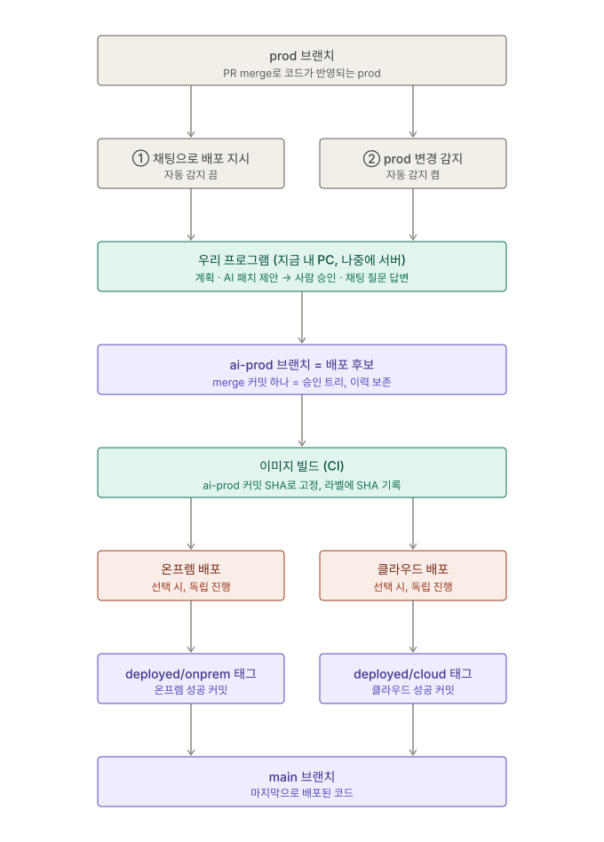

# 20. 트리거 개편: 로컬 폴더 → git 브랜치 기준 (2026-10-01 저녁, 회의용)

> 결정자: 정준우. 상태: ✅ 방향 확정 / 세부 구현은 아래 "바뀌는 것" 순서대로.
> **📌 10/1 밤 회의:** 브랜치 이름 `prod`(개발자) → `ai-prod`(후보) → `main`(배포된 코드), 환경별 기록은 태그 `deployed/onprem`·`deployed/cloud`. 온프렘·클라우드 대기 지점 제거(독립 진행, 교차 검증은 둘 다 성공 시).
> 그림: [assets/20_트리거-흐름.svg](assets/20_트리거-흐름.svg)

## 한 줄 요약

배포할 코드의 기준을 **개발자 PC의 로컬 폴더에서 GitHub 저장소의 prod 브랜치로** 바꾼다. 개발자는 PR merge로 prod에 코드를 반영하고(prod는 브랜치 보호로 직접 push 금지), 우리 프로그램이 prod를 보고 파이프라인을 돌리며, 성공한 코드는 `main`(실제 배포된 코드)에 반영되고 환경별 기록은 태그(`deployed/onprem`, `deployed/cloud`)로 남는다.

## 왜 바꾸나

| 이전(로컬 폴더 배포)의 문제 | git 브랜치 기준이면 |
|---|---|
| 각자 로컬 코드로 배포해서 남의 기능을 지울 수 있음 | 늘 prod 최신 커밋(팀 작업이 합쳐진 코드)이 나감 |
| PC마다 변경 탐지·롤백 기준이 다름 | 기준이 git과 환경(이미지 라벨) 쪽으로 옮겨감 |
| 운영 코드와 저장소 코드가 어긋남 | 배포한 것 = 특정 커밋. 추적·재현 가능 |
| "노트북에서 운영에 바로 쏘는 것 아니냐" | 기업 흐름(개발 → push → CI/CD)과 같은 모양 |
| 여러 사람이 쓰기 어려움 | 프로그램을 서버에 올리면 팀원은 접속만 해서 사용 |

## 흐름

1. 개발자가 **PR을 prod에 merge해 코드를 반영**한다. prod는 브랜치 보호로 직접 push하지 않는다. 데모에서는 **v2 PR을 prod에 merge**한다.
2. 파이프라인 시작은 두 가지다.
   - **① 수동:** 자동 감지를 끄고, 관리 페이지 채팅에 "prod를 클라우드에 배포해줘"처럼 지시한다.
   - **② 자동:** 자동 감지를 켜면 prod에 새 커밋이 생길 때 파이프라인이 시작된다(원격 브랜치를 10~30초마다 확인, webhook 불필요).
   - 두 방식 모두 **승인 관문은 그대로**다. 자동 감지는 "자동 배포"가 아니라 "자동 시작"이다.
3. 우리 프로그램이 계획을 세우고, 환경 차이(localhost 등)를 고치는 **AI 패치를 제안 → 사람이 승인**한다.
4. **ai-prod 브랜치 = 배포 후보:** 기존 ai-prod에 prod SHA를 merge한 뒤 관리 대상 파일을 **승인된 build_files 전체 트리**와 맞춰 승인 트리를 고정한 merge 커밋 하나를 만들고 일반 push한다. merge 충돌은 기록만 남기고 승인 트리로 해결한다. 재사용 패치가 새 prod에 맞지 않으면 승인 전에 민영님이 재제안한다. 패치 OFF는 prod 그대로여서 이전 AI 패치가 빠진다(**10/2 수정 라운드, 정준우 확인 필요**). `.env.example`·`.env.sample` 및 prod의 deploy.yaml env_example 경로는 prod 내용을 유지하며 비밀검사에는 포함한다.
5. **이미지 빌드(CI):** ai-prod 브랜치의 **그 run 커밋 SHA**로 고정해 멀티 아키텍처 이미지를 빌드하고(브랜치 이름으로 빌드하면 승인 중에 브랜치가 움직여 다른 코드가 빌드될 수 있음), 이미지 라벨에 커밋 SHA를 남긴다.
6. **배포(CD):** run마다 대상을 고른다(**온프렘만 / 클라우드만 / 둘 다**).
   - 둘 다면 온프렘·클라우드 두 트랙을 **독립적으로** 진행한다. 한쪽이 다른 쪽을 기다리는 대기 지점이 없고, 환경별로 따로 롤백한다(✅ 10/1 밤 분리). 둘 다 성공하면 마지막에 교차 검증을 돌린다.
   - 하나만이면 교차 검증은 건너뛴다.
7. **배포 기록:** 배포·검증에 성공한 환경의 기록을 그 커밋에 **태그**로 남긴다(`deployed/onprem`, `deployed/cloud`). 롤백 기준이 된다. 실제로 배포된 코드는 `main`이며 파이프라인만 갱신한다. 태그와 `main`은 배포 트리거가 아니라 **기록**이다.
   - 릴리스 기록에는 `source_sha`(그 run에 쓴 prod 커밋)와 `candidate_sha`(빌드·배포한 ai-prod 커밋)를 둘 다 남긴다. 다음 run의 변경 탐지는 새 prod 커밋을 환경별 마지막 성공 `source_sha`와 비교한다(패치가 들어간 `deployed/<환경>` 태그와 비교하지 않음). `deployed/<환경>` 태그와 이미지 라벨은 `candidate_sha`(실제로 도는 코드)를 가리킨다.
   - `main`은 그 run이 선택한 대상이 모두 성공했을 때만 이동한다. 한쪽만 성공하면 그 환경 태그만 이동하고 `main`은 그대로다(💭 정준우 확인).
   - 온프렘·클라우드는 독립 진행이므로 한쪽이 실패해도 다른 쪽은 끝까지 진행하고, 실패한 쪽만 롤백한다(✅ 분리 결정의 결과).
8. **채팅 질문:** "지난 배포 왜 실패했어?", "지금 클라우드에 뭐가 떠 있어?", "AI가 뭘 바꿨어?" 같은 질문에 답한다(읽기 전용). 배포 지시는 의도 JSON → 코드 검증 → 같은 승인 흐름으로만 들어간다.

## 정한 것

### 앱 저장소 전환 가이드 (실제 Git 조작 없음)

사용자 전달상 `2026-Gerbera/gerbera-application`은 현재 `dev` 브랜치 하나이고 README는 옛 설계입니다. 실시간 조회로 확인한 상태는 아닙니다. 전환 시 담당자는 `dev` 기준으로 `prod`를 만들고, `ai-prod`·`main`의 초기 기준을 맞춰 생성한 뒤 기본 브랜치를 `prod`로 바꿉니다. 이후 개발 변경은 PR로 `prod`에 반영하고, 후보·배포 기록은 파이프라인이 관리합니다.

옛 `prod/onprem`·`prod/cloud` 브랜치가 있으면 Git ref 이름 충돌로 `prod`를 생성할 수 없습니다. 담당자가 기존 기록을 보존하면서 해당 ref를 정리한 뒤 전환해야 합니다. 환경별 기록은 브랜치를 추가하지 않고 `deployed/*` 태그만 사용합니다. 이번 작업에서는 생성·전환·삭제를 실행하지 않습니다.

제품은 `validate_infra` → `plan_infra` → 한 화면의 infra 승인 → foundation(state bucket + app/build 권한 경계) → platform apply 순서로 실행합니다. bucket이 없으면 local backend plan을 승인한 뒤 코드가 SDK로 bucket을 만들고 platform local apply 후 remote backend로 state를 이전합니다. 사람이 미리 foundation/platform을 apply하는 전제는 폐기합니다. 사람의 사전 준비는 AWS 자격증명과 도메인 구매입니다. AI 개발 에이전트는 Terraform을 직접 실행하지 않으며, 승인 뒤 제품 코드가 실행하는 경로와 구분합니다. 실제 생성기의 O2 연결은 아직 미완이고 AWS 전체 완료를 의미하지 않습니다.

💭 v2 기능은 미정이며 로그인은 후보입니다. 정준우의 10/2 검증은 1차 Flask 기본 앱에 이미지·박스를 추가한 파이프라인 E2E, 2차 실제 로직의 LLM 분석·패치·인프라 생성 검증으로 나눕니다. 1차 결과로 실제 LLM·AWS 전체 완료를 주장하지 않습니다.

| 항목 | 결정 |
|---|---|
| 입력 | GitHub 저장소 + 브랜치(기본 prod). 데모 저장소는 **공개**(읽기 인증 불필요) |
| 실행 위치 | 지금은 정준우 로컬 PC. 나중에 서버로 옮김 |
| 배포 대상 | run마다 선택(온프렘 / 클라우드 / 둘 다). "둘 다 동시"는 대회 데모의 선택이지 제품 제약이 아님 |
| 브랜치 | `prod`(개발자) → `ai-prod`(배포 후보, 파이프라인 전용, 승인 트리를 고정한 merge 커밋 하나로 이력 보존) → `main`(실제 배포된 코드, 파이프라인 전용). 환경별 롤백 기록은 태그 `deployed/onprem`·`deployed/cloud` |
| 승인 | 우리 관리 페이지에서 한 번(기존 원칙 유지) |
| 시작 방식 | 수동 채팅 지시 + 자동 감지(켜고 끄기) |
| 로컬 폴더 입력 | 개인 시험용으로 남겨도 됨(실행기는 입력이 폴더라 그대로) |

## 지킬 것

앱 저장소 보호 규칙(팀 개발 저장소 규칙과 구분):

- **prod만** PR merge 필수, force push 금지, 삭제 금지로 보호한다.
- **main·ai-prod**는 파이프라인이 직접 push하므로 브랜치 보호를 걸지 않는다.
- **deployed/* 태그**는 `--force-with-lease`로 옮기므로 태그 보호 규칙을 걸지 않는다.

- **공개 저장소라 비밀값이 커밋되면 바로 유출이다.** ai-prod의 AI 패치는 "환경변수에서 읽게 바꾸는 코드"만 담고, 실제 값(SECRET_KEY 등)은 절대 담지 않는다. 패치 검사기에서 막는다.
- **브랜치 push에는 쓰기 권한이 필요하다.** 개인 PC 모드에서는 사용자 본인의 git 인증을 쓴다. 커밋에 AI attribution을 넣지 않는다.
- **동시 실행 잠금은 아직 없다.** 테스트 기간에는 "공유 환경(온프렘 VM·ECS) 배포는 한 번에 한 명, 채팅방에 알리고"로 운영한다.
- 사람은 ai-prod에 직접 커밋하지 않는다(파이프라인만 커밋). 잘못된 패치는 승인 내용을 고쳐 새 후보를 만든다.

## 추후 개발 (지금 안 함)

- 동시 실행 잠금(서버로 옮기면 컨트롤러가 하나라 로컬 잠금으로 해결)
- 서버 모드: 웹 로그인, LLM은 `api`만(구독 CLI 금지), 서버의 자격증명과 온프렘까지 네트워크 경로
- AI 패치도 인프라 변경도 없는 단순 배포의 자동 승인 옵션
- ai-prod → prod 되돌림 PR(개발자 코드에 패치 반영)

## 바뀌는 것 (담당, 10/1 저녁)

> 원칙(정준우 결정): **이미 누군가 맡아 진행 중인 영역의 확장은 그 사람에게 신규 기능으로** 주고, **완전히 새로운 기능만 정준우**가 맡는다. 남의 일을 가져오지 않는다.

| 일 | 담당 | 구분 |
|---|---|---|
| 요청 접수: 저장소 URL·브랜치를 임시 폴더로 가져오기(`git fetch` + `git archive`) | 김준석 | 기존 접수(intake)의 신규 기능 |
| 커밋 기준 변경 탐지(환경별 마지막 성공 `source_sha` ↔ 이번 prod 커밋) | 김준석 | 기존 변경 탐지(detect)의 신규 기능 |
| 계획 생성·검증이 run별 대상(온프렘만/클라우드만/둘 다)을 반영 | 김준석 | 기존 planner·validate_plan |
| 채팅 의도에 "대상 선택"·"질문" 추가, 질문 답변(읽기 전용) | 김준석 | 기존 채팅 의도·`call_ai`의 신규 기능 |
| AI 패치 내용 생성·비밀값 검사(prod 최신에 바로 적용되는 diff) | 장민영 | 기존 |
| 샘플 앱을 새 공개 GitHub 저장소 prod 브랜치 기준으로 | 장민영 | 기존 샘플 앱 |
| 빌드 소스를 **ai-prod 브랜치**로 하되 CodeBuild `sourceVersion`에 파이프라인이 넘기는 **ai-prod 커밋 SHA**를 넣음(브랜치 이름은 움직이므로 승인한 코드와 빌드 코드를 일치시키려고), 이미지 라벨에 같은 SHA, 클라우드만 배포하는 run 지원 | 안승환 | 기존 빌드·ECS 배포의 신규 기능 |
| 프로젝트 설정(저장소 URL, 감시 브랜치, 자동 감지, 기본 대상)·대상 선택·채팅 질문 화면, 결과 카드에 커밋 SHA·환경별 기록 | 양서윤 | 기존 관리 페이지·설정의 신규 기능 |
| prod 브랜치 감시(자동 감지 켜고 끄기, 10~30초 확인) | **김준석** | 준석님 기존 watch.py가 prod를 감시(감시 브랜치를 main에서 prod로 바꾸는 건 준석님 요청) |
| ai-prod 갱신(prod merge → 승인 트리 확정 merge 커밋 → 일반 push, 충돌 목록 기록) | **정준우** | 실행기의 패치 적용 단계 확장(O1) |
| run별 대상에 맞춘 독립 트랙(대기 지점 없음)·교차 검증(둘 다 성공 시) 실행 규칙 | **정준우** | 실행기(O1) |
| 성공 시 환경별 태그 기록(`deployed/onprem`, `deployed/cloud`)·`main` 갱신, 이미지 라벨의 커밋 읽기 | **정준우** | 실행기 배포 기록(O1) |
| 추후 개발(동시 실행 잠금, 서버 모드, 단순 배포 자동 승인, ai-prod → prod 되돌림 PR) | **정준우** | 완전 신규, 지금 안 함 |

**정준우 작업 순서(권장):** ① 클라우드 실배포 한 번 통과(C1 고정 틀·검증·plan·apply + 승환 님 빌드) → ② ai-prod 후보 + 대상별 실행 규칙(데모 흐름에 꼭 필요) → ③ 준석님 감시 연동 → ④ 환경별 태그 기록·`main` 갱신. 클라우드 실배포가 점수 60점(완성도 30 + 클라우드 30)에 걸려 있어 가장 먼저다.

상세 문서 수정 목록은 별도로 정리한다.
