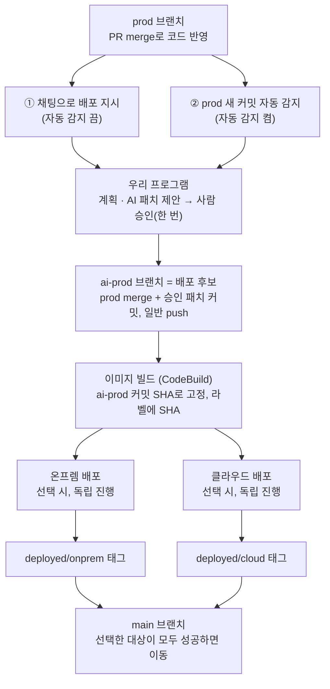

# 10월 1일 변경 사항과 각자 할 일

10/1 저녁 회의까지 정해진 내용입니다. 이 문서만 보고 바로 작업을 시작할 수 있게 정리했습니다.

## 0. 전체 흐름

1. 개발자가 **PR merge로 앱 저장소의 `prod`에 코드를 반영**합니다. prod는 브랜치 보호로 직접 push하지 않습니다.
2. 파이프라인 시작: **① 관리 페이지 채팅으로 지시**하거나, **② 자동 감지를 켜 두면 `prod`의 새 커밋을 보고 자동으로 시작**합니다.
3. 우리 프로그램이 계획을 세우고, 환경 차이(localhost, 하드코딩된 개발값 등)를 고치는 **AI 패치를 제안**합니다. 사람이 **한 화면에서 한 번 승인**합니다.
4. **`ai-prod` 브랜치**에 `prod`를 merge하고 승인된 패치를 커밋으로 얹어 push합니다. 이것이 배포 후보입니다.
5. **CodeBuild**가 `ai-prod`의 그 커밋 SHA로 멀티 아키텍처 이미지를 빌드해 Docker Hub에 올립니다.
6. run마다 고른 대상(**온프렘만 / 클라우드만 / 둘 다**)에 배포합니다. 둘 다면 **서로 기다리지 않고 독립적으로** 진행하고, 실패한 환경만 롤백합니다.
   - 온프렘: was VM의 앱 복제본 3개를 하나씩 교체(외부 공개는 Cloudflare Tunnel)
   - 클라우드: 필요하면 인프라 변경(시크릿·권한)을 승인된 plan대로 적용한 뒤 ECS 배포(HTTPS, `gerbera.cloud`)
7. 헬스·smoke 검사를 하고, 둘 다 성공했으면 **교차 검증**(두 환경의 실제 동작 비교)을 합니다.
8. 성공한 환경의 **`deployed/onprem`·`deployed/cloud` 태그**를 옮기고, 고른 대상이 모두 성공했으면 **`main`**을 옮깁니다. 결과 카드에 커밋 SHA, 두 공개 주소, AI가 바꾼 내용을 보여 줍니다.

## 1. 무엇이 바뀌었나

### 1-1. 배포할 코드의 기준: 로컬 폴더 → GitHub 저장소의 `prod` 브랜치

- 개발자는 **PR merge로 앱 저장소의 `prod`에 코드를 반영**합니다(prod 직접 push 금지). 이 브랜치가 배포할 코드의 기준입니다. (처음에는 `dev`라고 했다가, 개발 서버처럼 들려서 `prod`로 바꿨습니다.)
- 우리 프로그램은 `prod`를 보고 파이프라인을 돌립니다. 각자 PC의 로컬 코드를 배포하지 않습니다.
- 데모용 앱 저장소는 **공개 저장소**입니다. 읽을 때 인증이 필요 없고, 대신 **비밀값이 커밋되면 바로 유출**되니 절대 넣지 않습니다.
- 개인 시험용으로 로컬 폴더 입력은 남겨 둬도 됩니다.

### 1-2. 브랜치 흐름: `prod` → `ai-prod` → `main`

| 브랜치 | 역할 | 누가 커밋하나 |
|---|---|---|
| `prod` | PR merge로 코드가 반영되는 기준 브랜치(직접 push 금지) | 개발자 PR·merge |
| `ai-prod` | 배포 후보. `prod` merge 뒤 관리 파일을 승인 build_files와 맞춘 merge 커밋을 **일반 push**(강제 push 없음, 이력 보존) | 파이프라인만 |
| `main` | 실제로 배포에 성공한 코드 | 파이프라인만 |

- 이전 승인 패치의 재사용 여부와 새 `prod` 적합성은 민영님 단계에서 판단하고, 맞지 않으면 승인 전에 재제안합니다. 실행기는 그 run의 승인 트리만 배포합니다.
- merge 충돌 파일 목록은 기록만 남기고 승인 build_files로 확정합니다. 충돌 자체로 파이프라인을 멈추지 않습니다.
- 패치 OFF는 `prod` 원본 그대로이므로 이전 AI 패치가 빠집니다(**10/2 수정, 정준우 확인 필요**). 잘못된 패치는 승인 내용을 고쳐 새 후보를 만듭니다.
- 빌드는 `ai-prod`를 **그 run의 커밋 SHA로 고정**해서 합니다. 브랜치 이름으로 빌드하면 승인하는 동안 브랜치가 움직여 승인하지 않은 코드가 빌드될 수 있습니다.
- 배포 기록에는 SHA를 두 개 남깁니다.
  - `source_sha`: 그때 쓴 `prod` 커밋. 다음 변경 탐지의 기준입니다.
  - `candidate_sha`: 실제로 빌드·배포한 `ai-prod` 커밋. 이미지 라벨에도 넣고, 롤백 기준이 됩니다.
- 온프렘과 클라우드에 떠 있는 코드가 서로 다를 수 있으므로, 환경별로 어떤 커밋이 떠 있는지는 **환경별 태그**(`deployed/onprem`, `deployed/cloud`)로 기록합니다. `main`은 사람이 보는 "마지막으로 배포된 코드"입니다.

### 1-3. 파이프라인 시작 방법

- **① 수동:** 자동 감지를 끄고, 관리 페이지 채팅에 "prod를 클라우드에 배포해줘"처럼 지시합니다.
- **② 자동:** 자동 감지를 켜면 `prod`에 새 커밋이 생길 때 파이프라인이 시작됩니다(원격 브랜치를 주기적으로 확인, webhook 없음).
- 두 방식 모두 **승인 관문은 그대로**입니다. 자동 감지는 "자동 배포"가 아니라 "자동 시작"입니다. 승인은 관리 페이지 한 화면에서 한 번 합니다.
- 채팅은 "지난 배포 왜 실패했어?", "지금 클라우드에 뭐가 떠 있어?", "AI가 뭘 바꿨어?" 같은 질문에도 답합니다(읽기 전용). 배포 지시는 의도 JSON → 코드 검증 → 같은 승인 흐름으로만 들어갑니다.

### 1-4. 배포 대상은 run마다 선택하고, 온프렘과 클라우드는 서로 묶지 않음

- run마다 **온프렘만 / 클라우드만 / 둘 다** 중에서 고릅니다. "둘 다 동시에"는 대회 데모의 선택이지 제품의 제약이 아닙니다.
- **온프렘 검증이 끝나야 클라우드가 진행되던 대기 지점은 없앱니다.** 둘 다 고르면 두 환경이 각자 독립적으로 진행되고, 실패한 환경만 롤백합니다.
- 교차 검증(두 환경의 실제 동작 비교)은 **둘 다 배포에 성공했을 때만** 마지막에 실행합니다.

### 1-5. 그 밖의 결정

- **도메인: `gerbera.cloud`로 구매 예정**(아직 구매 전, 사면 공지). DNS는 Cloudflare에 둡니다. 클라우드 HTTPS(ACM + ALB)에 쓰고, 클라우드 레코드는 TLS가 ALB에서 끝나도록 **프록시를 끄고 DNS만** 연결합니다. 도메인은 관리 페이지에 사람이 입력합니다.
- **온프렘 외부 공개: Cloudflare Tunnel로 확정**(EC2 frp는 쓰지 않음). web VM에 cloudflared를 띄우고, 도메인을 사면 `onprem.gerbera.cloud` 같은 고정 주소로, 그 전에는 임시 터널 주소로 씁니다. 파이프라인은 인벤토리의 `public_url`만 읽습니다. 온프렘 외부 접속이 HTTPS가 되므로 쿠키 Secure·ProxyFix는 켭니다(`public_url`이 https면 켜는 규칙).
- **실행 위치:** 지금은 정준우 PC에서 우리 프로그램을 띄웁니다. 나중에 서버로 옮기면 팀원은 접속만 해서 쓰면 됩니다(코드 기준이 git이라 위치와 무관).
- **동시 실행 잠금은 추후 개발입니다.** 그때까지는 **공유 환경(온프렘 VM, ECS)에는 한 번에 한 명만 배포**하고, 배포 전에 채팅방에 알립니다.
- **커밋 규칙:** 커밋·PR에 AI 공동 작성자나 AI 생성 표시를 넣지 않습니다. 파이프라인이 만드는 `ai-prod` 커밋도 같습니다. git 이메일은 GitHub noreply 주소로 설정해야 기여자로 잡힙니다.

## 2. 각자 할 일

원칙: 이미 맡아 진행 중인 영역의 확장은 그 사람에게 신규 기능으로, 완전히 새로운 기능은 정준우가 맡습니다.

### 준석님(분석·계획 + AI Terraform 생성)

1. **요청 접수:** 로컬 폴더 대신 **GitHub 저장소 URL + 브랜치(기본 `prod`)**를 받아 임시 폴더로 가져옵니다. 출력 필드 이름은 `commit` 대신 `source_sha`로 맞춥니다.
2. **변경 탐지:** 폴더 해시 대신 **새 `prod` 커밋 ↔ 마지막 성공 배포의 `source_sha`** 비교로 바꿉니다.
3. **계획 생성·검증:** run별 대상(온프렘만/클라우드만/둘 다)에 맞게 step을 넣고 뺍니다. **"클라우드 상태 변경은 로컬 검증 뒤" 규칙과 그 대기 step은 뺍니다**(온프렘·클라우드 분리). 교차 검증 step은 둘 다일 때만 넣습니다.
4. **채팅 의도:** "대상 선택"과 "질문"을 추가하고, 질문에는 읽기 전용으로 답합니다.
5. **PR #3 정리**
   - 지금 PR #1(서윤 님) 위에 쌓여 있어서 그대로 merge하면 PR #1이 같이 들어갑니다. PR #1이 merge된 뒤 본인 커밋만 main 위로 옮겨 주세요.
   - deploy.yaml 키가 공통 계약과 다릅니다. 민영 님과 맞춰 주세요.
   - 계획 모델 필드와 클라우드 배포 step 이름은 정준우와 맞춰 주세요.
   - 로컬 테스트 실패(uv 버전)는 `make -C harness setup`으로 환경을 맞추면 됩니다.
6. **AI Terraform 생성(C1 분담):** 데모 라이브 장면인 **앱 층**(시크릿 리소스 + 실행 역할의 그 시크릿 읽기 권한)부터 합니다. 출력 위치·형식은 정준우와 맞춘 계약을 따릅니다.

### 민영님 (AI 패치 + 샘플 앱)

1. **새 공개 GitHub 저장소**를 만들어 샘플 앱(flaskr)을 올립니다.
   - 기능 브랜치에서 개발하고 PR로 `prod`에 반영합니다. v1을 `prod`에 두고, 데모 때 **v2 PR을 prod에 merge**합니다.
   - `ai-prod`와 `main`은 파이프라인이 관리하므로 직접 커밋하지 않습니다.
   - 정준우 계정에 push 권한을 주세요(파이프라인이 `ai-prod`·`main`에 push).
2. **AI 패치:** 승인한 최신 `prod` 원본에 적용되는 diff로 만듭니다. **비밀값은 절대 넣지 않습니다**(공개 저장소). "환경변수에서 읽게 바꾸는 코드"만 담습니다.
3. **패치 생성은 함수로 불러 쓸 수 있게** 만들어 주세요. 재사용 패치가 새 prod에 안 맞으면 승인 전에 재제안합니다. 실행기의 merge 충돌은 중단 조건이 아니며 승인 트리로 확정합니다.
4. "승인 패치 재사용" 여부와 적합성은 민영님 단계에서 판단합니다. 앱 저장소 `.env.example`·`.env.sample`은 허용하지만 `.env`는 금지이며 템플릿도 비밀검사 대상입니다.
5. deploy.yaml 키는 준석 님과 맞춰 주세요.

### 승환님 (빌드·클라우드 배포)

1. **PR #4는 merge해도 됩니다.**
2. **빌드 소스:** `ai-prod` 브랜치를 소스로 하고, CodeBuild `sourceVersion`에는 파이프라인이 넘기는 **커밋 SHA**를 넣습니다. 공개 저장소를 바로 받는 경로를 기본으로 하고, 지금의 S3 업로드는 대체 경로로 남깁니다.
3. **이미지 라벨**에 같은 커밋 SHA를 넣고(`org.opencontainers.image.revision`), **실제로 빌드한 SHA를 결과로 돌려주세요**(정준우가 배포 기록에 씀, 변수 이름은 정준우와 맞춤).
4. 멀티 아키텍처용 binfmt 이미지를 digest로 고정합니다.
5. **클라우드만 배포하는 run**, 온프렘과 독립적으로 진행하는 run에서도 동작해야 합니다.
6. **10/2 첫 작업으로 새 AWS 계정에서 CodeBuild를 한 번 실제로 돌려 주세요.** 새 계정은 동시 빌드 한도가 낮을 수 있습니다. 데모 시간을 줄이려면 빌드 캐시(registry 캐시)도 넣어 주세요.

### 서윤님 (클라우드 검증·관리 페이지)

1. **PR #1:** 앞서 전달한 수정 4개(루트 README 되돌리기, 승인 화면 패치 가림 제거, TLS 리다이렉트 판정, C3 가이드 문구)를 반영하면 merge합니다. 준석 님 PR이 그 뒤에 이어집니다.
2. **설정 화면:** 저장소 URL, 감시 브랜치(기본 `prod`), 자동 감지 켜고 끄기, 기본 배포 대상, 도메인
3. **run별 대상 선택**과 **채팅 질문 답변 표시**
4. **진행 화면:** 온프렘·클라우드 두 열이 서로 기다리지 않고 독립적으로 진행됩니다("로컬 검증 대기" 상태는 없어짐).
5. **결과 카드:** 배포된 커밋 SHA, 환경별 배포 기록, 두 공개 주소. 교차 검증 카드는 두 환경 모두 성공했을 때만 보입니다.

### 준우님 (실행기 + C1 분담 + 신규 기능)

1. **감시 연결:** 준석님 기존 watch.py가 감시(main → prod 변경 요청). 정준우는 실행기 접점만 연결
2. **`ai-prod` 갱신:** `prod` merge → 승인 build_files 트리로 확정한 merge 커밋 → 고정 SHA 일반 push. 충돌 목록은 기록용이며 승인 트리로 해결. 패치 OFF는 이전 AI 패치를 제거(**10/2 수정, 정준우 확인 필요**)
3. **실행기:** run별 대상 선택, **온프렘·클라우드 대기 지점 제거(독립 진행)**, 실패한 환경만 롤백
4. **배포 기록:** 성공 시 환경별 태그와 `main` 갱신, 이미지 라벨의 커밋 읽기
5. **C1 분담:** 초기 고정 틀(state 버킷·권한 경계), 인프라 검증·plan 요약·승인된 plan만 apply, 출력 읽기, TLS
6. **도메인(`gerbera.cloud`)·DNS(Cloudflare)·ACM 설정, 온프렘 VM 3대 구축과 Cloudflare Tunnel**
7. **추후 개발:** 동시 실행 잠금, 서버 모드(로그인, `api` LLM, 자격증명·네트워크), 단순 배포 자동 승인, `ai-prod` → `prod` 되돌림 PR

### 모두

- 공유 환경(온프렘 VM, ECS)에는 **한 번에 한 명만** 배포하고 채팅방에 알립니다.
- 커밋·PR에 AI 공동 작성자나 AI 생성 표시를 넣지 않습니다. git 이메일은 GitHub noreply 주소로 설정합니다.
- 각자 AI 사용 기록을 3~5줄 남겨 주세요(팀 개발 점수 증거).

## 3. PR merge 순서

1. **PR #4** (안승환, 빌드): 바로 merge 가능
2. **PR #1** (양서윤, 관리 페이지): 수정 4개 반영 뒤
3. **PR #3** (김준석, 데이터 모델): PR #1 merge 뒤 본인 커밋만 옮긴 다음
4. **PR #2** (정준우, 온프렘): 마지막

merge는 사람만 합니다.

## 4. 아직 정할 것

- 플랫폼 층(VPC·ALB·ECS·RDS·CodeBuild)을 사람이 미리 apply하고 파이프라인은 앱 층만 다룰지
- 데모 LLM 방식(`api` 기본 + 저장된 응답 폴백 권장)과 `api` SDK 추가 담당
- smoke·교차 검증 구현을 민영 님 대신 다른 사람이 맡을지(민영 님은 샘플 앱과 AI 패치에 집중)
- 리허설을 반복할 때 회차마다 브랜치를 새로 만들지(승인 패치가 `ai-prod`에 남아 두 번째부터 "변경 없음"이 되는 문제)
- Notion·회의록 담당
